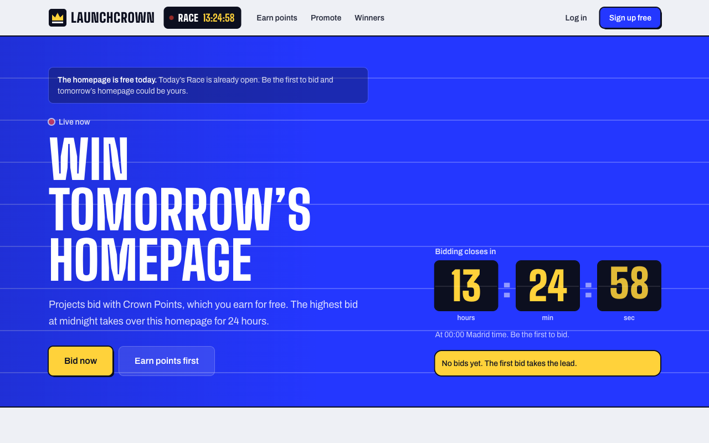
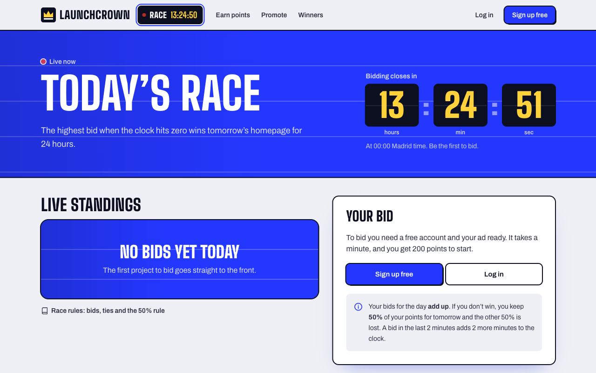

# LaunchCrown 👑

**One homepage, one winner, every day.**

LaunchCrown is a free daily race for a single homepage. Startups, side projects and creators bid **Crown Points**, and the highest total bid at midnight (Madrid time) takes over the whole LaunchCrown homepage, full screen, for 24 hours. Points can't be bought: you earn them by discovering other people's projects.

🌐 **Live:** [www.launchcrown.com](https://www.launchcrown.com)



---

## How it works

1. **Sign up** and get 200 Crown Points.
2. **Earn more** by watching the websites of the projects bidding today (10 points every 10 seconds, +40 at 60 seconds, up to 100 per website per day) or by visiting the links other members promote.
3. **Bid** in today's Race. Bids add up during the day, and a bid in the last 2 minutes pushes the close back 2 more minutes.
4. **At midnight** the top bid wins tomorrow's homepage. Everyone else keeps 50% of their bid for the next Race.
5. **The winner's ad is reviewed** before going live. The homepage turns into an animated presentation built from the winner's own website (logo, brand colour, headline and images), and the winner gets 500 points to bid again.



## Features

- **Live Race:** cumulative bids, real-time standings over WebSocket, countdown and anti-sniping extension.
- **Automatic daily close** at midnight, with ties broken by who reached the total first and the 50% carry-over rule.
- **Earn points by watching:** a full-screen viewer shows each project's real website in an isolated iframe (or in its own window when the site doesn't allow framing). The server keeps one clock per person, so ten tabs earn the same as one, and it never pays for more time than has really passed.
- **Bonus links and Promote:** anyone can post their website, YouTube channel or social profile for free; other members earn points for visiting it. Three reports hide a link for review.
- **Winner presentation:** the backend reads the winner's public website (with SSRF protection) and the homepage becomes a five-scene "film" in their brand colour. It is frozen at approval, so what goes live is exactly what was reviewed.
- **Notifications** in the app and by email ("you've been outbid", "you won").
- **Admin panel:** points overview, ad and promotion moderation, settings and an audit log.
- **SEO-ready:** server-rendered pages, structured data (JSON-LD), sitemap, Open Graph images and `llms.txt`.

## Tech stack

| Layer | Technology |
|---|---|
| Frontend | Next.js 16 (App Router), React 19, TypeScript, Tailwind CSS 4, STOMP over WebSocket |
| Backend | Java 21, Spring Boot 4.1 (Web MVC, Security, Data JPA, WebSocket, Validation, Actuator) |
| Database | PostgreSQL 17, schema managed by Flyway migrations |
| Auth | Short-lived JWT access tokens plus rotating refresh tokens in an HttpOnly cookie, with reuse detection |
| Testing | JUnit 5, Spring Boot Test and Testcontainers (a real PostgreSQL in Docker) |
| Hosting | Vercel (web), Render (API, Docker), Supabase (PostgreSQL), Brevo (email). All on free plans |
| CI | GitHub Actions: backend tests, plus lint and build for the web |

## Architecture

```
  Browser ──HTTPS──▶  Next.js (Vercel)  ──REST /api/* (proxied)──▶  Spring Boot API (Render)  ──JDBC──▶  PostgreSQL
     │                                                                   │
     └──────────── WebSocket (STOMP): live standings, notifications ─────┘
                                                                         ├──▶ Brevo (transactional email)
                                                                         └──▶ Public websites (site reader, SSRF-protected)
```

**Golden rule:** all the logic for points, bids, rewards and the daily close lives in the backend. The web only displays data and sends intentions ("bid 500 points", "I've been watching this project for 10 seconds"); the server validates and decides.

A few design decisions worth knowing:

- **Points are a double-entry ledger.** Every movement (signup bonus, view reward, bid, carry-over, refund) is a ledger transaction, so balances can always be audited and points never appear out of nowhere. Amounts are integers: no rounding errors.
- **The daily close is idempotent** and runs on a schedule. Configuration changes only apply from the next Race, so nobody changes the rules mid-game.
- **Emails go through an outbox table:** an email is never lost and never sent for something that was rolled back.
- **Security:** per-IP rate limiting (Bucket4j) behind a shared proxy secret, a strict Content Security Policy, uploaded images re-encoded by the server, `https`-only advertiser URLs and a site reader that refuses private and internal addresses.
- **SEO without giving up interactivity:** public pages are rendered on the server (ISR), and live data is layered on top in the browser.

## Run it locally

### Requirements

- Docker Desktop (running)
- Java 21
- Node.js 20 or later

No need to install Maven: the backend ships with the Maven Wrapper (`./mvnw`).

### One command

```bash
git clone https://github.com/AdrianLuchaco/AdArena.git
cd AdArena
./dev.sh
```

This starts PostgreSQL in Docker, the API and the web, and fills the database with sample data (four demo projects, a Race in progress and a past winner). Stop everything with `Ctrl + C`. If a port is still busy from a previous run, free it with `./dev.sh stop`.

| What | URL |
|---|---|
| 🌐 Web | http://localhost:3000 |
| 🛠️ Admin panel | http://localhost:3000/admin |
| ⚙️ API and Swagger UI | http://localhost:8081/swagger-ui.html |

Local demo accounts (they only exist on your machine, created by the `dev` profile):

| Account | Email | Password |
|---|---|---|
| Admin | `admin@adarena.local` | `AdminAdArena2026!` |
| Demo projects | `demo-cafe@adarena.local`, `demo-bicis@adarena.local`, `demo-lumen@adarena.local`, `demo-huerta@adarena.local` | `DemoAdArena2026!` |

Locally, emails are not sent: they are printed in the backend console (look for `[EMAIL NOT SENT`).

Different ports: `BACKEND_PORT=8082 FRONTEND_PORT=3001 ./dev.sh`.

### Tests

```bash
cd backend && ./mvnw test                      # 268 backend tests against a real PostgreSQL (Docker)
cd frontend && npm run lint && npm run build   # web checks
```

### Local database

```bash
docker compose down      # stop (data is kept)
docker compose down -v   # stop and DELETE the local database; sample data is recreated on the next start
```

The local database only listens on `127.0.0.1`, never on your network.

## Project structure

```
backend/                Spring Boot API
  src/main/java/com/adarena/
    auction/            the Race: bids, standings, daily close
    wallet/             Crown Points ledger
    earn/               rewards for watching websites and bonus links
    site/               site reader for the winner presentation (SSRF-protected)
    adprofile/ adslot/  advertiser profiles and the homepage slot
    notification/       in-app notifications and the email outbox
    realtime/           WebSocket (STOMP) broadcasting
    security/           JWT, CORS, rate limiting
    admin/ settings/    admin panel, moderation and audit log
    demo/               sample data for local development
  src/main/resources/db/migration/   Flyway migrations
frontend/               Next.js web
  src/app/              routes (home, race, earn, promote, winners, admin…)
  src/components/       UI components
  src/lib/              API client, auth, SEO helpers
brand/                  logo and banner sources
docker-compose.yml      local PostgreSQL
render.yaml             Render blueprint for the API
dev.sh                  starts everything locally
```

Code comments are written in Spanish; the product and this README are in English.

## Deploy your own instance

Everything runs on free plans:

1. **Database:** create a Supabase project and copy the *Session pooler* connection details.
2. **API:** in Render, choose *New → Blueprint* and select this repository. Render reads [`render.yaml`](render.yaml) and asks for the variables documented in [`.env.example`](.env.example).
3. **Web:** import the `frontend/` folder into Vercel and set the variables from [`frontend/.env.example`](frontend/.env.example). `PROXY_SECRET` must be the same value in Render and Vercel.
4. **Email (optional):** create a Brevo API key and set `BREVO_API_KEY` and `MAIL_FROM`.
5. **Keep it awake (optional):** Render's free plan sleeps after 15 minutes. A free UptimeRobot monitor on `/actuator/health` every 5 minutes keeps it awake, so the midnight close always runs on time.

Never set `SPRING_PROFILES_ACTIVE=dev` in production: it creates the demo data and the demo admin account.

## Contributing

Issues and pull requests are welcome. Before opening a pull request, run the backend tests and the frontend lint and build (see [Tests](#tests)). CI runs the same checks on every push.

## Author

Built by **Adrian** ([@AdrianLuchaco](https://github.com/AdrianLuchaco)) · [www.launchcrown.com](https://www.launchcrown.com)
