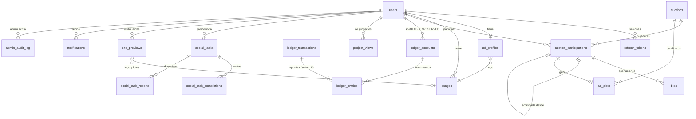

# AdArena — Arquitectura

> Última actualización: fase 12 (2026-09-28): lista para subirla gratis a la nube (Supabase, Render, Vercel, Brevo; guía en `docs/DESPLIEGUE.md`). Fase 11 (2026-09-28): la web entera en **inglés**, rutas nuevas, navegación centrada en la Arena, diseño nuevo de "la pista" (la clasificación como una carrera por calles) y arreglo del modo "ventana aparte" del visor. (Fase 10: visor de webs, presentación animada del ganador y premio de 500. Fase 9: **Arena Points**, sin dinero real.) El detalle de cada fase está en `docs/fases/` y la auditoría de seguridad en `docs/AUDITORIA-SEGURIDAD.md`.
>
> (Hasta la fase 3 el proyecto se llamaba *Publifi*.)

> Documento vivo. Si una decisión cambia, se actualiza aquí primero.

## 1. Visión general

```
                        ┌──────────────────────────┐
  Navegador ───HTTPS───▶│  Frontend (Vercel)       │  adarena.vercel.app
  (móvil/escritorio)    │  Next.js + TS + Tailwind │  (reenvía /api/* al backend: proxy.ts)
        │               └────────────┬─────────────┘
        │  WebSocket STOMP           │ REST (JSON, Bearer JWT) + IP real + PROXY_SECRET
        ▼                            ▼
┌──────────────────────────────────────────────┐        ┌──────────────┐
│ Backend (Render, Fráncfort)  *.onrender.com  │─HTTPS─▶│ Brevo (API)  │
│ Java 21 + Spring Boot 4.1                    │        └──────────────┘
│  · API REST + Swagger       · WebSocket STOMP│
│  · Spring Security + JWT    · @Scheduled +   │   Sin pagos: todo funciona con
│  · Rate limiting (Bucket4j)   (cierre diario)│   Arena Points (no son dinero)
└──────────────────────┬───────────────────────┘
                       │ JDBC (Flyway gestiona el esquema)
                       ▼
              ┌──────────────────┐
              │ PostgreSQL       │  (Supabase, Fráncfort; session pooler)
              └──────────────────┘

  Lector de webs (backend) ──HTTPS──▶ webs públicas de los proyectos (solo IP públicas, protección SSRF)
  Visor (navegador) ──iframe aislado──▶ la web del proyecto (o su propia ventana si no se deja)
  Google AdSense ◀── en /promote y, pequeño, bajo las clasificaciones (opcional)
```

**Regla de oro:** toda la lógica de puntos, pujas, recompensas y cierres vive en el backend. El frontend
solo muestra datos y envía intenciones ("quiero pujar 500 puntos", "llevo 10 s viendo este proyecto").
El servidor valida y decide.

## 2. Decisiones tomadas

| Tema | Decisión | Motivo |
|---|---|---|
| Moderación | Solo se modera al ganador. La ventana es **fija**: hasta que apruebas, se ve el contenido base | Tu elección |
| Moneda | **Arena Points**: no se compran, no se venden, no se retiran ni se transfieren. 1 céntimo antiguo = 1 punto | Tu elección (fase 9): sin dinero real |
| Cómo se consiguen | 200 al registrarse, viendo proyectos (10 cada 10 s + 40 de bonus a los 60 s, máx. 100/día por proyecto) y con Créditos extra (20 por tarea, máx. 10/día) | Tu elección (fase 9) |
| Créditos extra | Se gana por **visitar** enlaces, nunca por seguir o dar like | Tu elección: las redes prohíben el engagement incentivado |
| Promociones de usuarios | Gratis, se publican **al momento**; 3 denuncias las ocultan; el admin puede ocultarlas con motivo | Tu elección |
| Anuncios (AdSense) | En `/promote` (6 huecos) y uno pequeño bajo la clasificación de la portada y de la Arena. **Nunca** donde se ganan puntos (Gana puntos, Créditos extra, visor). Sin "Auto ads" | Tu elección (fase 10) y normas de AdSense: no se puede compensar por ver anuncios |
| Ganar puntos mirando webs | El visor muestra **la web del proyecto** (iframe aislado) o, si no se deja, la abre en su ventana; cuenta mientras la miras | Tu elección (fase 10): que cuente el tiempo en la web de verdad |
| Premio al ganador | **+500** puntos cuando su anuncio se aprueba y sale en portada | Tu elección (fase 10): que pueda volver a pujar |
| Presentación del ganador | Se monta con lo leído del HTML de su web (sin capturas de pantalla) y se **congela al aprobar** | Sencillo de alojar y se publica exactamente lo revisado |
| Portada sin iframe (regla 10) | La web del ganador nunca se incrusta en la portada: su presentación se dibuja con sus datos | Regla 10 original |
| Ganador rechazado | Se le devuelven el **100 %** de sus puntos y pasa el siguiente clasificado | Tu elección |
| Usuarios | Cualquier persona (B2C) | Tu elección (ver riesgos en §11) |
| Empate | Gana quien alcanzó **antes** ese total | Estándar y verificable |
| Arrastre | Se acumula: si pierdes otra vez, conservas el 50 % del nuevo total | Aplicación literal de la regla 7 |
| Redondeo del arrastre | Hacia abajo al punto (101 pts → arrastra 50, pierde 51) | Nunca aparecen puntos de la nada |
| Incremento mínimo | Importe mínimo de **cada aportación adicional**; no hace falta superar al líder | Regla 2 (pujas acumulativas) |
| Cambios de configuración | Se aplican desde la **siguiente** subasta | Nadie cambia las reglas a mitad de partido |
| Puntos | Enteros (`long` / `bigint`) | Sin errores de redondeo |
| URL del anunciante | Solo `https://` | Seguridad de tus visitantes |
| Imágenes | Re-codificadas por el servidor (PNG/JPEG, máx. 2 MB) y guardadas en PostgreSQL | Un servicio menos; se puede migrar a R2/S3 más adelante |
| Tiempo real | **WebSocket + STOMP** | Ver §7 |
| Hosting backend | **Render** (plan gratuito, Docker, Fráncfort) + UptimeRobot para que no se duerma | Tu elección (fase 12): todo gratis. Railway ya no tiene plan gratuito |
| Base de datos | **Supabase** (PostgreSQL gratuito, siempre encendido; session pooler por IPv4) | El backend consulta cada pocos segundos: los planes por horas (Neon) no darían |
| Hosting frontend | **Vercel** (Hobby, gratis; solo uso no comercial: con AdSense hará falta Pro u otro alojamiento) | Creadores de Next.js |
| Emails | **Brevo** por su API HTTPS (300/día gratis, sin dominio). SMTP sigue disponible | Render gratuito bloquea los puertos SMTP |
| Spring Boot | **4.1.x** (migrado en la fase 3; la rama 3.5 se quedó sin soporte gratuito el 30/06/2026) | Parches de seguridad y soporte vigentes |
| Datos de ejemplo | Solo en local (perfil `dev`): 4 anunciantes, un anuncio ganador, una subasta con pujas y 3 promociones, con los puntos pasando por el ledger | Ver la web "viva" desde el primer arranque |
| Puertos en local | Web `3000`, API `8081`, PostgreSQL `5432`. Todo se arranca con `./dev.sh` | En tu ordenador el 8080 lo usa otro proyecto |
| Pagos | **Ninguno** desde la fase 9 (las recargas por transferencia se eliminaron) | Tu elección |
| Nombre y vocabulario | **AdArena**. En la web no se dice "subasta": se dice **la Arena** | Tu elección (fase 4) |
| Emails | Bandeja de salida (outbox) + SMTP configurable. Sin SMTP, se escriben en el log | Nunca se pierde un email ni se envía el de algo que se deshizo |
| "Te han superado" por email | Como mucho uno por cada puja del superado | Sin spam en las guerras de pujas |

## 3. Reglas de negocio formalizadas

### 3.1 Ciclo diario
- Solo hay **una subasta abierta** a la vez (lo garantiza un índice único en la BD).
- La subasta del día D cierra a `close_time` (00:00 por defecto) en `Europe/Madrid`.
- Al cerrar la subasta A se abre al instante la siguiente, B.
- El anuncio ganador de A se emite en la ventana **[fin programado de A, fin programado de B)**:
  24 h normalmente, 23 h o 25 h los días de cambio de hora.

### 3.2 Pujar
Para pujar hace falta: sesión iniciada, perfil de anuncio completo, subasta abierta y puntos disponibles suficientes.
- Primera aportación del día: ≥ `min_bid` (100 pts).
- Aportaciones siguientes: ≥ `min_increment` (100 pts).
- Los puntos pasan de *disponibles* a *en pujas* en la misma transacción que registra la puja.
- Cada puja lleva un `Idempotency-Key`: un doble clic no puja dos veces.

### 3.3 Anti-sniping
Si una puja entra cuando quedan ≤ 120 s, el fin se retrasa 120 s. Como máximo hay 10 extensiones.
Todo es configurable.

### 3.4 Cierre (idempotente)
Cuando `now ≥ ends_at`:
1. Se bloquea la subasta. Si ya está `CLOSED`, no se hace nada (idempotencia).
2. Ranking: `total DESC`, y a igualdad, `last_bid_seq ASC`.
3. **Si nadie pujó:** resultado `NO_BIDS` y la portada muestra "Hoy nadie ha pujado".
4. **Ganador (1.º):** su participación queda `WON` y se guarda una copia de su anuncio. Se crea un
   `ad_slot` `PENDING_REVIEW`. Sus puntos **siguen retenidos** hasta la moderación.
5. **Perdedores:** `arrastre = floor(total × 50 %)` y `perdido = total − arrastre`.
   - Los puntos perdidos pasan de *en pujas* a `POINTS_SPENT` (gastados).
   - El arrastre sigue reservado y se convierte en su puja inicial en B, sin que tenga que hacer nada.
6. Se abre la subasta B con las reglas vigentes en ese momento.

Todo ocurre en **una sola transacción**: o se aplica entero o no se aplica nada.

### 3.5 Moderación
- **Aprobar:** los puntos retenidos se gastan (`POINTS_SPENT`) y el anuncio se emite durante lo que quede de la ventana.
- **Rechazar:** se devuelven el 100 % de los puntos al usuario. El siguiente clasificado pasa a ser
  candidato: su arrastre se retira de la subasta B, porque sus puntos vuelven a estar retenidos como
  candidato, y se crea un nuevo `ad_slot` pendiente.
- **Nadie modera antes de que acabe la ventana:** el slot pasa a `EXPIRED` y se devuelve el 100 %.

### 3.6 Ejemplo completo con puntos

Ana tiene 5.000 pts y puja 1.000 + 600 = **1.600**. Luis tiene 2.000 pts y puja **1.200**.

| Momento | Ana disponible | Ana en pujas | Luis disponible | Luis en pujas | Gastados |
|---|---:|---:|---:|---:|---:|
| Antes de pujar | 5.000 | 0 | 2.000 | 0 | 0 |
| Tras pujas | 3.400 | 1.600 | 800 | 1.200 | 0 |
| Cierre (Ana 1.ª, Luis pierde 50 %) | 3.400 | 1.600 | 800 | 600 *(arrastre al día siguiente)* | 600 |
| **Caso A:** apruebas a Ana | 3.400 | 0 | 800 | 600 | **2.200** |
| **Caso B:** rechazas a Ana → Luis candidato | 5.000 | 0 | 800 | 600 *(retenido como candidato)* | 600 |
| Caso B, apruebas a Luis | 5.000 | 0 | 800 | 0 | **1.200** |

En todo momento: `Σ puntos de los usuarios + gastados = repartidos`.

## 4. Los puntos: libro de movimientos (ledger) de partida doble

Cada movimiento es una `ledger_transaction` con apuntes (`ledger_entries`) que **suman cero**.
Cuentas del sistema: `POINTS_ISSUED` (de donde salen todos los puntos que se reparten) y
`POINTS_SPENT` (donde acaban los gastados). Cada usuario tiene `USER_AVAILABLE` y `USER_RESERVED`.

| Transacción | Movimiento | Clave de idempotencia |
|---|---|---|
| `SIGNUP_BONUS` | POINTS_ISSUED → USER_AVAILABLE | `signup:<user_id>` |
| `VIEW_REWARD` | POINTS_ISSUED → USER_AVAILABLE | `view:<project_view_id>:<nº de tick>` |
| `TASK_REWARD` | POINTS_ISSUED → USER_AVAILABLE | `task:<completion_id>` |
| `TEST_GRANT` | POINTS_ISSUED → USER_AVAILABLE (solo en local y en tests) | `demo:points:…` |
| `BID_RESERVE` | USER_AVAILABLE → USER_RESERVED | `bid:<bid_id>` |
| `BID_FORFEIT` | USER_RESERVED → POINTS_SPENT | `forfeit:<participation_id>` |
| `BID_WIN_CHARGE` | USER_RESERVED → POINTS_SPENT | `win:<ad_slot_id>` |
| `WINNER_REFUND` | USER_RESERVED (+ POINTS_SPENT) → USER_AVAILABLE | `refund:<ad_slot_id>` |
| `WINNER_BONUS` | POINTS_ISSUED → USER_AVAILABLE (500 al ganador) | `winner-bonus:<ad_slot_id>` |
| `ADMIN_ADJUSTMENT` | Corrección manual auditada | `adjust:<uuid>` |
| `TOP_UP` | Histórico (recargas en euros hasta la fase 8) | — |

**Redes de seguridad en PostgreSQL** (funcionan aunque el código Java tenga un bug):
1. Un trigger diferido rechaza el `COMMIT` si una transacción no suma cero.
2. Las tablas del ledger son de solo inserción: no admiten UPDATE ni DELETE.
3. Un `CHECK` impide que una cuenta de usuario quede en negativo.
4. Un `UNIQUE (idempotency_key)` impide que la misma operación se contabilice dos veces.
5. La vista `ledger_account_mismatches` debe estar siempre vacía. La vigilan los tests y el panel de administración.

### 4.1 Cómo se ganan los puntos (y el antitrampas)

**Mirando la web de un proyecto** (`/watch/[id]`, visor a pantalla completa): la web del
proyecto se ve dentro de AdArena (iframe con `sandbox`) si lo permite (`frame-ancestors` /
`X-Frame-Options`); si no, se abre en su propia ventana. El navegador cuenta el tiempo que la miras
(`useActiveTimer`: dentro de AdArena, pestaña visible + foco + actividad; en ventana aparte, desde que
la abres y mientras estás **fuera de AdArena**, hasta que vuelves o pulsas "I'm done". Ya no se mira
`ventana.closed`: YouTube, X o Instagram envían `Cross-Origin-Opener-Policy` y el navegador corta el
enlace con la ventana, que parece cerrada al instante; fase 11) y pide tramos de 10 s. El servidor (`ViewRewardService`) decide:
- hay que haber abierto el visor antes (`POST /start` apunta la hora del servidor);
- **un solo reloj de atención por persona** (`AttentionClock`): los tramos pagados nunca superan el
  tiempo real desde el último premio del usuario (de cualquier proyecto o tarea), con 0,4 s de margen;
- se pueden pedir varios tramos a la vez (al volver de otra ventana), pero nunca más de los que caben;
- los premios de un usuario se procesan de uno en uno (se bloquean sus cuentas de puntos);
- como mucho 100 pts al día por empresa (`project_views`, único por visitante, empresa y día);
- tu propio proyecto no cuenta (también con un `CHECK` en la base de datos).

**Bonus links** (antes «Créditos extra»; `/watch/link/[id]`, el mismo visor): se cobra tras mirar el enlace 10 s; el servidor
exige 10 s desde que se abrió y desde el último premio del usuario, una vez por tarea y día, hasta 10 al día.

**Promociones** (`/promote`): cualquier usuario publica gratis hasta 5 enlaces `https`, que
salen como tareas para los demás. 3 denuncias de usuarios distintos las ocultan hasta que el admin decide.

**Premio al ganador:** 500 puntos (`WINNER_BONUS`) al aprobarse su anuncio.

### 4.2 Las webs de los proyectos (`site/`)

`SitePreviewUpdater` lee la web (HTML + imágenes) de anuncios y promociones en segundo plano: al
guardarlos, cada 15 min las que están en uso y tienen más de 20 h, y a petición (mínimo 2 min entre
lecturas). Solo se conecta a **IP públicas** (`PublicDnsResolver`: protección SSRF), solo https en el
puerto 443 (también en cada redirección), con límites de tiempo y tamaño. Las imágenes se vuelven a
codificar y se guardan en AdArena. Las redes sociales no se leen (no se dejan). Con lo leído se decide
el modo del visor (`SiteInfo`) y se monta la presentación del ganador (`Showcase`), que se congela en
`ad_slots.showcase` al aprobarlo.

## 5. Modelo de datos



| Tabla | Para qué sirve |
|---|---|
| `users` | Cuentas (rol `USER`/`ADMIN`), versión de términos aceptada |
| `refresh_tokens` | Hash de refresh tokens con rotación y detección de reutilización |
| `images` | Logos ya saneados e inmutables |
| `ad_profiles` | Perfil de anuncio (1 por usuario) |
| `app_settings` | Configuración (fila única) |
| `auctions` | Una por día, con una copia de sus reglas, `ends_at` móvil y estado |
| `auction_participations` | **Total** de un usuario en una subasta: ranking, bloqueo y copia del anuncio al cierre |
| `bids` | Historial de cada aportación (`BID`, `CARRY_OVER`, `CARRY_REVERSAL`) |
| `ad_slots` | Candidatos a la ventana de emisión + moderación |
| `ledger_*` | Puntos y su contabilidad |
| `project_views` | Lo que cada usuario ha visto de cada empresa cada día (ticks, puntos, bonus, último tick) |
| `site_previews` | Lo leído de cada web (una fila por dirección): si se puede mostrar dentro, nombre, titular, color, logo, fotos y frases |
| `social_tasks`, `social_task_completions`, `social_task_reports` | Promociones (Créditos extra), quién las ha hecho cada día y denuncias |
| `notifications`, `email_outbox` | Avisos in-app y emails con reintentos |
| `password_reset_tokens` | Enlaces de "he olvidado mi contraseña" (solo su hash; 60 min; un uso) |
| `admin_audit_log` | Rastro de cada acción de administración |
| `shedlock` | Reservada. No hace falta: cada tarea bloquea sus filas y es segura aunque se ejecute dos veces a la vez |

Migraciones: `backend/src/main/resources/db/migration/V1…V11` (V10: Arena Points, ganar puntos y
promociones; borra `top_ups` y `payment_events`. V11: `site_previews`, `ad_slots.showcase` y `WINNER_BONUS`).
**Una migración ya aplicada nunca se edita**: cualquier cambio va en una nueva `V12__…sql`.

## 6. Concurrencia

- **Orden de bloqueo único** en todas las operaciones: `auction` → `participation` → cuentas del ledger
  (ordenadas por id). Mismo orden siempre = sin interbloqueos (*deadlocks*).
- **Puja:** `SELECT … FOR UPDATE` sobre la subasta. Todas las pujas de una subasta se ejecutan una
  detrás de otra. Con el volumen previsto (decenas o cientos de pujas al día) el coste es despreciable,
  y el ranking, los puntos y el anti-sniping siempre son coherentes.
- **Cierre:** la tarea se ejecuta cada 5 s y cierra la ronda si `ends_at ≤ now`. El bloqueo de la fila y la
  comprobación del estado `OPEN` hacen que ejecutarla dos veces (o en dos instancias) no duplique nada.
- **Orden de bloqueo global:** fila de negocio (hueco de anuncio, visita o tarea) → ronda → participaciones →
  cuentas de TODOS los usuarios implicados, a la vez y por id → cuentas del sistema (`POINTS_ISSUED`, después `POINTS_SPENT`).
- **Recompensas:** primero las cuentas del usuario (así sus ticks y tareas van de uno en uno), después la fila
  de la visita o la tarea, y por último `POINTS_ISSUED`.
- `@Version` (bloqueo optimista) en el resto de entidades editables, como perfiles o configuración.

## 7. Tiempo real: WebSocket + STOMP (y por qué no SSE)

Aquí SSE bastaría técnicamente, porque el servidor solo empuja datos: las pujas van por REST.
Elijo **STOMP** porque Spring trae de serie:
- temas públicos: `/topic/arena` con la portada entera: ranking, `endsAt` y la hora del servidor;
- colas privadas por usuario: `/user/queue/notifications`, para todos los avisos ("te han superado", "has ganado"…);
- autenticación del JWT en el `CONNECT` (`EventSource`, la API de SSE, no puede enviar la cabecera `Authorization`).

El **contador** no se emite cada segundo. El servidor envía `endsAt` y `serverTime`, y el navegador
cuenta solo, corrigiendo el desfase de su reloj. Cuando hay una extensión llega un `endsAt` nuevo.

Para el lanzamiento: **una sola instancia** del backend (el broker STOMP vive en memoria).
Para escalar a varias instancias se añadiría un broker externo (RabbitMQ) o `LISTEN/NOTIFY` de PostgreSQL.

## 8. Autenticación y CORS entre Next.js y Spring

- **Access token (JWT, 15 min):** se guarda en memoria en el navegador (nunca en `localStorage`,
  para reducir el riesgo si hay un fallo XSS) y se envía como `Authorization: Bearer …`.
- **Refresh token (30 días):** en una cookie `HttpOnly; Secure; SameSite=Lax; Path=/api/auth`.
  JavaScript no puede leerla. Se rota en cada uso.
- **En la nube (fase 12), sin dominio propio:** la web está en `*.vercel.app` y el backend en
  `*.onrender.com`, que son sitios distintos: el navegador bloquearía la cookie. Por eso la web
  **reenvía `/api/*` al backend** (`frontend/src/proxy.ts`, `NEXT_PUBLIC_API_URL=/`): para el navegador
  la API está en la misma dirección que la web y la cookie es propia de la web. El WebSocket va directo
  al backend (`NEXT_PUBLIC_WS_URL`): no usa cookies, se autentica con el token en la cabecera STOMP.
  Al reenviar, la web añade la IP real del visitante y una clave compartida (`PROXY_SECRET`); el
  backend solo cree esa IP si la clave coincide (límites por persona, no por Vercel).
- **Con dominio propio (más adelante):** `adarena.com` (web) y `api.adarena.com` (backend) son el mismo
  sitio; el reenvío puede seguir igual.
- **CORS:** el backend solo acepta los orígenes de `FRONTEND_ORIGINS`, con `allowCredentials=true` y las
  cabeceras `Authorization`, `Content-Type` e `Idempotency-Key`.
- **CSRF:** las rutas con Bearer no son vulnerables. Las rutas que usan la cookie (`/api/auth/**`) se
  protegen con `SameSite=Lax` y comprobando la cabecera `Origin` (`OriginCheckFilter`).
- **En local:** `localhost:3000` y `localhost:8081` cuentan como el mismo sitio y todo funciona sin trucos.

## 9. Estructura del backend

Organizado **por módulo de negocio** y, dentro de cada módulo, **por capas**:

```
backend/
├── pom.xml
└── src/
    ├── main/java/com/adarena/
    │   ├── AdArenaApplication.java
    │   ├── common/        errores, config, textos/URLs/puntos, "/" → web, jobs/ (tareas automáticas)
    │   ├── security/      JWT, SecurityConfig, rate limiting, origen y tamaño de las peticiones
    │   ├── user/          cuentas, sesiones, recuperar contraseña
    │   ├── image/         subida y saneado de imágenes
    │   ├── adprofile/     perfil de anuncio
    │   ├── settings/      configuración de la Arena (editable por el admin)
    │   ├── auction/       pujas, ranking, anti-sniping, apertura y CIERRE diario
    │   ├── adslot/        huecos ganadores y moderación (aprobar, rechazar, caducar)
    │   ├── home/          portada e historial (API pública)
    │   ├── realtime/      WebSocket STOMP
    │   ├── wallet/        ledger y puntos
    │   ├── earn/          ganar puntos (ver webs), Créditos extra, promociones y el reloj de atención
    │   ├── site/          leer las webs de los proyectos (SSRF-safe), visor y presentación del ganador
    │   ├── notification/  avisos, emails (outbox + SMTP)
    │   ├── admin/         panel, resumen, auditoría y herramientas de desarrollo
    │   └── demo/          datos de ejemplo, SOLO en local (perfil dev)
    ├── main/resources/
    │   ├── application.yml, application-dev.yml
    │   └── db/migration/V1…V11__*.sql
    └── test/java/com/adarena/     257 tests (PostgreSQL real con Testcontainers)
```

Dentro de cada módulo:

| Capa | Responsabilidad |
|---|---|
| `domain` | Entidades JPA **con comportamiento** (`auction.applyAntiSniping(...)`, `ledgerTx.post(...)`) |
| `repository` | Interfaces de Spring Data (consultas, bloqueos `FOR UPDATE`) |
| `service` | Casos de uso con `@Transactional` (pujar, cerrar, aprobar…) |
| `controller` | Endpoints REST; solo traducen HTTP ⇄ DTO |
| `dto` | Objetos de entrada y salida con Bean Validation. Las entidades nunca salen a la API |

Entre módulos distintos nos referimos por **ID** (`UUID userId`), no con relaciones JPA. Así
evitamos cargas perezosas sorpresa y el acoplamiento entre módulos.

## 10. Estructura del frontend

Next.js 16 (App Router), TypeScript y Tailwind 4:

```
frontend/src/
├── app/                         RUTAS (cada carpeta con page.tsx es una página)
│   ├── layout.tsx               tipografías, cabecera, pie, sesión y Arena en directo
│   ├── page.tsx                 PORTADA: ganador de hoy + marcador de la Arena + top 5 + "How to win" (3 pasos)
│   ├── arena/                   la Arena: marcador, clasificación en directo y tarjeta para pujar
│   ├── earn/, earn/links/       Earn points (webs de hoy) y Bonus links
│   ├── watch/[id]/              visor de la web de un proyecto (gana puntos mirándola)
│   ├── watch/link/[id]/         visor de un Bonus link
│   ├── how-it-works/            la guía completa (solo enlazada desde el pie y desde cada sección)
│   ├── promote/                 promociona tu enlace gratis (la página con más anuncios de AdSense)
│   ├── ads.txt/                 generado desde NEXT_PUBLIC_ADSENSE_CLIENT
│   ├── winners/                 días anteriores
│   ├── login/, signup/, forgot-password/, reset-password/
│   ├── account/                 My ad · My points · My bids · Notifications (+ Log out)
│   ├── admin/                   Overview · Moderation · Promotions · Settings · Audit log
│   ├── legal/terms, privacy
│   │   (las rutas antiguas en español redirigen con 308: next.config.ts → redirects)
│   └── not-found.tsx, icon.svg
├── components/
│   ├── arena/                   ArenaScoreboard (el marcador, compartido portada/Arena), Leaderboard (una sola
│   │                            lista: fila amarilla del 1.º + resto), ProjectDialog, BidPanel, Countdown (fichas)
│   ├── ad/WinnerShowcase.tsx    la presentación animada del ganador (5 escenas, su color de marca)
│   ├── ad/AdView.tsx            el anuncio clásico (si su web no se pudo leer) y vistas previas
│   ├── viewer/                  SiteViewer (barra de puntos + la web en iframe o en su ventana), SiteAvatar
│   ├── earn/                    ProjectViewer, TaskViewer, EarnShell (tu marcador + 2 pestañas), EarnProjectsView, TasksView
│   ├── promote/, ads/           PromoteView y los bloques de AdSense
│   ├── home/HomeClient.tsx      la portada (franja amarilla "Bid now" + marcador + top 5 + 3 pasos)
│   ├── history/, panel/, admin/, auth/, layout/ (cabecera con el marcador en directo), ui/, fx/
│   └── Logo.tsx, icons.tsx
└── lib/
    ├── api.ts                   cliente de la API (sesión en memoria y renovación automática)
    ├── auth-context.tsx         quién ha iniciado sesión
    ├── arena-context.tsx        datos en directo, avisos emergentes, avisos sin leer y tus puntos
    ├── useActiveTimer.ts        tiempo mirando la web (dentro de AdArena o en su ventana)
    ├── adsense.ts               configuración de AdSense
    ├── realtime.ts              cliente STOMP
    └── format.ts, types.ts, config.ts, navigation.ts, hooks.ts, cn.ts
```

Seguridad de la web: CSP, `X-Frame-Options: DENY`, `nosniff`, `Referrer-Policy`, `Permissions-Policy`
y HSTS en producción (`next.config.ts`). La CSP admite iframes `https:` (el visor, con `sandbox`). Con
AdSense configurado, admite además `https:` en scripts, imágenes y conexiones (Google no admite listas de dominios).

## 11. Riesgos que debes revisar con un profesional antes de lanzar

1. ~~Ley del juego con dinero~~ → muy reducido en la fase 9: los puntos no se compran ni se cambian
   por dinero. **Si algún día se venden puntos**, el riesgo vuelve (subastas de céntimo, Ley 13/2011):
   consúltalo antes con un abogado.
2. **Términos y privacidad:** reescritos para los puntos, el antitrampas y AdSense. Que los revise un abogado.
3. **AdSense:** Google revisa la web antes de aprobarla y puede suspender la cuenta si detecta tráfico
   incentivado en páginas con anuncios. Por eso nunca hay anuncios donde se ganan puntos y no se usan
   los anuncios automáticos. En Europa hace falta su CMP (Privacidad y mensajes). Además, las visitas que
   AdArena manda a las webs de los proyectos son incentivadas: si esas webs tienen AdSense, es su
   responsabilidad (se avisa en los términos).
4. **Normas de las redes sociales:** YouTube, X, Instagram o TikTok prohíben pagar por likes o
   seguidores. AdArena solo premia visitar; no cambies eso.
5. **Fiscalidad:** los ingresos de AdSense son actividad económica (alta, IVA, IRPF). Consúltalo con tu gestor.
6. ~~Spring Boot 3.5 sin soporte~~ → resuelto: migrado a Spring Boot 4.1 en la fase 3.

## 12. Hoja de ruta

| Fase | Contenido | Estado |
|---|---|---|
| 1 | Arquitectura, modelo de datos, migraciones, estructura | ✅ |
| 2 | Configuración del backend, Docker Compose, autenticación JWT | ✅ |
| 3 | Perfil de anuncio, imágenes, portada (+ migración a Spring Boot 4) | ✅ |
| 4 | Pujas, ranking en tiempo real, contador, anti-sniping (+ nombre AdArena) | ✅ |
| 5 | Monedero + recargas por transferencia bancaria (sustituidas por los puntos en la fase 9) | ✅ |
| 6 | Cierre diario, arrastre, día vacío | ✅ |
| 7 | Avisos, emails y recuperar la contraseña | ✅ |
| 8 | Panel de administración y moderación (+ rediseño del ganador y la clasificación) | ✅ |
| — | Auditoría de seguridad (`docs/AUDITORIA-SEGURIDAD.md`) | ✅ |
| 9 | **Arena Points** (sin dinero), ganar puntos viendo proyectos, Créditos extra, promociones y AdSense | ✅ |
| 10 | Visor de webs para ganar puntos, presentación animada del ganador, premio de 500, rediseño y guía | ✅ |
| 11 | Web en inglés, navegación centrada en la Arena, diseño nuevo y arreglo del modo "ventana aparte" | ✅ |
| 12 | Preparado para la nube gratis: Supabase + Render + Vercel + Brevo + UptimeRobot; guía `docs/DESPLIEGUE.md`; sin herramientas de desarrollo | ✅ (falta que lo subas tú) |
| 13 | Legal (con tu abogado, términos en inglés), dominio propio y AdSense, verificación de email | |
