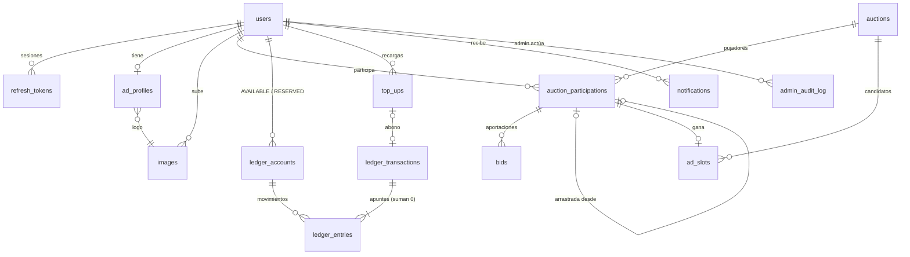

# Publifi — Arquitectura (Fase 1)

> Documento vivo. Si una decisión cambia, se actualiza aquí primero.

## 1. Visión general

```
                        ┌──────────────────────────┐
  Navegador ───HTTPS───▶│  Frontend (Vercel)       │  publifi.com
  (móvil/escritorio)    │  Next.js + TS + Tailwind │
        │               └──────────────────────────┘
        │  REST (JSON, Bearer JWT)  +  WebSocket STOMP
        ▼
┌──────────────────────────────────────────────┐        ┌──────────────┐
│ Backend (Railway)            api.publifi.com │──SMTP─▶│ Resend       │
│ Java 21 + Spring Boot 3.5                    │        └──────────────┘
│  · API REST + Swagger       · WebSocket STOMP│        ┌──────────────┐
│  · Spring Security + JWT    · @Scheduled +   │◀─webh.─│ Stripe       │
│  · Rate limiting (Bucket4j)   ShedLock       │──API──▶│ (Checkout)   │
└──────────────────────┬───────────────────────┘        └──────────────┘
                       │ JDBC (Flyway gestiona el esquema)
                       ▼
              ┌──────────────────┐
              │ PostgreSQL 17    │  (Railway, gestionado)
              └──────────────────┘
```

**Regla de oro:** toda la lógica de dinero, pujas y cierres vive en el backend. El frontend
solo muestra datos y envía intenciones ("quiero pujar 5 €"). El servidor valida y decide.

## 2. Decisiones tomadas

| Tema | Decisión | Motivo |
|---|---|---|
| Moderación | Solo se modera al ganador. La ventana es **fija**: hasta que apruebas, se ve el contenido base | Tu elección |
| Ganador rechazado | Se le devuelve el **100 %** al saldo y pasa el siguiente clasificado | Tu elección; lo más seguro legalmente |
| Retirar saldo | **No**: el saldo solo sirve para pujar | Tu elección (ver riesgos en §11) |
| Usuarios | Cualquier persona (B2C) | Tu elección (ver riesgos en §11) |
| Empate | Gana quien alcanzó **antes** ese total | Estándar y verificable |
| Arrastre | Se acumula: si pierdes otra vez, conservas el 50 % del nuevo total | Aplicación literal de la regla 7 |
| Redondeo del arrastre | Hacia abajo al céntimo (1,01 € → arrastra 0,50 €, pierde 0,51 €) | Nunca aparece dinero de la nada |
| Incremento mínimo | Importe mínimo de **cada aportación adicional**; no hace falta superar al líder | Regla 2 (pujas acumulativas) |
| Cambios de configuración | Se aplican desde la **siguiente** subasta | Nadie cambia las reglas a mitad de partido |
| Dinero | Enteros en **céntimos** (`long` / `bigint`), solo EUR | Sin errores de redondeo de `double` |
| URL del anunciante | Solo `https://` | Seguridad de tus visitantes |
| Imágenes | Re-codificadas por el servidor (PNG/JPEG, máx. 2 MB) y guardadas en PostgreSQL | Un servicio menos; se puede migrar a R2/S3 más adelante |
| Tiempo real | **WebSocket + STOMP** | Ver §7 |
| Hosting backend + BD | **Railway** (app + PostgreSQL gestionado) | Lo más sencillo: todo en un panel, despliegue desde Git, precio bajo |
| Hosting frontend | **Vercel** | Creadores de Next.js |
| Emails | SMTP de **Resend** | Buen plan gratuito, fácil de configurar |
| Spring Boot | **3.5.x** (la última de la rama 3, como pediste) | La rama 4 ya existe; migrar más adelante es sencillo |

## 3. Reglas de negocio formalizadas

### 3.1 Ciclo diario
- Solo hay **una subasta abierta** a la vez (lo garantiza un índice único en la BD).
- La subasta del día D cierra a `close_time` (00:00 por defecto) en `Europe/Madrid`.
- Al cerrar la subasta A se abre al instante la siguiente, B.
- El anuncio ganador de A se emite en la ventana **[fin programado de A, fin programado de B)**:
  24 h normalmente, 23 h o 25 h los días de cambio de hora.

### 3.2 Pujar
Para pujar hace falta: sesión iniciada, perfil de anuncio completo, subasta abierta y saldo libre suficiente.
- Primera aportación del día: ≥ `min_bid` (1 €).
- Aportaciones siguientes: ≥ `min_increment` (1 €).
- El importe pasa de *saldo libre* a *saldo reservado* en la misma transacción que registra la puja.
- Cada puja lleva un `Idempotency-Key`: un doble clic no puja dos veces.

### 3.3 Anti-sniping
Si una puja entra cuando quedan ≤ 120 s, el fin se retrasa 120 s. Como máximo hay 10 extensiones.
Todo es configurable.

### 3.4 Cierre (idempotente)
Cuando `now ≥ ends_at`:
1. Se bloquea la subasta. Si ya está `CLOSED`, no se hace nada (idempotencia).
2. Ranking: `total DESC`, y a igualdad, `last_bid_seq ASC`.
3. **Si nadie pujó:** resultado `NO_BIDS` y la portada muestra "Hoy nadie ha pujado".
4. **Ganador (1.º):** su participación queda `WON` y se guarda una copia de su anuncio. Se crea un
   `ad_slot` `PENDING_REVIEW`. Su dinero **sigue reservado** hasta la moderación.
5. **Perdedores:** `arrastre = floor(total × 50 %)` y `perdido = total − arrastre`.
   - El importe perdido pasa de *reservado* a *ingresos de la plataforma*.
   - El arrastre sigue reservado y se convierte en su puja inicial en B, sin que tenga que hacer nada.
6. Se abre la subasta B con las reglas vigentes en ese momento.

Todo ocurre en **una sola transacción**: o se aplica entero o no se aplica nada.

### 3.5 Moderación
- **Aprobar:** el importe retenido pasa a ingresos y el anuncio se emite durante lo que quede de la ventana.
- **Rechazar:** se devuelve el 100 % al saldo libre del usuario. El siguiente clasificado pasa a ser
  candidato: su arrastre se retira de la subasta B, porque su dinero vuelve a estar retenido como
  candidato, y se crea un nuevo `ad_slot` pendiente.
- **Nadie modera antes de que acabe la ventana:** el slot pasa a `EXPIRED` y se devuelve el 100 %.

### 3.6 Ejemplo completo con dinero

Ana recarga 50 € y puja 10 € + 6 € = **16 €**. Luis recarga 20 € y puja **12 €**.

| Momento | Ana libre | Ana reservado | Luis libre | Luis reservado | Tus ingresos |
|---|---:|---:|---:|---:|---:|
| Tras recargas | 50 | 0 | 20 | 0 | 0 |
| Tras pujas | 34 | 16 | 8 | 12 | 0 |
| Cierre (Ana 1.ª, Luis pierde 50 %) | 34 | 16 | 8 | 6 *(arrastre al día siguiente)* | 6 |
| **Caso A:** apruebas a Ana | 34 | 0 | 8 | 6 | **22** |
| **Caso B:** rechazas a Ana → Luis candidato | 50 | 0 | 8 | 6 *(retenido como candidato)* | 6 |
| Caso B, apruebas a Luis | 50 | 0 | 8 | 0 | **12** |

En todo momento: `Σ saldos de usuarios + tus ingresos = total recargado`.

## 4. El dinero: libro de movimientos (ledger) de partida doble

Cada movimiento es una `ledger_transaction` con apuntes (`ledger_entries`) que **suman cero**.

| Transacción | Movimiento | Clave de idempotencia |
|---|---|---|
| `TOP_UP` | STRIPE_CLEARING → USER_AVAILABLE | `topup:<checkout_session>` |
| `BID_RESERVE` | USER_AVAILABLE → USER_RESERVED | `bid:<bid_id>` |
| `BID_FORFEIT` | USER_RESERVED → PLATFORM_REVENUE | `forfeit:<participation_id>` |
| `BID_WIN_CHARGE` | USER_RESERVED → PLATFORM_REVENUE | `win:<ad_slot_id>` |
| `WINNER_REFUND` | USER_RESERVED (+ PLATFORM_REVENUE) → USER_AVAILABLE | `refund:<ad_slot_id>` |
| `ADMIN_ADJUSTMENT` | Corrección manual auditada | `adjust:<uuid>` |

**Redes de seguridad en PostgreSQL** (funcionan aunque el código Java tenga un bug):
1. Un trigger diferido rechaza el `COMMIT` si una transacción no suma cero.
2. Las tablas del ledger son de solo inserción: no admiten UPDATE ni DELETE.
3. Un `CHECK` impide que una cuenta de usuario quede en negativo.
4. Un `UNIQUE (idempotency_key)` impide que la misma operación se contabilice dos veces.
5. La vista `ledger_account_mismatches` debe estar siempre vacía. La vigilan los tests y el panel de administración.

## 5. Modelo de datos



| Tabla | Para qué sirve |
|---|---|
| `users` | Cuentas (rol `USER`/`ADMIN`), versión de términos aceptada |
| `refresh_tokens` | Hash de refresh tokens con rotación y detección de reutilización |
| `images` | Logos ya saneados e inmutables |
| `ad_profiles` | Perfil de anuncio (1 por usuario) |
| `app_settings` | Configuración (fila única) |
| `auctions` | Una por día, con una copia de sus reglas, `ends_at` móvil y estado |
| `auction_participations` | **Total** de un usuario en una subasta: ranking, bloqueo y copia del anuncio al cierre |
| `bids` | Historial de cada aportación (`BID`, `CARRY_OVER`, `CARRY_REVERSAL`) |
| `ad_slots` | Candidatos a la ventana de emisión + moderación |
| `ledger_*` | Monedero y contabilidad |
| `top_ups`, `stripe_events` | Recargas y webhooks idempotentes |
| `notifications`, `email_outbox` | Avisos in-app y emails con reintentos |
| `admin_audit_log` | Rastro de cada acción de administración |
| `shedlock` | Candado de tareas programadas entre instancias |

Migraciones: `backend/src/main/resources/db/migration/V1…V8`. **Una migración ya aplicada
nunca se edita**: cualquier cambio va en una nueva `V9__…sql`.

## 6. Concurrencia

- **Orden de bloqueo único** en todas las operaciones: `auction` → `participation` → cuentas del ledger
  (ordenadas por id). Mismo orden siempre = sin interbloqueos (*deadlocks*).
- **Puja:** `SELECT … FOR UPDATE` sobre la subasta. Todas las pujas de una subasta se ejecutan una
  detrás de otra. Con el volumen previsto (decenas o cientos de pujas al día) el coste es despreciable,
  y el ranking, el saldo y el anti-sniping siempre son coherentes.
- **Cierre:** la tarea se ejecuta cada ~10 s y busca subastas con `ends_at ≤ now`. ShedLock evita
  que corra en dos instancias a la vez. Además, el bloqueo de la fila y la comprobación del estado
  `OPEN` hacen que ejecutarla dos veces no duplique nada.
- `@Version` (bloqueo optimista) en el resto de entidades editables, como perfiles o configuración.

## 7. Tiempo real: WebSocket + STOMP (y por qué no SSE)

Aquí SSE bastaría técnicamente, porque el servidor solo empuja datos: las pujas van por REST.
Elijo **STOMP** porque Spring trae de serie:
- temas públicos: `/topic/auction` con el ranking, `ends_at` y la hora del servidor;
- colas privadas por usuario: `/user/queue/notifications`, para el aviso "te han superado";
- autenticación del JWT en el `CONNECT` (`EventSource`, la API de SSE, no puede enviar la cabecera `Authorization`).

El **contador** no se emite cada segundo. El servidor envía `endsAt` y `serverTime`, y el navegador
cuenta solo, corrigiendo el desfase de su reloj. Cuando hay una extensión llega un `endsAt` nuevo.

Para el lanzamiento: **una sola instancia** del backend (el broker STOMP vive en memoria).
Para escalar a varias instancias se añadiría un broker externo (RabbitMQ) o `LISTEN/NOTIFY` de PostgreSQL.

## 8. Autenticación y CORS entre Next.js y Spring

- **Access token (JWT, 15 min):** se guarda en memoria en el navegador (nunca en `localStorage`,
  para reducir el riesgo si hay un fallo XSS) y se envía como `Authorization: Bearer …`.
- **Refresh token (30 días):** en una cookie `HttpOnly; Secure; SameSite=Lax; Path=/api/auth`
  emitida por `api.publifi.com`. JavaScript no puede leerla. Se rota en cada uso.
- **Dominios en producción:** `publifi.com` (Vercel) y `api.publifi.com` (Railway). Son el *mismo
  sitio*, así que el navegador envía la cookie. Con `*.vercel.app` + `*.railway.app` Safari la
  bloquearía como cookie de terceros. Por eso **hace falta un dominio propio** (fase 10).
- **CORS:** el backend solo acepta el origen `FRONTEND_URL`, con `allowCredentials=true` y las
  cabeceras `Authorization`, `Content-Type` e `Idempotency-Key`.
- **CSRF:** las rutas con Bearer no son vulnerables. Las dos rutas que usan la cookie (`/refresh` y
  `/logout`) se protegen con `SameSite` y comprobando la cabecera `Origin`.
- **En local:** `localhost:3000` y `localhost:8080` cuentan como el mismo sitio y todo funciona sin trucos.

## 9. Estructura del backend

Organizado **por módulo de negocio** y, dentro de cada módulo, **por capas**:

```
backend/
├── pom.xml
└── src/
    ├── main/java/com/publifi/
    │   ├── PublifiApplication.java
    │   ├── common/        BaseEntity, errores globales, utilidades (dinero, reloj)
    │   ├── security/      JWT, filtros, SecurityConfig, rate limiting       (fase 2)
    │   ├── user/          domain · repository · service · controller · dto  (fase 2)
    │   ├── image/         subida y saneado de imágenes                      (fase 3)
    │   ├── adprofile/     perfil de anuncio                                 (fase 3)
    │   ├── settings/      configuración global                              (fase 4/8)
    │   ├── auction/       pujas, ranking, anti-sniping, WebSocket, cierre   (fases 4 y 6)
    │   ├── adslot/        anuncio vigente y moderación                      (fases 3 y 8)
    │   ├── wallet/        ledger y saldos                                   (fase 5)
    │   ├── payment/       Stripe Checkout + webhooks                        (fase 5)
    │   ├── notification/  notificaciones + emails (outbox)                  (fase 7)
    │   └── admin/         panel, estadísticas, auditoría                    (fase 8)
    ├── main/resources/
    │   ├── application.yml
    │   └── db/migration/V1…V8__*.sql
    └── test/java/com/publifi/
        ├── TestcontainersConfiguration.java   PostgreSQL real en Docker
        ├── schema/                            migraciones + mapeo de entidades
        └── auction/domain/                    reglas de dominio (tests unitarios)
```

Dentro de cada módulo:

| Capa | Responsabilidad |
|---|---|
| `domain` | Entidades JPA **con comportamiento** (`auction.applyAntiSniping(...)`, `ledgerTx.post(...)`) |
| `repository` | Interfaces de Spring Data (consultas, bloqueos `FOR UPDATE`) |
| `service` | Casos de uso con `@Transactional` (pujar, cerrar, aprobar…) |
| `controller` | Endpoints REST; solo traducen HTTP ⇄ DTO |
| `dto` | Objetos de entrada y salida con Bean Validation. Las entidades nunca salen a la API |

Entre módulos distintos nos referimos por **ID** (`UUID userId`), no con relaciones JPA. Así
evitamos cargas perezosas sorpresa y el acoplamiento entre módulos.

## 10. Estructura del frontend

Generado con `create-next-app` (Next.js 16, App Router, TypeScript, Tailwind 4). Plan de carpetas:

```
frontend/src/
├── app/
│   ├── layout.tsx               cabecera, pie, proveedor de sesión
│   ├── page.tsx                 PORTADA: anuncio vigente + desplegable (tiempo + ranking)
│   ├── subasta/page.tsx         contador grande, ranking, pujar / incrementar
│   ├── historial/page.tsx       ganadores anteriores
│   ├── entrar/page.tsx          login
│   ├── registro/page.tsx
│   ├── panel/                   perfil de anuncio, saldo, pujas, notificaciones
│   ├── admin/                   moderación, configuración, estadísticas
│   └── legal/                   términos, privacidad
├── components/                  ui/, auction/, ad/, layout/
├── lib/
│   ├── api.ts                   cliente fetch con renovación automática del token
│   ├── auth.tsx                 contexto de sesión
│   ├── realtime.ts              cliente STOMP (@stomp/stompjs)
│   └── format.ts                céntimos → "16,00 €", fechas en Europe/Madrid
└── proxy.ts                     redirecciones previas (en Next 16 "middleware" se llama "proxy")
```

## 11. Riesgos que debes revisar con un profesional antes de lanzar

1. **Ley del juego:** perder parte de lo pujado sin ganar se parece a las *subastas de céntimo*.
   Consulta con un abogado si Publifi podría considerarse juego (Ley 13/2011) o si la cláusula del
   50 % sería abusiva.
2. **Consumidores (B2C) + saldo no retirable:** en España, retener indefinidamente saldo prepagado
   de consumidores tiene riesgo legal. Revisa también el derecho de desistimiento de 14 días.
3. **Stripe:** su lista de negocios restringidos incluye las subastas con coste por puja
   ("bidding fee auctions"). **Antes de lanzar, describe el modelo a Stripe y pide confirmación
   por escrito**, o te pueden cerrar la cuenta con fondos retenidos.
4. **Fiscalidad:** IVA (21 %) sobre los servicios de publicidad y cuándo se reconoce el ingreso.
   Consúltalo con tu gestor.

El código dejará todo configurable (porcentaje de arrastre, retiradas, etc.) para adaptarte a lo que te digan.

## 12. Hoja de ruta

| Fase | Contenido | Estado |
|---|---|---|
| 1 | Arquitectura, modelo de datos, migraciones, estructura | ✅ |
| 2 | Configuración del backend, Docker Compose, autenticación JWT | ⏳ |
| 3 | Perfil de anuncio, imágenes, portada | |
| 4 | Pujas, ranking en tiempo real, contador, anti-sniping | |
| 5 | Monedero + Stripe (webhooks) | |
| 6 | Cierre diario, arrastre, día vacío | |
| 7 | Emails y "te han superado" | |
| 8 | Panel de administración y moderación | |
| 9 | Legal, pulido de diseño, batería completa de tests | |
| 10 | Despliegue y checklist de lanzamiento | |
