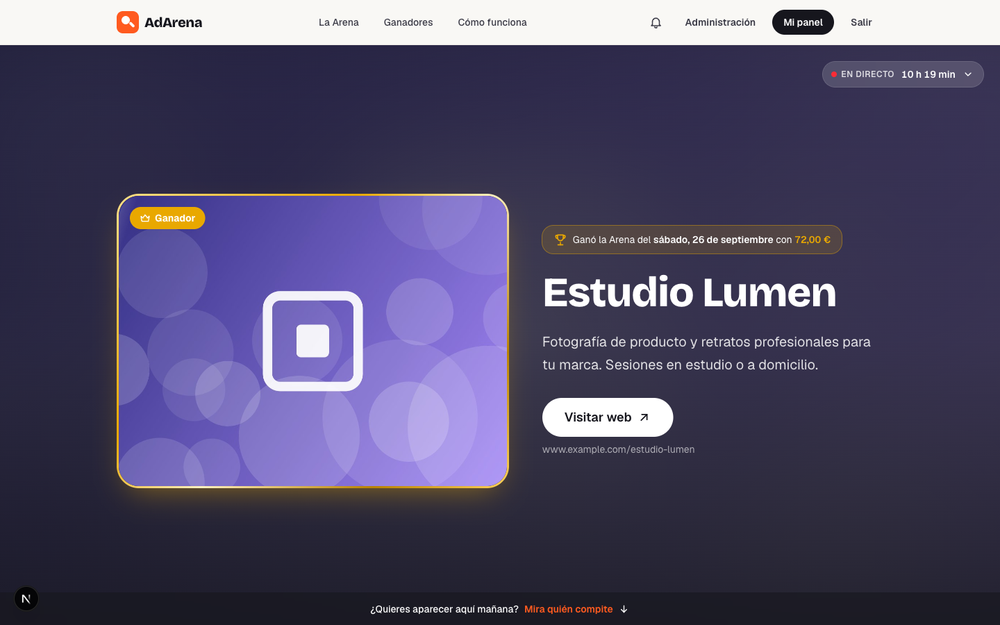
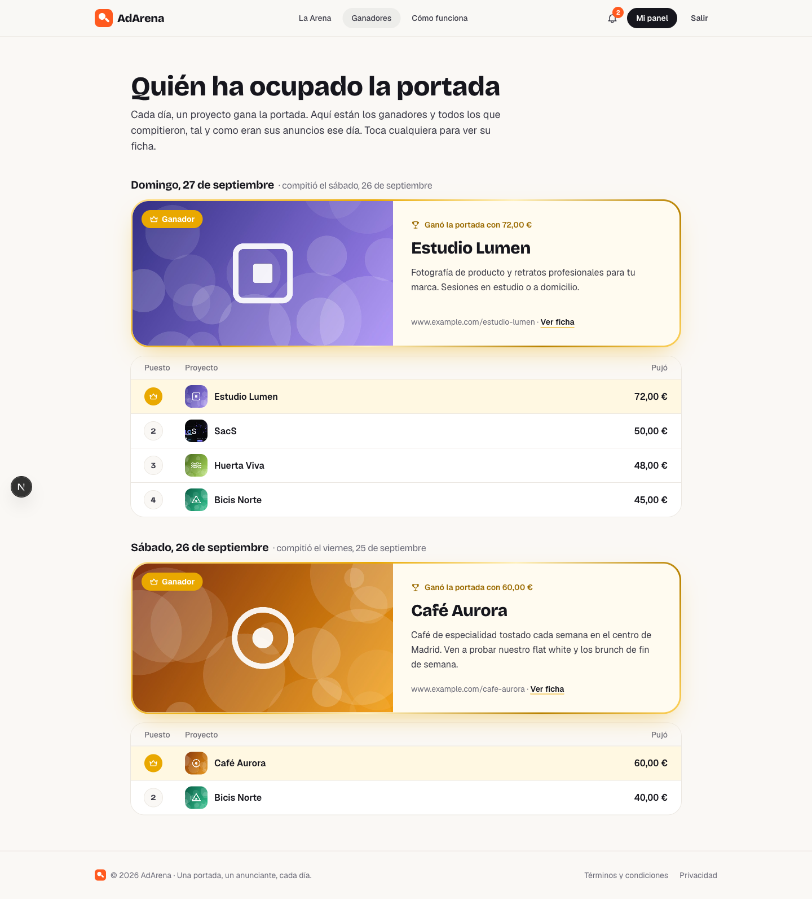
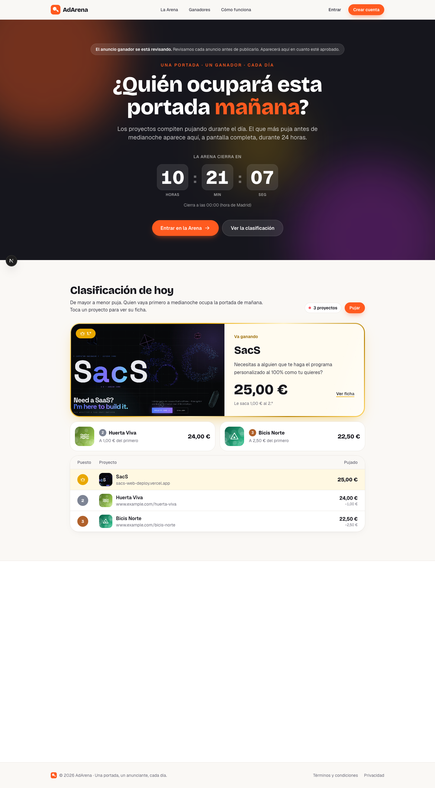
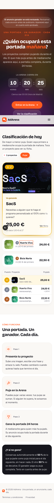
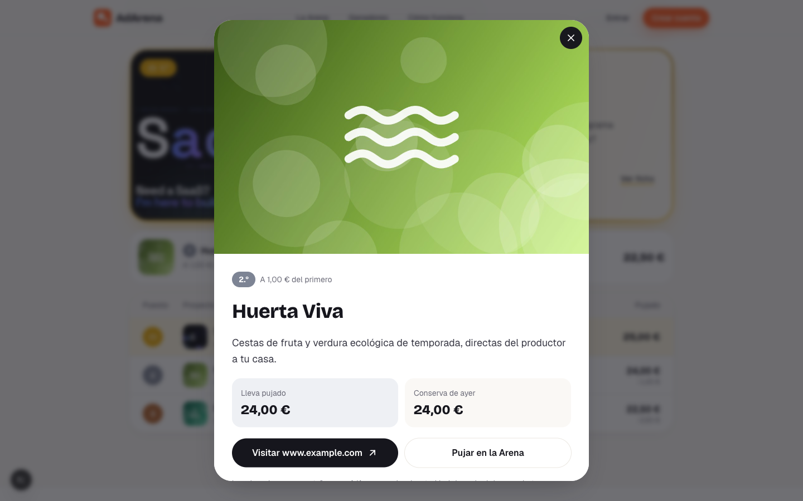
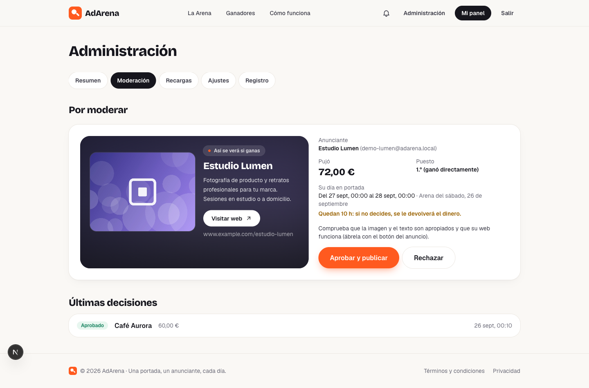
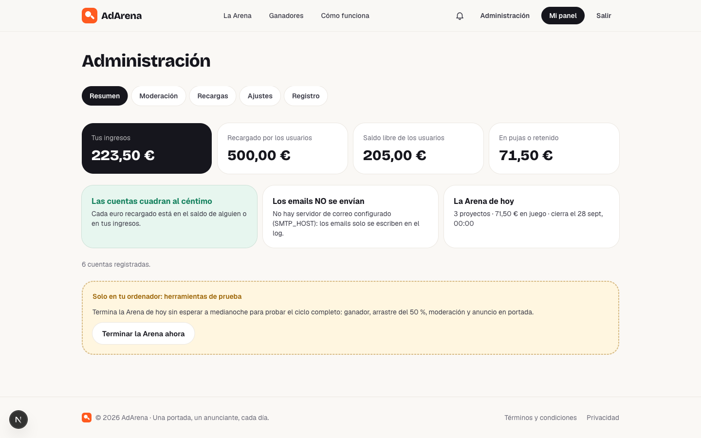

# Fase 8 — Panel de administración, moderación y rediseño del ganador y la clasificación

> **Estado:** ✅ terminada (2026-09-27)
> **Resultado verificable (probado en el navegador con tus datos):**
> - **Administración → Moderación:** aprobé el anuncio de Estudio Lumen (ganó con 72 €) y apareció en portada con su placa de ganador.
> - **Administración → Resumen:** "Las cuentas cuadran al céntimo" (223,50 € de ingresos + 205,00 € libres + 71,50 € en pujas = 500,00 € recargados).
> - La clasificación es una **tabla de mayor a menor** con el 1.º destacado en oro, y **tocar un proyecto abre su ficha**.
> - Capturas en [`img/`](img/).

---

## Índice

1. [Lo que pediste sobre el diseño](#1-lo-que-pediste-sobre-el-diseño)
2. [El ganador, con más protagonismo](#2-el-ganador-con-más-protagonismo)
3. [La clasificación: una tabla clara, de mayor a menor](#3-la-clasificación-una-tabla-clara-de-mayor-a-menor)
4. [La ficha de cada proyecto](#4-la-ficha-de-cada-proyecto)
5. [Moderación: aprobar, rechazar y caducar](#5-moderación-aprobar-rechazar-y-caducar)
6. [El panel de administración](#6-el-panel-de-administración)
7. [La API de administración](#7-la-api-de-administración)
8. [Archivo por archivo](#8-archivo-por-archivo)
9. [Tests](#9-tests)
10. [Cómo usar el panel cada día](#10-cómo-usar-el-panel-cada-día)

---

## 1. Lo que pediste sobre el diseño

| Pediste | Qué se hizo |
|---|---|
| Que el ganador tenga más representación | Marco dorado de "trofeo", insignia **Ganador** y placa "Ganó la Arena del sábado, 26 de septiembre con 72,00 €" en la portada; la misma placa dorada en Ganadores y para quien **va ganando** hoy |
| Que la tabla de quién va 1.º, 2.º… se vea más clara y en orden descendente | Tabla de posiciones **Puesto · Proyecto · Pujado**, siempre de mayor a menor, con medallas de oro, plata y bronce, y lo que le falta a cada uno para alcanzar al primero |
| Que al tocar un proyecto se abra lo que ha indicado (descripción, enlace…) | **Ficha del proyecto** con imagen grande, descripción completa, lo que lleva pujado, lo que conserva de ayer y el botón a su web |

**Criterio de diseño:** la web mantiene su identidad (crema cálido, naranja de marca, tipografías Bricolage y Geist), que ya te gustaba. El único elemento "de lujo" es el **oro del ganador**; todo lo demás se queda sobrio para que el ganador destaque de verdad. Solo hay un efecto que se reproduce solo: un brillo que cruza una vez el marco dorado al cargar la página.

## 2. El ganador, con más protagonismo

- **Portada con ganador:** la imagen del anuncio lleva el **marco dorado** y la insignia "Ganador". Encima del nombre, la placa: *"Ganó la Arena del sábado, 26 de septiembre con 72,00 €"*. Para esto la API de la portada devuelve ahora `wonWithCents` y `roundDate`.
- **Quien va ganando hoy:** la misma placa dorada encabeza la clasificación (grande en la portada, compacta en la Arena), con "Va ganando", su total y cuánto le saca al 2.º.
- **Ganadores:** cada día empieza con la placa dorada de su ganador y debajo la tabla de todos los que compitieron.

## 3. La clasificación: una tabla clara, de mayor a menor

En la **portada**:
1. **Placa dorada** del 1.º (imagen grande, descripción, total y ventaja sobre el 2.º).
2. **Tarjetas del 2.º y el 3.º**, con medalla de plata y bronce y lo que les falta para alcanzar al primero.
3. **Tabla completa**: Puesto · Proyecto (imagen, nombre y web) · Pujado (y la diferencia con el 1.º).

En la **Arena** (`/arena`), la placa del 1.º en versión compacta y la tabla completa, al lado de la tarjeta para pujar. En el móvil, la tarjeta para pujar va primero.

Detalles:
- El orden lo decide el servidor: mayor total primero y, a igualdad, quien llegó antes. La web no reordena nada.
- Cuando alguien puja, la fila **destella** y el importe **sube animado**. Si cambia el primero, la placa dorada destella.
- La tabla es una tabla de verdad (`<table>` con cabeceras y título oculto para lectores de pantalla). Se puede usar con teclado: el nombre de cada proyecto es un botón.
- Probado en escritorio (1440 px) y móvil (390 px) sin desbordamiento horizontal.

## 4. La ficha de cada proyecto

Al tocar cualquier proyecto (en la portada, en la Arena o en Ganadores) se abre su ficha:
- imagen grande;
- su puesto ("2.º · A 1,00 € del primero", "Va primero en la Arena de hoy" o "Ganó la portada");
- nombre y **descripción completa**;
- lo que lleva pujado y lo que conserva de ayer (o su web);
- botón **Visitar** su web (pestaña nueva, `rel="noopener noreferrer sponsored"`) y **Pujar en la Arena**.

Es un `<dialog>` nativo del navegador: se cierra con Escape, con la X o tocando fuera; el foco del teclado se queda dentro mientras está abierta y la página de fondo no se desplaza. En el móvil sale desde abajo, como una hoja; en escritorio, centrada.

## 5. Moderación: aprobar, rechazar y caducar

Tras el cierre, el ganador aparece en **Administración → Moderación** con su anuncio **tal y como se verá en portada**, quién es, cuánto pujó, su puesto, su ventana y cuántas horas quedan.

### Aprobar
- Se cobra lo que tenía retenido (movimiento `BID_WIN_CHARGE`, reservado → tus ingresos).
- El anuncio sale en portada **al instante** en todos los navegadores y el anunciante recibe "Tu anuncio ya está en portada".

### Rechazar (con motivo obligatorio, que se le envía)
1. Se le devuelve el **100 %** a su saldo libre (`WINNER_REFUND`).
2. El **siguiente clasificado** pasa a ser el candidato, con la misma ventana:
   - su arrastre se **retira** de la ronda de hoy (una puja `CARRY_REVERSAL`): ese dinero vuelve a quedar retenido, ahora como candidato, y no puede contar dos veces;
   - se crea su hueco pendiente y recibe "¡Ahora el ganador eres tú!".
3. Si también lo rechazas, pasa el siguiente, y así sucesivamente. Si no quedan más, ese día la portada queda libre.

**El dinero de un candidato que llegó por un rechazo:** en el cierre ya perdió su 50 % (está en tus ingresos) y el otro 50 % era su arrastre (retenido). Si lo apruebas, se cobra el arrastre: en total pagó su puja entera. Si lo rechazas o caduca, se le devuelven **las dos partes**: recupera el 100 %.

Es exactamente la tabla del §3.6 de `ARCHITECTURE.md` (casos A y B), comprobada por los tests.

### Caducar (automático)
Si su día en portada termina sin que decidas, cada minuto una tarea lo marca como caducado y le devuelve el 100 %, con el aviso "Te hemos devuelto tu puja".

### Lo que no se puede hacer
- Moderar dos veces el mismo anuncio (`AD_SLOT_NOT_PENDING`).
- Moderar cuando su ventana ya terminó (`AD_SLOT_WINDOW_OVER`).
- Rechazar sin motivo (`REASON_REQUIRED`).

Cada acción queda en el **registro de auditoría** (quién, qué, cuándo y los detalles).

## 6. El panel de administración

Aparece el enlace **Administración** en la cabecera solo si tu cuenta es de administrador. Secciones:

| Sección | Qué hay |
|---|---|
| **Resumen** | Tus ingresos, lo recargado, el saldo libre de los usuarios y lo que hay en pujas. **Comprobación de las cuentas** (verde si cuadran, rojo si no). Estado de los emails. La Arena de hoy (proyectos, dinero en juego, hora de cierre). Avisos de lo pendiente (anuncios por moderar, recargas por confirmar). En local, "Terminar la Arena ahora" |
| **Moderación** | §5 |
| **Recargas** | Pendientes o todas, búsqueda por código `ADA-…`, "Ha llegado el dinero" (con el importe recibido y, opcional, la referencia del banco) y "Descartar" (con motivo) |
| **Ajustes** | Puja mínima, incremento mínimo, porcentaje de arrastre, hora de cierre, zona horaria y pujas de última hora. **Se aplican desde la siguiente ronda.** Cada cambio queda auditado con el valor anterior y el nuevo |
| **Registro** | Todas las acciones de administración, las más recientes primero |

La protección es doble: la web no muestra nada a quien no es administrador, y el backend exige el rol `ADMIN` en todas las rutas `/api/admin/**` (y otra vez en cada método con `@PreAuthorize`).

## 7. La API de administración

| Método | Ruta | Qué hace |
|---|---|---|
| GET | `/api/admin/overview` | Resumen (§6) |
| GET | `/api/admin/ad-slots/pending` | Anuncios por moderar |
| GET | `/api/admin/ad-slots/recent` | Últimas 20 decisiones |
| POST | `/api/admin/ad-slots/{id}/approve` | Aprobar |
| POST | `/api/admin/ad-slots/{id}/reject` | `{"reason": "…"}` → devuelve cuánto se reembolsó y el hueco del siguiente candidato |
| GET, POST | `/api/admin/top-ups…` | Recargas (ver [FASE-05.md](FASE-05.md)) |
| GET, PUT | `/api/admin/settings` | Ajustes (validados campo a campo) |
| GET | `/api/admin/audit-log?limit=50` | Registro |
| POST | `/api/dev/arena/close-now` | **Solo local:** terminar la Arena ahora |

## 8. Archivo por archivo

### Backend
| Archivo | Nuevo/Mod. | Qué hace |
|---|---|---|
| `adslot/service/ModerationService.java` | Nuevo | Aprobar, rechazar (+ siguiente candidato), caducar y las cuentas del dinero de cada candidato |
| `adslot/service/AdSlotQueryService.java`, `dto/AdminAdSlotView.java` | Nuevos | Listados de moderación |
| `adslot/repository/AdSlotRepository.java` | Mod. | Bloqueo, pendientes, recientes, caducados |
| `admin/controller/AdminController.java` | Nuevo | Todas las rutas `/api/admin/**` |
| `admin/controller/DevToolsController.java` | Nuevo | "Terminar la Arena ahora" (solo local) |
| `admin/service/AdminOverviewService.java`, `AdminAuditService.java`, `repository/AdminAuditLogRepository.java`, `dto/AdminDtos.java` | Nuevos | Resumen y auditoría |
| `settings/service/SettingsService.java`, `dto/SettingsDto.java` | Nuevos | Ajustes con validación y auditoría |
| `home/dto/HomeResponse.java`, `service/HomeService.java` | Mod. | El anuncio actual incluye con cuánto ganó y qué día |
| `home/dto/HistoryPage.java`, `service/HistoryService.java` | Mod. | Cada proyecto del historial lleva su id (para abrir su ficha) |

### Frontend
| Archivo | Nuevo/Mod. | Qué hace |
|---|---|---|
| `components/arena/Leaderboard.tsx` | Nuevo | Placa del 1.º, 2.º y 3.º y tabla de posiciones |
| `components/arena/ProjectDialog.tsx` | Nuevo | Ficha del proyecto |
| `components/arena/medals.ts` | Nuevo | Colores oro, plata y bronce |
| `components/fx/useFlashOnChange.ts` | Nuevo | Destello en filas de tabla |
| `components/home/StandingsSection.tsx` | Nuevo | Sección de clasificación de la portada |
| `components/ad/AdView.tsx` | Mod. | Marco dorado y placa del ganador |
| `components/home/HomeClient.tsx`, `ArenaHero.tsx` | Mod. | Portada con la clasificación nueva |
| `components/arena/ArenaClient.tsx` | Mod. | Clasificación nueva; en el móvil, la tarjeta para pujar primero |
| `components/history/HistoryClient.tsx` | Reescrito | Placa del ganador + tabla de cada día + fichas |
| `components/arena/ProjectCard.tsx`, `ProjectsSection.tsx` | Borrados | Sustituidos por la clasificación |
| `components/admin/*`, `app/admin/**` | Nuevos | Panel de administración |
| `app/globals.css` | Mod. | Colores de medalla, marco de trofeo, brillo y estilo de la ficha |
| `app/panel/layout.tsx`, `app/admin/layout.tsx` | Mod./Nuevo | Títulos de pestaña correctos ("Saldo · Mi panel · AdArena") |

## 9. Tests

| Clase | Tests | Qué comprueba |
|---|---:|---|
| `ModerationIntegrationTest` | 10 | Aprobar cobra y publica (caso A de la tabla); no se modera dos veces; rechazar devuelve el 100 % y promociona al 2.º retirando su arrastre (caso B); aprobar al promocionado cobra su puja entera; rechazar al promocionado le devuelve todo; motivo obligatorio; la participación vaciada no cuenta en el cierre siguiente; caducidad con devolución del 100 % (también del promocionado); nada se modera fuera de plazo |
| `AdminApiIntegrationTest` | 4 | Moderar desde el panel por HTTP (rechazo → promoción → aprobación → portada); resumen con las cuentas cuadradas; los ajustes se aplican desde la siguiente ronda y quedan auditados; ajustes no válidos rechazados campo a campo |

## 10. Cómo usar el panel cada día

1. **Por la mañana:** Administración → **Moderación**. Revisa el anuncio del ganador (abre su web con el botón del anuncio) y **aprueba** o **rechaza** con un motivo. Cuanto antes lo hagas, más horas estará en portada.
2. **Cuando te lleguen transferencias:** Administración → **Recargas** → busca el código del concepto → "Ha llegado el dinero" con el importe exacto.
3. **De vez en cuando:** mira el **Resumen**: la comprobación de cuentas debe estar siempre en verde.
