# Fase 9 — Arena Points: sin dinero real, ganar puntos, Créditos extra y promoción con AdSense

> **Estado:** ✅ terminada (2026-09-27)
> **Resultado verificable (probado en el navegador con una base de datos aparte):**
> - Una cuenta nueva empieza con **200 Arena Points** (se ven en la cabecera).
> - Viendo un proyecto: **+10 cada 10 s**, **+40 de bonus a los 60 s**, y se para en **100 / 100**. Con la pestaña oculta, el contador se pone **en pausa** y no suma nada.
> - Llamando a la API sin esperar (como haría un tramposo): el servidor responde **429 `TICK_TOO_SOON`**.
> - Créditos extra: "Visitar" abre el enlace, "Vuelve en 9 s"… y al volver se suman **+20** solos.
> - Promocionar: publiqué un canal de YouTube gratis; apareció al momento y el administrador lo ve en **Administración → Promociones**.
> - Pujar 1.000 pts en la Arena: la cabecera baja de 4.000 a 3.000 pts al instante.
> - Administración → Resumen: **"Los puntos cuadran"** (40.330 repartidos = 32.330 de los usuarios + 8.000 gastados).
> - Capturas en [`img/`](img/) (las que empiezan por `points-`).

---

## Índice

1. [Lo que pediste y qué se hizo](#1-lo-que-pediste-y-qué-se-hizo)
2. [Decisiones](#2-decisiones)
3. [Arena Points: el dinero pasa a ser puntos](#3-arena-points-el-dinero-pasa-a-ser-puntos)
4. [La Arena con puntos (la subasta no cambia)](#4-la-arena-con-puntos-la-subasta-no-cambia)
5. [Ganar puntos viendo proyectos](#5-ganar-puntos-viendo-proyectos)
6. [Antitrampas: dos barreras](#6-antitrampas-dos-barreras)
7. [Créditos extra (tareas sociales)](#7-créditos-extra-tareas-sociales)
8. [Promocionar tus redes + Google AdSense](#8-promocionar-tus-redes--google-adsense)
9. [Administración](#9-administración)
10. [La API nueva](#10-la-api-nueva)
11. [Base de datos: migración V10](#11-base-de-datos-migración-v10)
12. [Configuración](#12-configuración)
13. [Archivo por archivo](#13-archivo-por-archivo)
14. [Tests](#14-tests)
15. [Lo que tienes que hacer tú](#15-lo-que-tienes-que-hacer-tú)
16. [Límites conocidos](#16-límites-conocidos)

---

## 1. Lo que pediste y qué se hizo

| Pediste | Qué se hizo |
|---|---|
| Cambiar saldo y euros por **Arena Points** | Todo el sistema cuenta en puntos: base de datos (`*_cents` → `*_points`), libro de cuentas, API, textos, emails y avisos. Se han **eliminado** las recargas por transferencia (tablas, endpoints y pantallas) |
| Mantener la subasta de 24 h: el ganador gasta todos sus puntos y sale en portada; los perdedores conservan el 50 % | Intacto. Solo cambia la unidad: la misma lógica, probada por los mismos tests |
| Ganar puntos visitando proyectos del ranking: 10 cada 10 s, bonus a los 60 s (100 en total), máx. 100 al día por proyecto | Página **Gana puntos** (`/ganar`) con los proyectos de hoy y una página propia por proyecto (`/proyecto/[id]`) con el contador. 6 ticks × 10 + bonus de 40 = **100** |
| Antitrampas estricto en el frontend (Page Visibility API, onblur/onfocus) | El contador se para **al instante** si la pestaña se oculta, si la ventana pierde el foco o si llevas 45 s sin tocar nada. Y además, lo que decide de verdad es el **servidor** (ver §6) |
| Créditos extra: tareas diarias que abren un enlace externo y dan la recompensa tras confirmar la visita | Pestaña **Créditos extra** (`/ganar/extra`). Al pulsar "Visitar" se abre el enlace y el servidor apunta la hora; al volver, pasados 10 s, los puntos se suman solos |
| Panel de promoción donde los usuarios envían sus enlaces gratis para que salgan como tareas | Página **Promocionar** (`/promocionar`): se publican al momento, gratis, hasta 5 a la vez; con estadísticas de visitas, pausa y borrado |
| Contenedores preparados para Google AdSense (laterales, in-feed…) | En `/promocionar`: **banner superior**, **lateral fijo de 300×600**, **in-feed** entre la lista y **banner inferior**. Se activan con variables de entorno (§8.4) |

## 2. Decisiones

### Las que tomaste tú

| Pregunta | Tu respuesta | Qué implica |
|---|---|---|
| ¿Las tareas dan puntos por **seguir/dar like** o por **visitar**? | **Por visitar** | Nunca pedimos likes ni seguidores. Así no incumplimos las normas de YouTube, X o Instagram (prohíben el "engagement" pagado o incentivado), y no hace falta comprobar nada en su web |
| ¿Las promociones de los usuarios se publican **al momento** o tras revisión? | **Al momento** | Los usuarios pueden denunciar; con **3 denuncias** de personas distintas se ocultan solas hasta que las revises, y tú puedes ocultar cualquiera con un motivo (su dueño recibe un aviso) |

### Las que tomé yo (y por qué)

| Decisión | Motivo |
|---|---|
| **1 céntimo antiguo = 1 punto** (72,00 € → 7.200 pts) | La migración no tiene que multiplicar ni redondear nada: solo cambia el nombre de las columnas. Los mínimos de puja pasan de 1 € a 100 pts |
| Regalo de **200 puntos** al registrarse | Para que una cuenta nueva pueda pujar el mínimo (100) desde el primer día |
| Anuncios de AdSense **solo** en `/promocionar` | Las normas de AdSense prohíben pagar (con puntos o lo que sea) por ver anuncios, y los sitios de "gana por navegar". Por eso **nunca** hay anuncios en Gana puntos, Créditos extra ni en la página de un proyecto |
| El contador se mide en **nuestra** página del proyecto, no en la web del anunciante | Un navegador no puede saber cuánto tiempo pasas en otra web. En `/proyecto/[id]` sí: ves imagen, descripción y enlace, y el tiempo cuenta. Si pulsas "Visitar web", se abre en otra pestaña y el contador se pausa |
| Idle a los 45 s | Una pestaña olvidada no debe dar puntos. Mover el ratón, tocar la pantalla, hacer scroll o pulsar una tecla cuentan como actividad |
| Tareas: **20 pts**, mínimo **10 s**, **10 al día**, cada una **una vez al día** | Suficiente para que merezca la pena sin que las tareas valgan más que ver los proyectos que compiten |
| Máximo **5 promociones activas** por usuario y 30 publicaciones por hora por IP | Evita que una sola persona llene los Créditos extra de todos |
| Solo enlaces `https://` públicos | Seguridad de quien los visita (nada de `http://`, `javascript:`, IPs privadas…) |
| Nueva versión de términos `2026-09-27` | Los términos cambian de fondo (ya no hay dinero). Las cuentas nuevas aceptan esta versión |

## 3. Arena Points: el dinero pasa a ser puntos

### 3.1 Qué son

- **No son dinero**: no se compran, no se venden, no se retiran y no se pasan de una cuenta a otra.
- Se consiguen gratis: **200** al registrarte, viendo proyectos (hasta **100 al día por proyecto**) y con los Créditos extra (**20 por tarea**, hasta **10 al día**).
- Solo sirven para pujar en la Arena.

### 3.2 El libro de cuentas sigue siendo de partida doble

Todo lo que ya protegía el dinero protege ahora los puntos: cada movimiento son apuntes que **suman cero**, las tablas son de solo inserción, ninguna cuenta de usuario puede quedar en negativo y cada operación lleva una clave de idempotencia.

Cambian las cuentas del sistema:

| Antes | Ahora | Para qué |
|---|---|---|
| `PAYMENTS_CLEARING` (dinero que entraba de fuera) | **`POINTS_ISSUED`** | De aquí salen todos los puntos que se reparten. Su saldo es negativo: "puntos emitidos" |
| `PLATFORM_REVENUE` (tus ingresos) | **`POINTS_SPENT`** | Aquí acaban los puntos gastados: la puja del ganador y el 50 % que pierden los demás |

Tipos de movimiento nuevos:

| Movimiento | De → a | Clave de idempotencia |
|---|---|---|
| `SIGNUP_BONUS` | POINTS_ISSUED → disponible del usuario | `signup:<userId>` |
| `VIEW_REWARD` | POINTS_ISSUED → disponible | `view:<viewId>:<nº de tick>` |
| `TASK_REWARD` | POINTS_ISSUED → disponible | `task:<completionId>` |
| `TEST_GRANT` | POINTS_ISSUED → disponible (solo en tu ordenador) | `demo:points:…` / `test:…` |
| `BID_RESERVE`, `BID_FORFEIT`, `BID_WIN_CHARGE`, `WINNER_REFUND`, `ADMIN_ADJUSTMENT` | Igual que antes, en puntos | Igual que antes |
| `TOP_UP` | Se conserva solo para leer movimientos antiguos | — |

**La regla que siempre se cumple:**

```
puntos repartidos (POINTS_ISSUED) = puntos de los usuarios (disponibles + en pujas) + puntos gastados (POINTS_SPENT)
```

La comprueban los tests y el panel de administración ("Los puntos cuadran").

## 4. La Arena con puntos (la subasta no cambia)

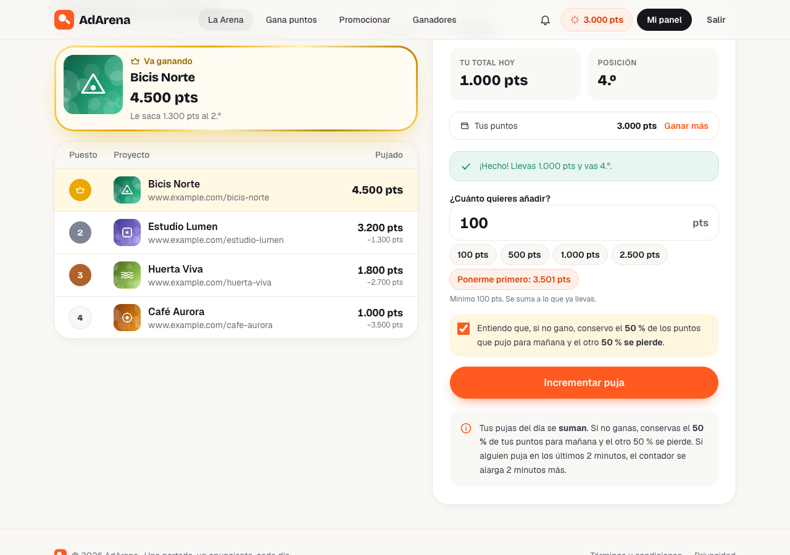

Mismas reglas, en puntos:

- Primera puja del día ≥ **100 pts**; cada aportación siguiente ≥ **100 pts**. Tus pujas del día se suman.
- A las 00:00 (Madrid) gana el total más alto; a igualdad, quien llegó antes.
- **Ganador:** sus puntos quedan retenidos hasta que apruebas el anuncio; al aprobarlo, **se gastan todos**.
- **Perdedores:** conservan el **50 %** como puja inicial de mañana; el otro 50 % se pierde (pasa a `POINTS_SPENT`).
- **Rechazas al ganador** o no lo revisas a tiempo: recupera el 100 % y pasa el siguiente.

Ejemplo: Ana tiene 1.600 pts y puja 1.000 + 600; Luis puja 1.200.

| Momento | Ana disponible | Ana en pujas | Luis en pujas | Gastados |
|---|---:|---:|---:|---:|
| Tras las pujas | 0 | 1.600 | 1.200 | 0 |
| Cierre: gana Ana, Luis pierde el 50 % | 0 | 1.600 | 600 *(para mañana)* | 600 |
| Apruebas el anuncio de Ana | 0 | 0 | 600 | **2.200** |

La tarjeta de pujar tiene botones rápidos (100, 500, 1.000, 2.500 pts), "Ponerme primero" y el enlace **Ganar más** si te faltan puntos. Tras pujar, la cabecera se actualiza al instante.

## 5. Ganar puntos viendo proyectos

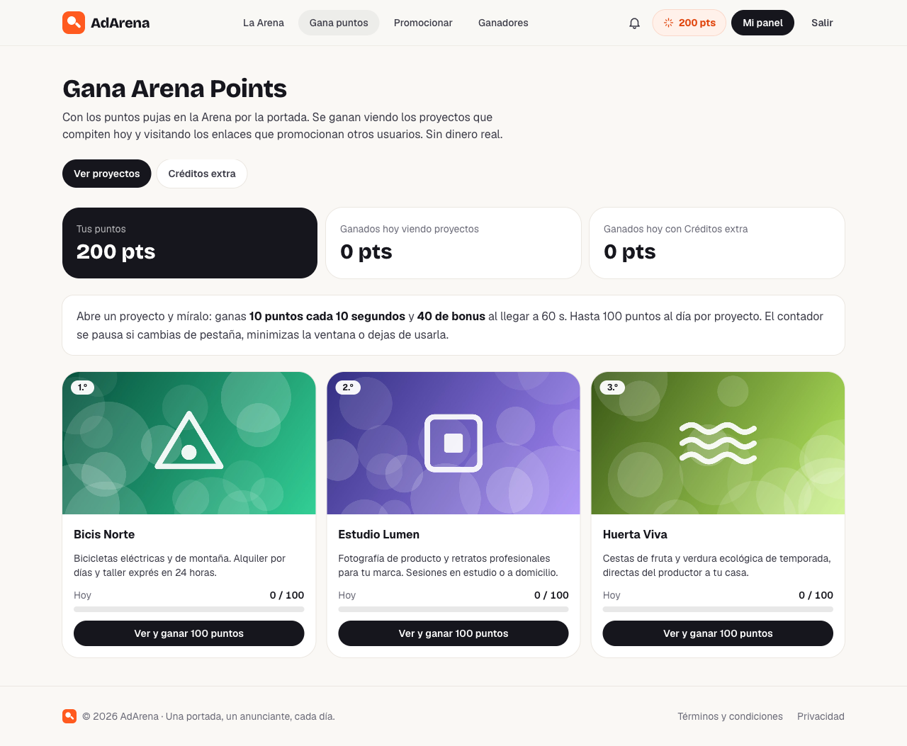

### 5.1 Cómo lo ve el usuario

1. Entra en **Gana puntos** (`/ganar`). Ve sus puntos, lo ganado hoy y los proyectos que compiten hoy (en el orden de la clasificación), cada uno con su barra "Hoy 0 / 100".
2. Pulsa **Ver y ganar 100 puntos** → se abre la página del proyecto (`/proyecto/[id]`): imagen grande, descripción, lo que lleva pujado, lo que conserva de ayer y el botón a su web.
3. Arriba, la barra de puntos: un anillo que se llena cada 10 s, "+10" flotando al sumar y el total "Hoy con este proyecto: 30 / 100".

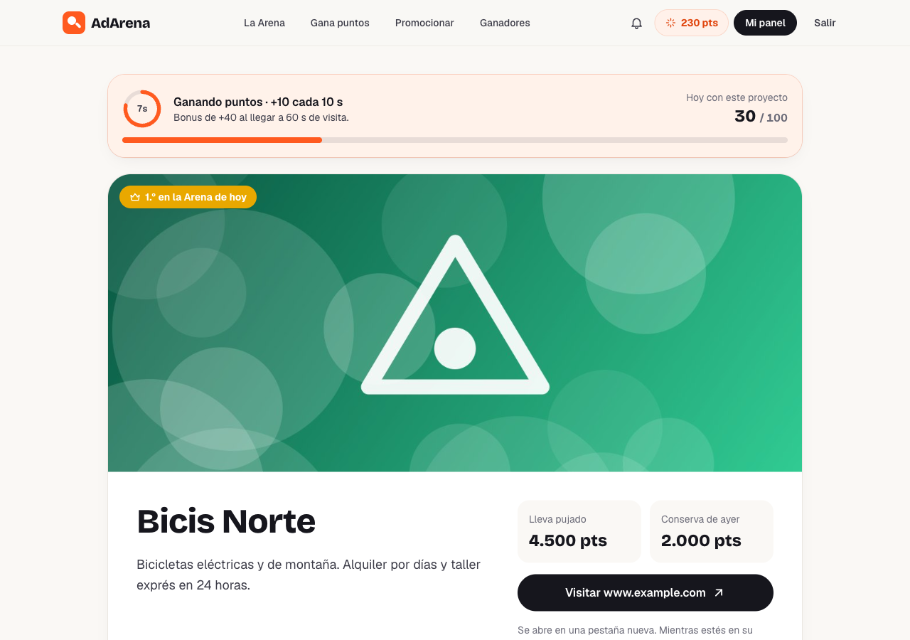

4. Si cambia de pestaña, minimiza, pulsa en otra aplicación o deja de tocar la página 45 s → **Contador en pausa**. El tiempo en pausa no cuenta.

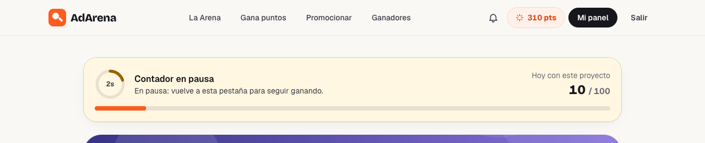

5. Al llegar a 100: **¡Completado!** y "Ver más proyectos".

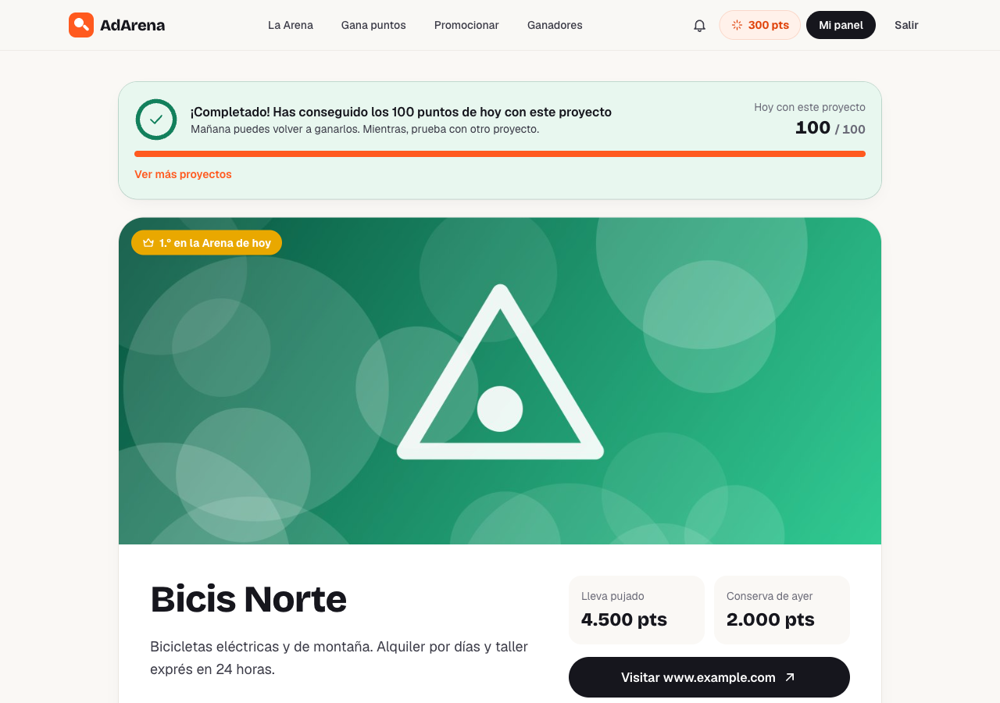

Otros estados: sin sesión ("Entra para ganar puntos"), tu propio proyecto ("Tu proyecto no te da puntos") y proyecto que ya no compite hoy.

### 5.2 Reglas

| Regla | Valor |
|---|---|
| Puntos por tick | 10 cada 10 s de visualización activa |
| Bonus | +40 al completar 60 s (el 6.º tick) → 6 × 10 + 40 = **100** |
| Límite | 100 pts al día por proyecto (por la **empresa**, no por su puja: el día es el de Madrid) |
| Qué proyectos | Solo los que compiten en la Arena de hoy, excepto el tuyo |
| Contador global | Como mucho **un tick cada 10 s por usuario**, sumando todos los proyectos |

Con 3 proyectos compitiendo, se pueden ganar hasta 300 pts al día viendo proyectos, más 200 con los Créditos extra.

## 6. Antitrampas: dos barreras

### Barrera 1: el navegador (`lib/useActiveTimer.ts`)

Cada 200 ms comprueba tres cosas y, si alguna falla, **no suma**:

| Comprobación | Cómo | Qué la dispara |
|---|---|---|
| ¿Se ve la pestaña? | `document.visibilityState` + evento `visibilitychange` (Page Visibility API) | Otra pestaña, ventana minimizada, pantalla bloqueada, móvil en otra app |
| ¿Tiene el foco la ventana? | `document.hasFocus()` + eventos `blur` / `focus` | Pulsar en otra aplicación o en otra ventana |
| ¿Hay alguien? | Último `pointermove`, `pointerdown`, `keydown`, `wheel`, `scroll` o `touchstart` | 45 s sin tocar nada |

Detalles importantes:
- Reacciona en el **mismo instante** del evento, sin esperar a la siguiente comprobación.
- Solo suma un intervalo si la página estaba activa **al principio y al final** de ese intervalo.
- No se fía de los eventos: consulta el estado real (`hasFocus()`). Un `blur` lanzado a mano desde la consola no engaña al contador en ningún sentido.

**Pero todo lo que ocurre en el navegador se puede manipular** (con la consola o un script). Por eso existe la segunda barrera.

### Barrera 2: el servidor (`ViewRewardService`)

Aunque alguien reescriba el JavaScript o llame a la API con un robot:

| Regla del servidor | Cómo |
|---|---|
| **Primero hay que abrir la página** | `POST /start` apunta la hora de inicio con el reloj del servidor. Sin eso, `409 VIEW_NOT_STARTED` |
| **Nadie gana más deprisa que el reloj** | Un tick exige 10 s (menos 0,4 s de margen por la red) desde el último tick **de cualquier proyecto** y desde que abrió esta página. Si no: `429 TICK_TOO_SOON` |
| **Muchas pestañas no sirven** | Los ticks de un usuario se procesan de uno en uno (se bloquean sus cuentas de puntos) y el límite de 10 s es global. 5 pestañas abiertas = los mismos 10 pts cada 10 s |
| **Límite diario** | 100 por proyecto; una restricción `UNIQUE (visitante, empresa, día)` impide duplicar el contador |
| **Tu proyecto no cuenta** | Comprobado en el servicio y además con un `CHECK` en la base de datos |
| **Sin puntos dobles** | Cada tick tiene su clave de idempotencia (`view:<id>:<nº>`); repetir la misma petición no suma dos veces |

Lo probé contra la API: abrir la página y pedir un tick al instante → `429 TICK_TOO_SOON`, dos veces seguidas.

## 7. Créditos extra (tareas sociales)

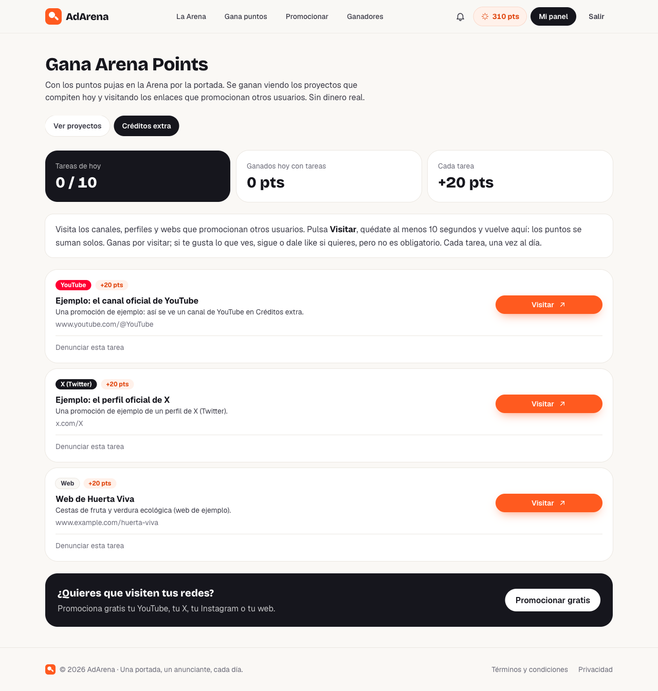

### 7.1 Cómo funciona

1. En **Gana puntos → Créditos extra** hay una lista de enlaces que promocionan otros usuarios (YouTube, X, Instagram, TikTok, Twitch, LinkedIn, Facebook, GitHub o una web), con su color y **+20 pts**.
2. **Visitar** → se abre el enlace en otra pestaña (en el mismo clic, para que el navegador no lo bloquee) y el servidor apunta la hora (`POST /start`).
3. La tarea muestra "Vuelve en 9 s…". Al volver a AdArena, pasados los 10 s, los puntos **se reclaman solos** (`POST /claim`). También hay un botón "Reclamar" por si acaso.
4. La tarea queda "Hecha hoy".

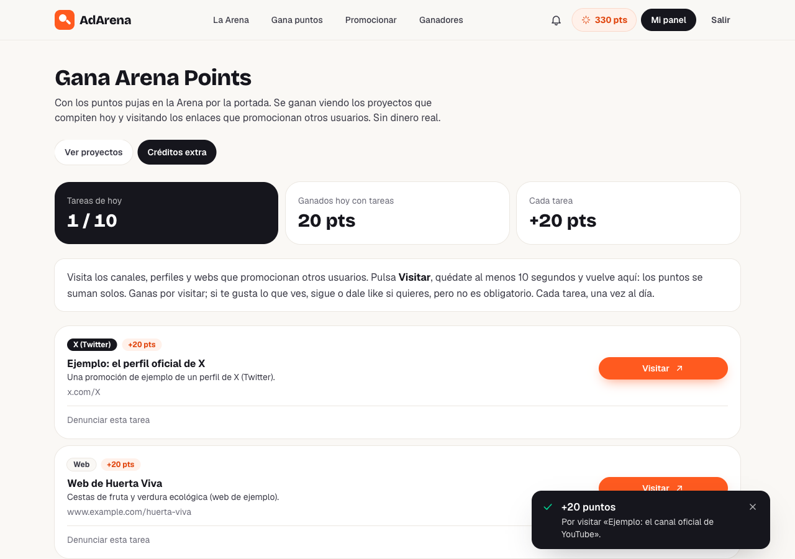

### 7.2 Reglas (todas en el servidor)

| Regla | Error si no se cumple |
|---|---|
| Hay que pulsar "Visitar" antes de reclamar | `409 TASK_NOT_STARTED` |
| Han pasado ≥ 10 s **según el reloj del servidor** | `409 TASK_TOO_SOON` |
| Cada tarea, una vez al día | `409 TASK_ALREADY_DONE` |
| Máximo 10 tareas al día | `409 TASK_DAILY_LIMIT` |
| Tus propias promociones no cuentan | `409 OWN_TASK` |
| La tarea sigue publicada | `409 TASK_UNAVAILABLE` |

**Por qué "visitar" y no "seguir":** no podemos comprobar si alguien te sigue sin conectarnos a la cuenta de cada red, y **pagar por likes o seguidores está prohibido** en YouTube, X, Instagram y TikTok (podrían cerrar el canal de quien se promociona). El texto de la página lo deja claro: "Ganas por visitar; si te gusta lo que ves, sigue o dale like si quieres".

### 7.3 Denuncias

Debajo de cada tarea: **Denunciar esta tarea** con un motivo. Cada usuario puede denunciar una tarea una vez (`409 ALREADY_REPORTED`). Con **3 denuncias** la tarea se oculta sola y su dueño recibe el aviso `TASK_HIDDEN`; tú decides en Administración → Promociones si vuelve a publicarse.

## 8. Promocionar tus redes + Google AdSense

### 8.1 La página

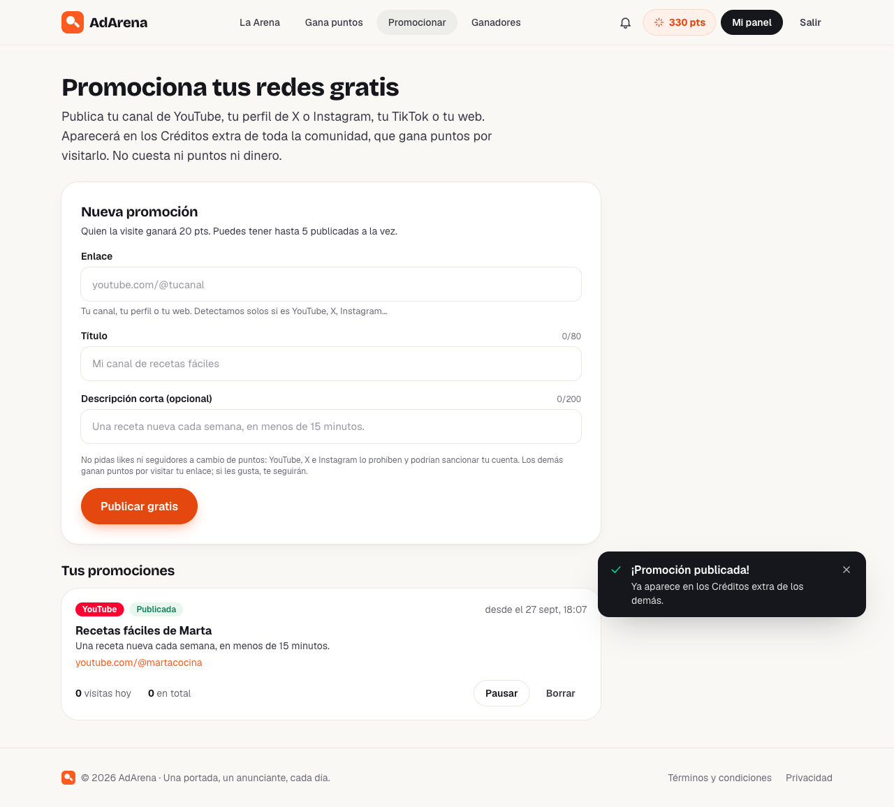

- **Sin sesión:** explica los 3 pasos y ofrece crear cuenta.
- **Con sesión:** formulario (enlace, título de hasta 80 caracteres, descripción opcional de 200) y **Tus promociones**, cada una con su red detectada automáticamente, estado (Publicada / En pausa / Oculta por revisión, con el motivo), **visitas hoy** y **en total**, y los botones Pausar/Reanudar y Borrar.
- Publicar **no cuesta nada**. Aviso en el formulario: "No pidas likes ni seguidores a cambio de puntos".

### 8.2 Dónde van los anuncios

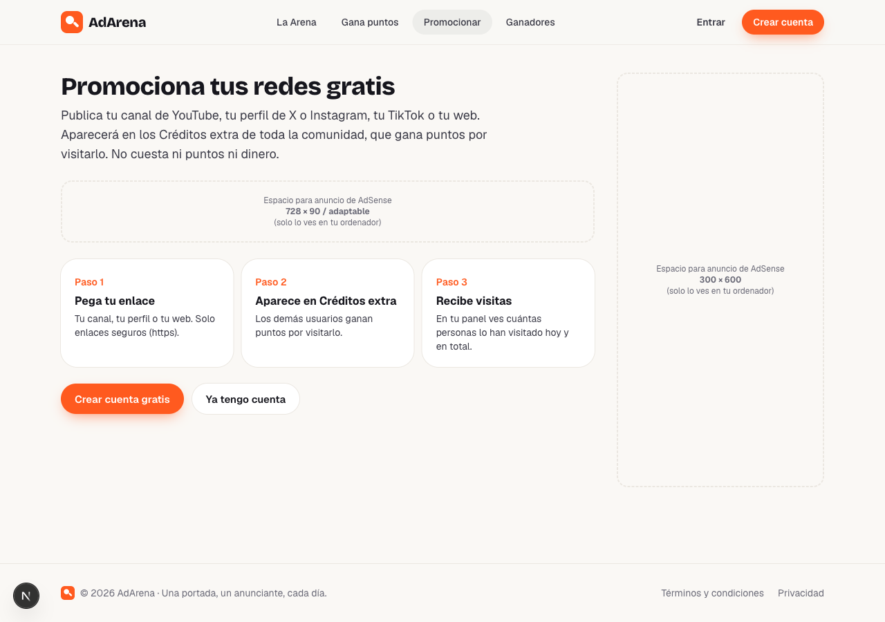

| Bloque | Dónde | Tamaño | Variable |
|---|---|---|---|
| Banner superior | Bajo el título | Adaptable (728×90 en escritorio) | `NEXT_PUBLIC_ADSENSE_SLOT_BANNER` |
| Lateral | Columna derecha, fijo al hacer scroll (solo escritorio ≥ 1024 px) | 300×600 | `NEXT_PUBLIC_ADSENSE_SLOT_SIDEBAR` |
| In-feed | Tras la 2.ª promoción de tu lista (o entre los pasos, en móvil, sin sesión) | Adaptable | `NEXT_PUBLIC_ADSENSE_SLOT_INFEED` |
| Banner inferior | Al final de la lista | Adaptable | `NEXT_PUBLIC_ADSENSE_SLOT_BANNER` |

En tu ordenador (`./dev.sh`) ves recuadros discontinuos "Espacio para anuncio de AdSense" para ver cómo quedan. En producción, **sin configurar AdSense no se ve nada ni se carga nada de Google** (ni scripts ni cookies).

En el móvil el lateral desaparece y quedan los banners:

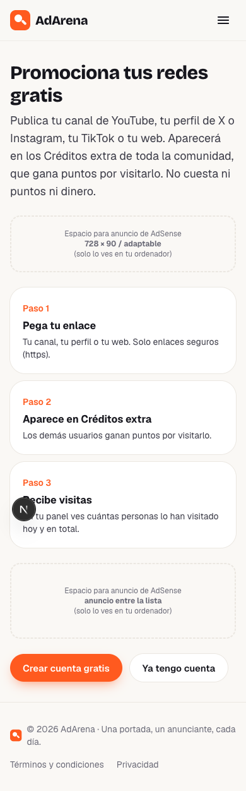

### 8.3 Cumplir las normas de AdSense

| Norma de Google | Cómo se cumple |
|---|---|
| No compensar a los usuarios por ver o pulsar anuncios | No hay anuncios en ninguna página donde se ganan puntos. Los puntos nunca dependen de los anuncios |
| Nada de "tráfico pagado" (paid-to-surf, autosurf, intercambio de clics) en páginas con anuncios | Los anuncios solo están en `/promocionar`, donde nadie gana nada |
| No animar a pulsar anuncios | Solo pone "Publicidad" encima de cada bloque, como exige Google |
| `ads.txt` | Se genera solo en `/ads.txt` a partir de tu ID de editor |
| Consentimiento de cookies en Europa (EEE/Reino Unido) | Google exige una CMP certificada: activa **la suya** (Privacidad y mensajes, §15). La carga el mismo script de AdSense |

> ⚠️ **No actives los "Anuncios automáticos" (Auto ads) en AdSense.** Google los colocaría por su cuenta en cualquier página, incluidas las que dan puntos, y eso incumple sus normas. Usa solo los **bloques de anuncios** que creas tú.

### 8.4 Activarlo (variables de Vercel)

```
NEXT_PUBLIC_ADSENSE_CLIENT=ca-pub-1234567890123456
NEXT_PUBLIC_ADSENSE_SLOT_BANNER=1234567890
NEXT_PUBLIC_ADSENSE_SLOT_SIDEBAR=1234567890
NEXT_PUBLIC_ADSENSE_SLOT_INFEED=1234567890
```

Al estar configurado `NEXT_PUBLIC_ADSENSE_CLIENT` (y solo entonces):
- `/ads.txt` responde `google.com, pub-…, DIRECT, f08c47fec0942fa0` (sin AdSense responde 404).
- En `/promocionar` se carga el script de AdSense y se pintan los bloques `<ins class="adsbygoogle">`.
- La **CSP** se abre a `https:` en scripts, imágenes, iframes y conexiones. Google [solo admite CSP basadas en *nonce* o abiertas](https://support.google.com/adsense/answer/16283098), no listas de dominios, porque sus dominios cambian. Se aplica en todas las páginas porque la web navega sin recargar: si solo se abriera en `/promocionar`, entrar desde la portada dejaría los anuncios bloqueados.

Lo verifiqué con un ID ficticio: `ads.txt` correcto, CSP abierta, 2 bloques `<ins>` en `/promocionar` y **0** en `/ganar`.

## 9. Administración

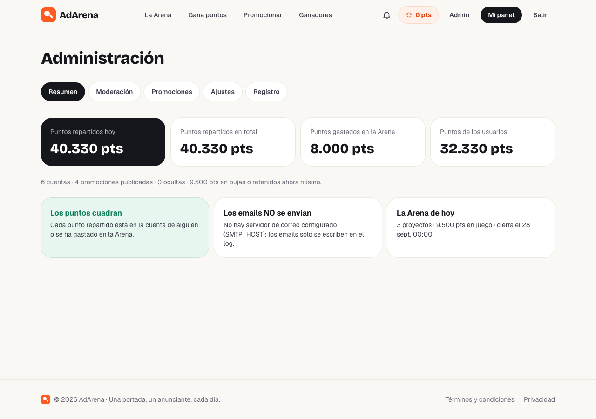

**Resumen:** puntos repartidos hoy y en total, puntos gastados en la Arena, puntos de los usuarios (y cuántos están en pujas), cuentas, promociones publicadas, denunciadas y ocultas, estado de los emails y la Arena de hoy. El cuadro **"Los puntos cuadran"** comprueba la regla del §3.2. Si hay promociones denunciadas, aparece un enlace directo.

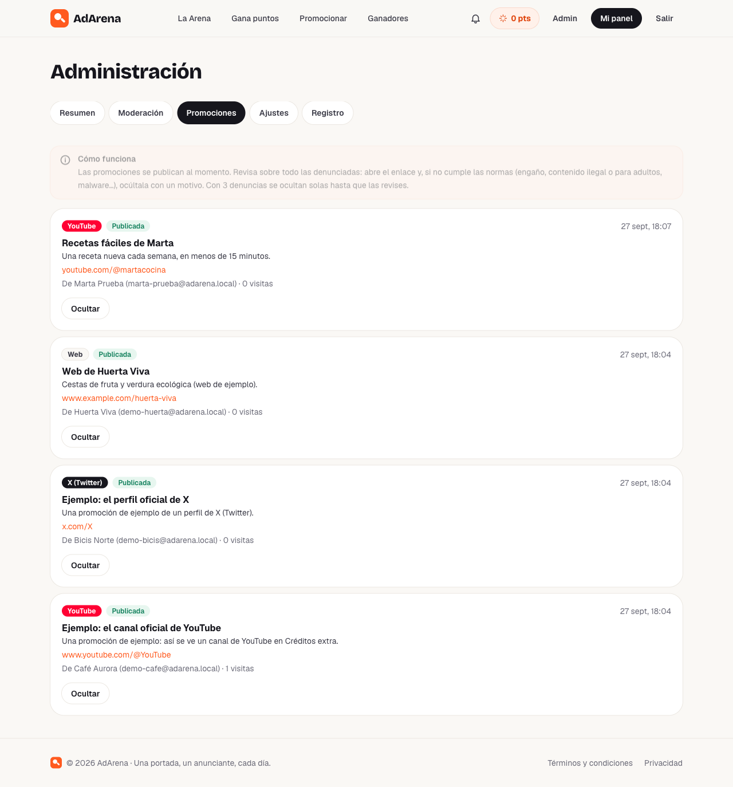

**Promociones** (sustituye a "Recargas"): todas las promociones (primero las ocultas, después las más denunciadas y luego las más recientes), con su dueño, visitas, motivos de las denuncias, y los botones **Ocultar** (con motivo; se lo enviamos al dueño) y **Volver a publicar**. Cada acción queda en el **Registro** (`TASK_HIDDEN`, `TASK_RESTORED`).

**Ajustes:** la puja mínima y el incremento mínimo ahora se escriben en puntos.

## 10. La API nueva

| Método | Ruta | Acceso | Qué hace |
|---|---|---|---|
| GET | `/api/me/points` | Sesión | Tus puntos (disponibles y en pujas) y últimos movimientos |
| GET | `/api/earn` | Sesión | Proyectos de hoy con lo ganado con cada uno, reglas y totales |
| POST | `/api/earn/projects/{id}/start` | Sesión | Abre la página de un proyecto (empieza a contar el servidor) |
| POST | `/api/earn/projects/{id}/tick` | Sesión | 10 s más → puntos |
| GET | `/api/earn/tasks` | Sesión | Créditos extra de hoy |
| POST | `/api/earn/tasks/{id}/start` | Sesión | "Visitar" |
| POST | `/api/earn/tasks/{id}/claim` | Sesión | Reclamar tras 10 s |
| POST | `/api/earn/tasks/{id}/report` | Sesión | Denunciar `{"reason": "…"}` |
| GET / POST | `/api/promotions` | Sesión | Tus promociones / publicar una `{"title","url","description"}` |
| POST | `/api/promotions/{id}/pause` · `/resume` | Sesión (dueño) | Pausar / reanudar |
| DELETE | `/api/promotions/{id}` | Sesión (dueño) | Borrar |
| GET | `/api/public/projects/{id}` | Público | Ficha de un proyecto de la Arena de hoy |
| GET | `/api/admin/tasks` | Admin | Todas las promociones |
| POST | `/api/admin/tasks/{id}/hide` · `/restore` | Admin | Ocultar `{"reason"}` / volver a publicar |
| POST | `/api/dev/points` | Solo en local | Puntos de prueba `{"points": 1000}` (máx. 100.000) |

**Eliminadas:** `/api/me/wallet`, `/api/me/top-ups/**`, `/api/admin/top-ups/**` y `/api/dev/wallet`.

Errores nuevos: `TICK_TOO_SOON` (429), `VIEW_NOT_STARTED`, `OWN_PROJECT`, `PROJECT_NOT_IN_ARENA`, `PROJECT_NOT_FOUND` (404), `TASK_TOO_SOON`, `TASK_NOT_STARTED`, `TASK_ALREADY_DONE`, `TASK_DAILY_LIMIT`, `OWN_TASK`, `TASK_UNAVAILABLE`, `ALREADY_REPORTED`, `PROMOTION_LIMIT` y errores de campo en `title`/`url`.

## 11. Base de datos: migración V10

`V10__arena_points.sql` (las migraciones anteriores no se tocan):

1. Renombra todas las columnas `*_cents` a `*_points` (subastas, participaciones, pujas, huecos, ajustes, ledger). Los valores no cambian: 1 céntimo = 1 punto.
2. Reescribe el trigger que exige que cada transacción sume cero y la vista `ledger_account_mismatches` con los nombres nuevos.
3. Cuentas del sistema: `PAYMENTS_CLEARING` → `POINTS_ISSUED` y `PLATFORM_REVENUE` → `POINTS_SPENT`, con sus restricciones.
4. Tipos de movimiento: añade `SIGNUP_BONUS`, `VIEW_REWARD`, `TASK_REWARD` y `TEST_GRANT`.
5. **Borra** `top_ups` y `payment_events` (recargas).
6. Tipos de aviso: quita los de recargas y añade `TASK_HIDDEN`.
7. Tablas nuevas:

| Tabla | Para qué | Restricciones clave |
|---|---|---|
| `project_views` | Lo que cada usuario ha visto de cada empresa cada día: inicio de la sesión, ticks, puntos, bonus, último tick | `UNIQUE (viewer, owner, view_date)`, `CHECK (viewer <> owner)`, puntos ≥ 0 |
| `social_tasks` | Las promociones: red, título, enlace, estado, puntos, denuncias, visitas, motivo de ocultación | `url LIKE 'https://%'`, red y estado de una lista cerrada |
| `social_task_completions` | Quién ha hecho qué tarea cada día y cuándo la empezó | `UNIQUE (task, user, task_date)` |
| `social_task_reports` | Denuncias | `UNIQUE (task, user)`: una por persona |

## 12. Configuración

Backend (`.env` en Railway; todas opcionales, estos son los valores por defecto):

| Variable | Por defecto | Qué es |
|---|---|---|
| `SIGNUP_BONUS_POINTS` | 200 | Puntos de regalo al registrarse |
| `TASK_REWARD_POINTS` | 20 | Puntos por tarea de Créditos extra |
| `TASKS_PER_DAY` | 10 | Máximo de tareas por usuario y día |

El resto de valores (10 s, 10 pts, bonus a 60 s de 40 pts, límite 100, 10 s mínimos por tarea, 5 promociones activas, 3 denuncias) están en `application.yml` → `app.rewards`.

**Eliminadas:** `BANK_IBAN`, `BANK_BENEFICIARY`, `BANK_NAME`, `MIN_TOP_UP_CENTS`, `MAX_TOP_UP_CENTS`. Si las tienes en Railway, puedes borrarlas.

Frontend (Vercel): las 4 variables de AdSense del §8.4 (opcionales).

## 13. Archivo por archivo

### Backend

| Archivo | Cambio |
|---|---|
| `db/migration/V10__arena_points.sql` | Nuevo (§11) |
| `common/config/AppProperties.java` | Fuera `Payments`; nuevo `Rewards` (`Views`, `Tasks`) |
| `application.yml`, `application-dev.yml`, `application-test.yml` | Bloque `app.rewards`; fuera los datos bancarios; límite `promotions`; términos `2026-09-27` |
| `common/text/Points.java` | Sustituye a `Money`: "1.250 puntos" |
| `wallet/domain/LedgerAccountType.java`, `LedgerTransactionType.java` | Cuentas y movimientos en puntos (§3.2) |
| `wallet/service/WalletService.java` | `grant(...)` para dar puntos desde `POINTS_ISSUED`, `grantTestPoints`, totales en puntos |
| `wallet/repository/LedgerEntryRepository.java`, `MovementRow.java` | Movimientos del usuario y puntos repartidos desde una fecha |
| `wallet/controller/WalletController.java`, `DevWalletController.java` | `GET /api/me/points` y `POST /api/dev/points` |
| `earn/domain/*` | `ProjectView`, `SocialTask`, `SocialTaskCompletion`, `SocialTaskReport`, `SocialPlatform` (detecta la red por el dominio), `SocialTaskStatus` |
| `earn/repository/*` | Consultas con bloqueo (`FOR UPDATE`), alta sin duplicados (`ON CONFLICT DO NOTHING`), contadores |
| `earn/service/RewardRules.java` | Reglas y "hoy" en la zona horaria de la Arena |
| `earn/service/ViewRewardService.java` | Ver proyectos y antitrampas (§5, §6) |
| `earn/service/SocialTaskService.java` | Créditos extra y denuncias (§7) |
| `earn/service/PromotionService.java` | Promociones del usuario y moderación del admin (§8, §9) |
| `earn/controller/*` | `EarnController`, `PromotionController`, `PublicProjectController` |
| `earn/dto/EarnDtos.java` | Todos los objetos de entrada y salida |
| `user/service/AuthService.java` | Regalo de bienvenida al registrarse |
| `auction/**`, `adslot/**`, `home/**` | Mismos cálculos con nombres en puntos (`totalPoints`, `wonWithPoints`…) |
| `notification/Notices.java`, `NotificationType.java` | Textos en puntos; aviso `TASK_HIDDEN`; fuera los de recargas |
| `admin/**` | Resumen en puntos, endpoints de promociones, fuera los de recargas |
| `demo/DemoDataSeeder.java`, `DemoTasksSeeder.java` | Datos de ejemplo en puntos y 3 promociones de ejemplo |
| `payment/**` | **Eliminado** |

### Frontend

| Archivo | Cambio |
|---|---|
| `lib/format.ts` | `formatPoints` ("1.250 pts"), `pointsText` ("1.250 puntos"), `parsePoints` |
| `lib/types.ts`, `lib/api.ts` | Tipos y llamadas de puntos, ganar, tareas y promociones; fuera las recargas |
| `lib/arena-context.tsx` | Tus puntos para la cabecera (`points`, `setPoints`, `refreshPoints`) |
| `lib/useActiveTimer.ts` | Contador de tiempo activo (§6, barrera 1) |
| `lib/adsense.ts`, `components/ads/AdSenseUnit.tsx`, `app/ads.txt/route.ts` | AdSense (§8) |
| `app/ganar/*`, `components/earn/*` | Gana puntos, Créditos extra, página del proyecto con contador, insignias de cada red |
| `app/proyecto/[id]/page.tsx` | Página del proyecto |
| `app/promocionar/page.tsx`, `components/promote/PromoteView.tsx` | Promocionar + huecos de anuncios |
| `app/panel/puntos/page.tsx`, `components/panel/PointsView.tsx` | **Mis puntos** (sustituye a Saldo) |
| `app/admin/promociones/page.tsx`, `components/admin/AdminTasksView.tsx` | Moderación de promociones (sustituye a Recargas) |
| `components/layout/SiteHeader.tsx` | Menú: La Arena · Gana puntos · Promocionar · Ganadores; tus puntos siempre a la vista |
| `components/arena/BidPanel.tsx`, `Leaderboard.tsx`, `ProjectDialog.tsx` | Pujas en puntos; la ficha del proyecto lleva a "Verlo y ganar puntos" |
| `components/home/*`, `components/history/*`, `components/ad/AdView.tsx` | Textos y cifras en puntos |
| `components/auth/RegisterForm.tsx` | "Te regalamos 200 Arena Points para empezar" y la regla del 50 % en puntos |
| `app/legal/terminos`, `app/legal/privacidad` | Reescritos para los puntos, el antitrampas, las promociones y AdSense |
| `next.config.ts` | CSP según AdSense; redirecciones `/panel/saldo` → `/panel/puntos` y `/admin/recargas` → `/admin/promociones` (por los emails antiguos) |
| `.env.example` | Variables de AdSense |
| Eliminados | `WalletView`, `AdminTopUpsView`, `app/panel/saldo`, `app/admin/recargas` |

## 14. Tests

**172 tests, 0 fallos** (`./mvnw test`, PostgreSQL real con Testcontainers). Los 154 que ya había siguen pasando con puntos (la subasta, el cierre, el arrastre del 50 %, la moderación y el ledger no han cambiado de lógica), y hay 18 nuevos:

`ViewRewardIntegrationTest` (8):
- 10 puntos cada 10 s y el bonus a los 60 s, hasta 100.
- Un tick antes de 10 s se rechaza.
- Muchas pestañas nunca ganan más deprisa que el reloj.
- Sin abrir antes la página no hay tick.
- Tu propio proyecto nunca da puntos.
- Solo dan puntos los proyectos que compiten hoy.
- El resumen muestra lo ganado con cada proyecto.
- La propia base de datos prohíbe "verte a ti mismo".

`SocialTaskApiIntegrationTest` (10, por HTTP como el navegador):
- Las cuentas nuevas empiezan con los puntos de bienvenida.
- Visitar un enlace y cobrar tras 10 s.
- Un doble clic en "Visitar" empieza la tarea una sola vez (las dos peticiones responden bien). Este test salió de la revisión de seguridad: con el código anterior, la segunda petición fallaba.
- Reclamar sin abrir el enlace, o tu propia tarea, no da nada.
- Solo se pueden promocionar enlaces `https` públicos.
- Máximo 5 promociones activas por usuario.
- Solo el dueño puede pausar, reanudar y borrar su promoción.
- 3 denuncias la ocultan y el admin puede volver a publicarla.
- El admin puede ocultar una promoción con un motivo.
- Hay un límite diario de tareas.

Frontend: `tsc`, `eslint` y `next build` sin errores.

## 15. Lo que tienes que hacer tú

**Para seguir probando en tu ordenador:**
1. Tu `./dev.sh` abierto desde las 13:58 tiene el backend **antiguo** (la web ya se había actualizado sola, así que ahora mismo no encajan). Páralo (Ctrl + C o `./dev.sh stop`) y vuelve a arrancar `./dev.sh`. Al arrancar, la migración V10 pasa tus datos locales a puntos.

**Para los anuncios (cuando tengas dominio y la web publicada):**
1. Crea tu cuenta en [AdSense](https://adsense.google.com) y añade tu dominio. Google revisará la web (suele tardar de días a semanas; necesita contenido real y las páginas legales).
2. En AdSense → **Privacidad y mensajes** → activa el mensaje de **RGPD** (la CMP de Google). Es obligatorio para mostrar anuncios en Europa.
3. En AdSense → **Anuncios → Por bloque de anuncios** crea 3 bloques de **display**: "Banner", "Lateral" y "In-feed". Apunta sus IDs.
4. **No actives** los anuncios automáticos (Auto ads) (§8.3).
5. En Vercel → Settings → Environment Variables, añade las 4 variables del §8.4 y vuelve a desplegar.
6. Comprueba que `https://tu-dominio/ads.txt` muestra tu línea de Google.

**Legal:**
- Ya no hay dinero en juego, así que el riesgo de que AdArena se considere juego baja mucho. Aun así, pide a un abogado que revise los términos antes de lanzar.
- **No vendas puntos** ni permitas cambiarlos por nada con valor sin hablarlo antes con él: en cuanto los puntos se compren, vuelve el riesgo de "subasta de céntimo" y de juego.
- Los ingresos de AdSense son rendimientos de una actividad económica: habla con tu gestor (alta como autónomo o empresa, IVA, IRPF).

## 16. Límites conocidos

- **Varias cuentas:** una persona podría crear varias cuentas para ganar más puntos. Frenos actuales: 5 registros por hora por IP, puntos no transferibles entre cuentas y límites diarios. Mejora futura: verificar el email antes de poder ganar puntos (prevista en la siguiente fase).
- **Bots que imitan a una persona:** un robot que espere 10 s de verdad entre ticks ganaría como una persona real (100 pts por proyecto y día como mucho). El servidor lo limita, pero no lo distingue. Si pasa, se puede añadir un CAPTCHA invisible (Cloudflare Turnstile) al empezar a ver un proyecto.
- **Las tareas no comprueban que miraste el enlace:** solo que pasaron 10 s desde que lo abriste. Es inevitable: el navegador no deja medir lo que pasa en otra web.
- **CSP con AdSense:** con los anuncios activados, la CSP es más permisiva (§8.4). Los datos de los usuarios se siguen mostrando siempre escapados (React) y no hay HTML de usuarios en la web.
