# Fase 10 — Ganar puntos mirando la web de verdad, presentación animada del ganador y rediseño

> **Estado:** ✅ terminada (2026-09-27)
> **Resultado verificable (probado en el navegador, en escritorio y móvil, con una base de datos aparte):**
> - La portada es una **presentación animada a pantalla completa** del ganador, montada sola con su web y con **su color de marca** (ámbar para Café Aurora, verde para Bicis Norte).
> - Al abrir un proyecto en «Gana puntos» se ve **su web** con la barra de puntos encima: 20 puntos en 23 s y «En pausa» al ocultar la pestaña.
> - Las webs que no se dejan mostrar (YouTube, X…) se abren **en su propia ventana** y cuentan mientras estás en ella: +20 al volver.
> - El ganador recibe **+500 puntos** al aprobarse su anuncio (se ve en «Mis puntos» como «Premio por ganar la Arena»).
> - Lectura de una web real: **nextjs.org** leída (nombre, titular, foto) y detectado que no se deja mostrar dentro de otras webs.
> - **257 tests** del backend, 0 fallos. Frontend: `tsc`, `eslint` y `next build` sin errores.
> - Capturas en [`img/`](img/) (las que empiezan por `show-`, `viewer-`, `earn-`, `mobile-`, `promote-`, `guide`, `panel-showcase`, `admin-moderation-showcase`, `arena-ad` y `home-`).

---

## Índice

1. [Lo que pediste y qué se hizo](#1-lo-que-pediste-y-qué-se-hizo)
2. [Decisiones que tomé (y por qué)](#2-decisiones-que-tomé-y-por-qué)
3. [Ganar puntos mirando la web de verdad](#3-ganar-puntos-mirando-la-web-de-verdad)
4. [La presentación animada del ganador](#4-la-presentación-animada-del-ganador)
5. [Leer webs de forma segura](#5-leer-webs-de-forma-segura)
6. [Los puntos: 200 al empezar, 500 al ganar y un solo reloj](#6-los-puntos-200-al-empezar-500-al-ganar-y-un-solo-reloj)
7. [Promociónate: ahora bien visible](#7-promociónate-ahora-bien-visible)
8. [Dónde van los anuncios](#8-dónde-van-los-anuncios)
9. [La guía «Cómo funciona»](#9-la-guía-cómo-funciona)
10. [El diseño](#10-el-diseño)
11. [API: qué cambia](#11-api-qué-cambia)
12. [Base de datos: migración V11](#12-base-de-datos-migración-v11)
13. [Configuración](#13-configuración)
14. [Archivo por archivo](#14-archivo-por-archivo)
15. [Tests](#15-tests)
16. [Lo que tienes que hacer tú](#16-lo-que-tienes-que-hacer-tú)
17. [Límites conocidos](#17-límites-conocidos)

---

## 1. Lo que pediste y qué se hizo

| Pediste | Qué se hizo |
|---|---|
| Que los puntos cuenten mientras miras **el enlace de esa persona**, no la ficha en AdArena | Nuevo **visor**: arriba la barra de puntos y debajo **su web**. Si la web se deja, se ve dentro de AdArena y cuenta mientras la miras. Si no (YouTube, Instagram, muchas tiendas), se abre **en su propia ventana** y cuenta mientras esa ventana está abierta y estás en ella. En AdArena, el contador se para (§3) |
| 200 puntos al crear la cuenta y ya nunca más | Así era y así sigue: 200 una sola vez. Lo demás se gana participando (§6) |
| 500 puntos al ganador para que pueda volver a pujar | **+500** cuando se aprueba su anuncio y sale en portada (movimiento propio, «Premio por ganar la Arena») (§6) |
| «Promociónate» más visible | Botón destacado **«Promociónate gratis»** en la cabecera (también en el menú del móvil), sección nueva en la portada, ficha naranja en «Gana puntos», franja en «Créditos extra» y en el pie (§7) |
| Anuncios de AdSense también en la Arena | Uno **pequeño** bajo la clasificación de la Arena y otro bajo la clasificación de la portada. En «Promociónate gratis», **más**: 6 huecos (§8) |
| «Gana puntos» y Créditos extra más vistosos e interactivos | Rediseño completo: tu día (lo ganado frente a lo que puedes ganar hoy), fichas grandes, la **siguiente web recomendada** en grande, tarjetas con la foto y el logo de cada web y un sello al completarla (§3, §10) |
| El ganador a pantalla completa, con su web leída automáticamente y como un vídeo | **Presentación animada** de 5 escenas montada sola con su web: logo, color de marca, titular, frases destacadas y fotos (§4) |
| Todo más bonito, pero sencillo | Rediseño de portada, «Gana puntos», Créditos extra, visor, Promocionar, Mi anuncio y moderación (§10) |
| Explicar mejor cómo se usa todo | Nueva página **[Cómo funciona](/como-funciona)** con 8 apartados y preguntas frecuentes, y enlaces a ella desde cada página (§9) |

## 2. Decisiones que tomé (y por qué)

| Decisión | Motivo |
|---|---|
| **Dentro de AdArena cuando se puede; en su ventana cuando no** | Un navegador no puede saber qué haces en otra pestaña. Dentro de AdArena (un *iframe*) sí: si esta pestaña se ve, tiene el foco y la usas, estás mirando la web. Muchas webs prohíben mostrarse dentro de otras (lo decide cada web), así que para esas la alternativa más fiable es su propia ventana, abierta por AdArena para saber si sigue abierta |
| **Leer el HTML de la web**, no hacer capturas de pantalla | Una captura necesita un navegador completo en el servidor (cientos de MB, lento y más caro en Railway). Leyendo el HTML tenemos lo importante (nombre, titular, logo, color, títulos de secciones y fotos) y la presentación se dibuja en el navegador del visitante, con movimiento real |
| La presentación se **congela al aprobarla** | En la portada se ve exactamente lo que revisó el administrador, aunque la web del ganador cambie después |
| El premio de 500 se da **al aprobar** (no al cerrar la ronda) | Así solo lo recibe quien sale de verdad en portada. Si se rechaza, lo recibe el siguiente que se apruebe |
| **Un solo reloj de atención** por persona (visitas y Créditos extra) | Nadie puede mirar dos webs a la vez: abrir un proyecto y un Crédito extra a la vez ya no suma el doble |
| **Varios tramos de 10 s en una petición** | Al volver de otra ventana (o en el móvil, que "congela" la pestaña de AdArena mientras estás en la otra app) se piden todos los tramos de golpe. El servidor nunca da más de los que caben en el tiempo real |
| La regla 10 («nunca meter la web del anunciante en un iframe») sigue para la **portada** | En la portada no hay iframe: la presentación se dibuja con los datos de su web y el botón «Visitar web» la abre en otra pestaña. El iframe solo se usa en el visor para ganar puntos, que es lo que pediste ahora |
| Redes sociales: **no se leen** | YouTube, X, Instagram, TikTok, Facebook y LinkedIn no dejan leer sus páginas sin cuenta ni mostrarse dentro de otras. Se abren en su ventana. Excepción: los **vídeos** de YouTube, que se ven dentro con su reproductor oficial sin cookies de seguimiento (youtube-nocookie.com) |
| Nueva versión de los términos (`2026-09-27-b`) | Añaden el premio del ganador, el visor y la lectura de tu web para la presentación |

## 3. Ganar puntos mirando la web de verdad

### 3.1 Cómo lo ve el usuario

1. En **Gana puntos** ve su día (puntos ganados hoy frente a los que aún puede ganar), la **siguiente web recomendada** en grande y todas las de hoy, cada una con su foto, su logo y si «Se ve aquí» o «Se abre aparte».

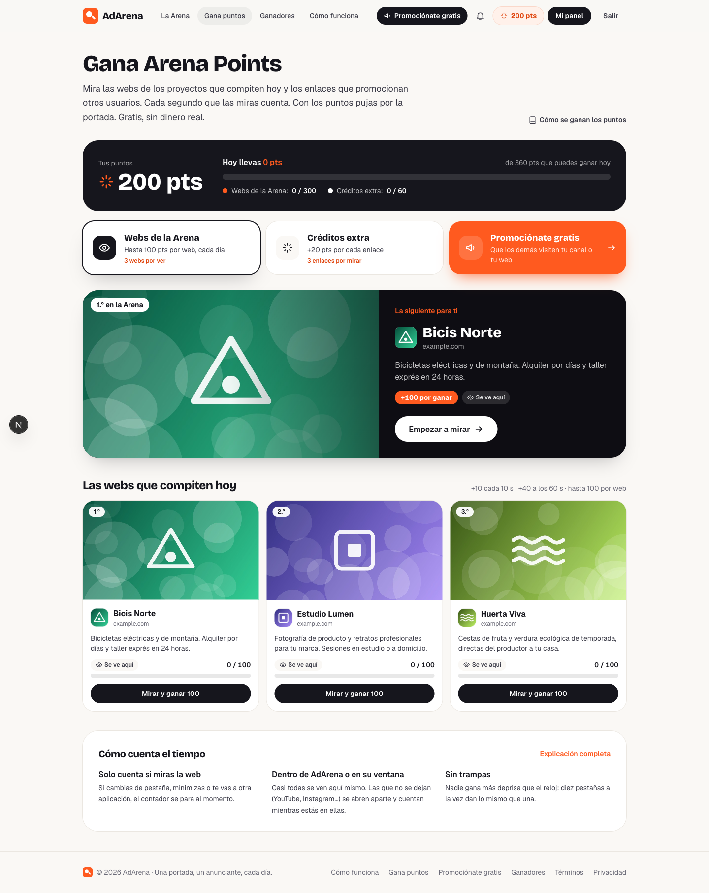

2. Al pulsar **Empezar a mirar** se abre el visor, que ocupa toda la pantalla:
   - Arriba, la **barra de puntos**: salir, el nombre y el logo del proyecto, un círculo que se llena cada 10 s (+10 flotando al sumar), el estado («Sumando puntos», «En pausa…»), lo ganado hoy (30 / 100), la ficha del proyecto (ⓘ), «Abrir aparte» y **«Siguiente web»**.
   - Debajo, **la web del proyecto**, en la que se puede navegar normalmente.

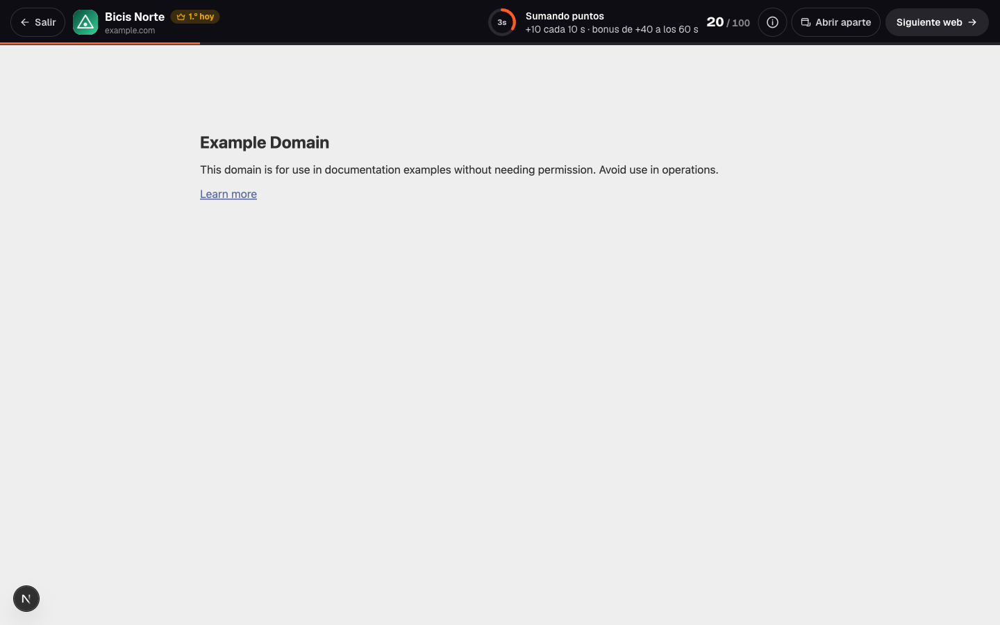

3. Al llegar a 100: tarjeta **«¡100 puntos conseguidos!»** con «Siguiente web» (o «Seguir viendo esta web»).

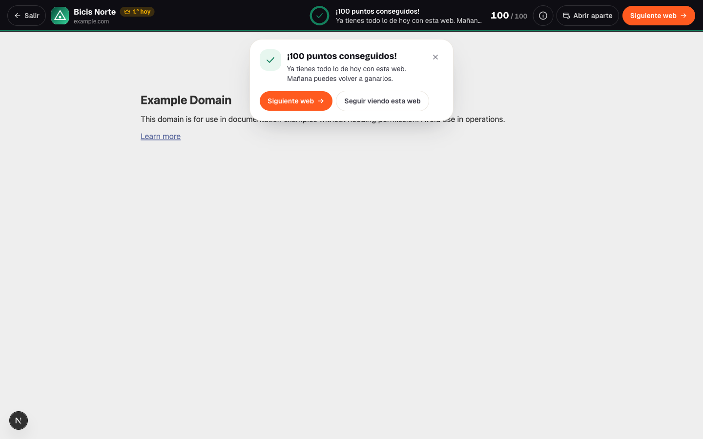

### 3.2 Dentro de AdArena (iframe)

Cuenta mientras:
- la pestaña **se ve** (Page Visibility API);
- la ventana **tiene el foco** (`document.hasFocus()`, que según el estándar de los navegadores sigue siendo cierto cuando haces clic **dentro** de la web; en la prueba automática siguió contando tras hacer clic dentro, aunque ese navegador de pruebas simula el foco, así que conviene que lo pruebes tú también en Chrome y Safari);
- hay **alguien**: movimiento, clic, teclado o scroll en los últimos 45 s. Si el ratón está sobre la web o el foco dentro de ella, cuenta como actividad (lo que pasa dentro de otra web no se puede ver desde AdArena).

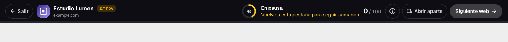

La web se carga **aislada** (`sandbox`): puede usar sus scripts, formularios y abrir enlaces en otra pestaña, pero **no** puede cambiar de página la pestaña de AdArena ni leer nada de AdArena. Si una web no se ve bien, **«Abrir aparte»** pasa al modo ventana.

### 3.3 En su propia ventana

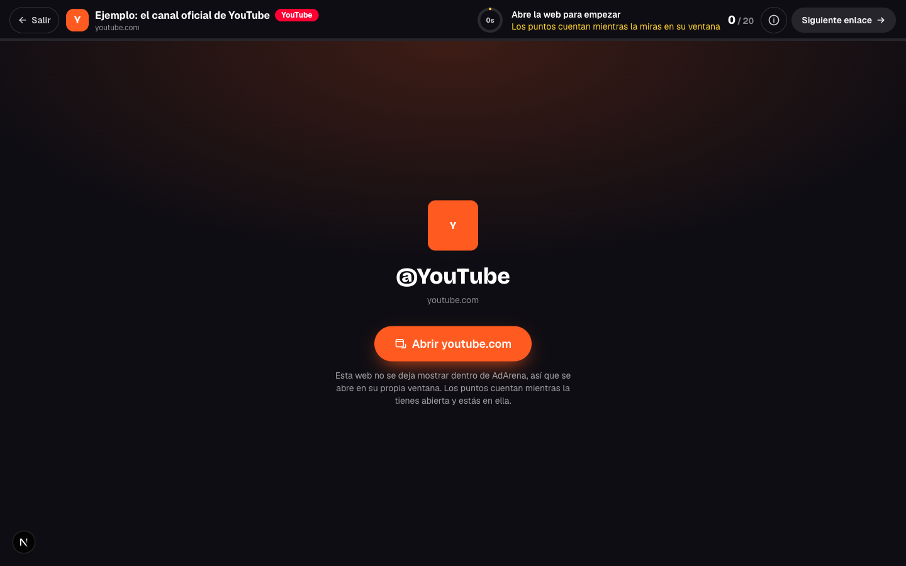

- Pulsas **«Abrir youtube.com»**: AdArena abre una ventana nueva en blanco, le **corta el acceso a AdArena** (`window.opener = null`, así la otra web no puede tocar esta pestaña) y carga la web.
- Cuenta mientras esa ventana está **abierta** y **tú estás en ella** (AdArena sin foco u oculta). Si vuelves a AdArena: «En pausa mientras estás aquí».
- Algunas webs cortan la relación con quien las abre y parecen "cerradas" al instante: en ese caso se cuenta mientras no estés en AdArena.
- Si el navegador bloquea la ventana, aparece un enlace normal y un aviso para permitir las ventanas emergentes.

### 3.4 Créditos extra

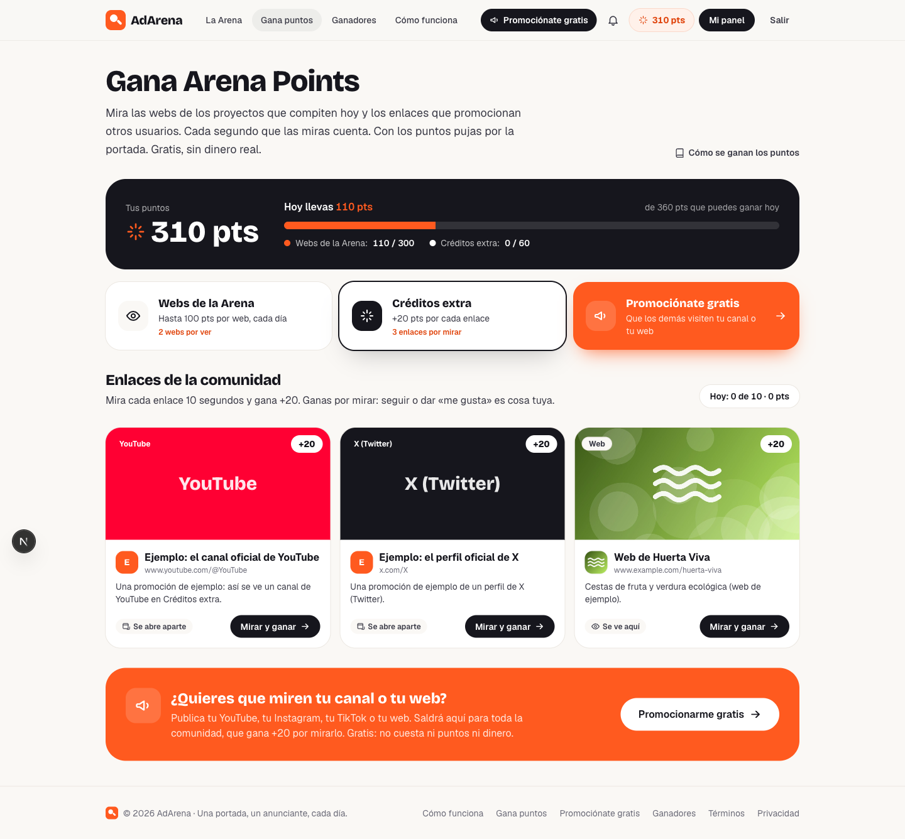

Mismas fichas visuales (con el color de cada red cuando no hay foto) y el **mismo visor**: +20 al mirar el enlace 10 segundos. La denuncia de un enlace está ahora en la ficha del visor (ⓘ).

### 3.5 Lo que decide el servidor

Todo lo anterior es la primera barrera (el navegador se puede manipular). Lo que decide los puntos:

| Regla | Detalle |
|---|---|
| Un solo reloj por persona | Cada premio por tiempo (tramo de un proyecto o tarea) se mide desde el **último premio** del usuario, sea de visitas o de Créditos extra |
| Nunca más deprisa que el reloj | Se piden N tramos de 10 s; se dan como mucho los que caben en el tiempo real desde el último premio (y desde que abrió el visor) |
| Tareas | Además de 10 s desde que abrió el enlace, 10 s desde su último premio |
| Límites | 100 por proyecto y día, 10 tareas al día, nada con lo propio |

Probado con tests: tras 35 s pide 6 tramos y recibe 3; al instante no recibe nada; 40 s después, 3 tramos con el bonus (+70) y completa los 100. Y cobrar una tarea obliga al proyecto a esperar 10 s más.

## 4. La presentación animada del ganador

### 4.1 Las cinco escenas

Se montan solas con lo leído de su web y su propio anuncio. Las que no tienen datos se saltan.

| Escena | Qué muestra | Captura |
|---|---|---|
| Presentación | Su logo y su nombre enormes (tipografía estrecha) y la placa dorada «Ganó la Arena del sábado… con 6.000 pts» | 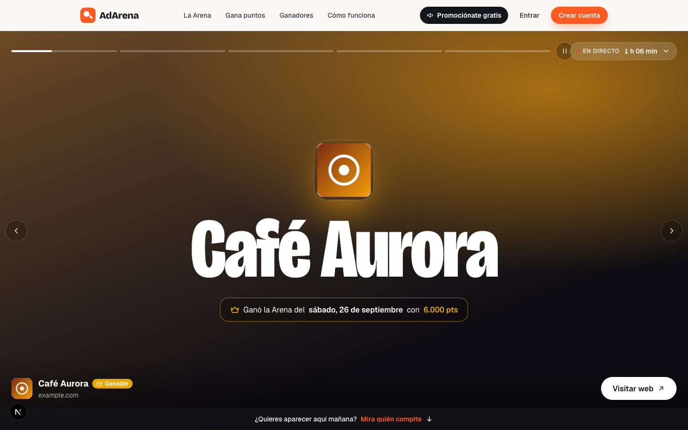 |
| Titular | Su foto principal acercándose despacio y el titular de su web | 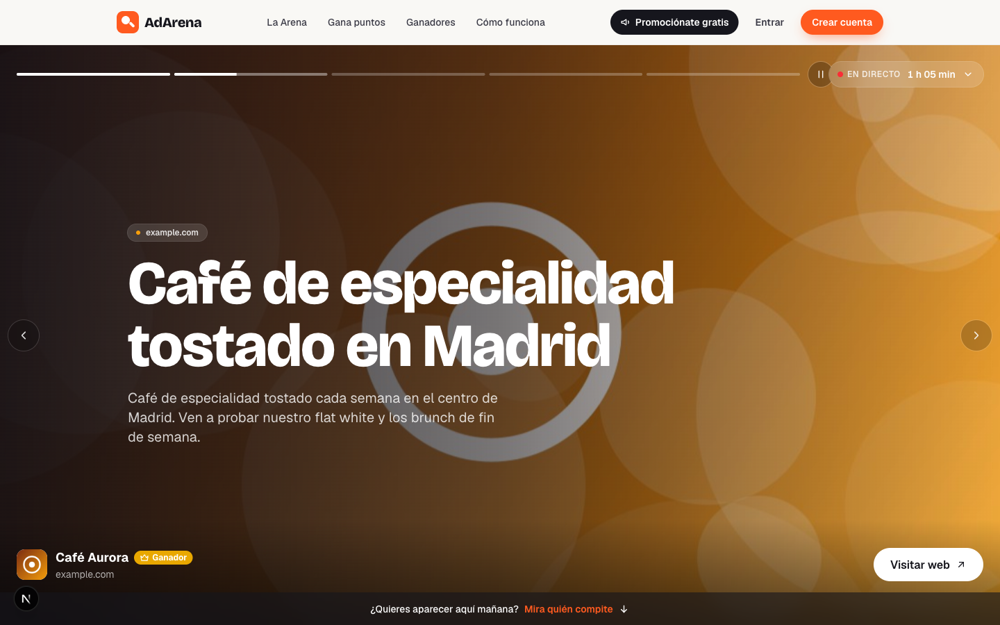 |
| Lo más importante | Los títulos de las secciones de su web, uno a uno | 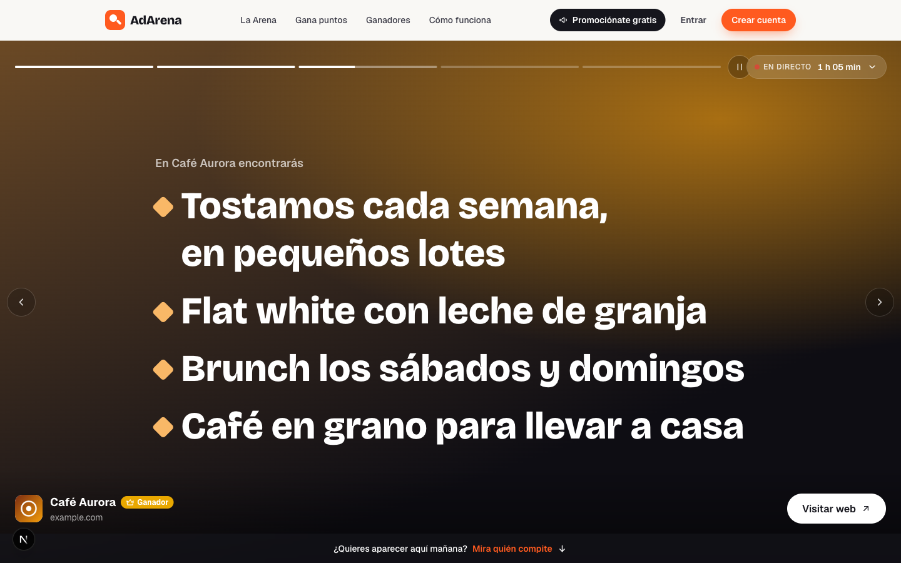 |
| Fotos | Hasta tres fotos de su web, flotando | 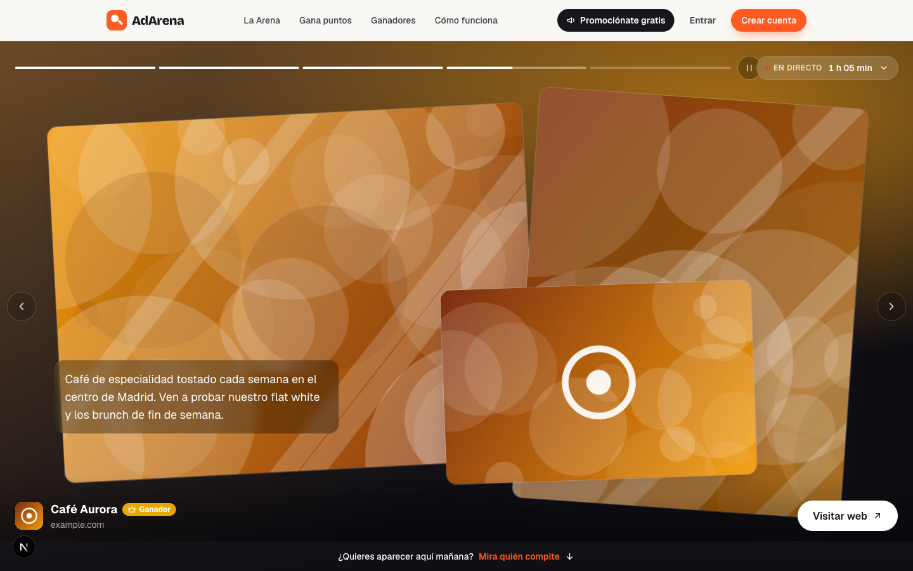 |
| Visítala | Su nombre, su descripción y «Ir a su web» | 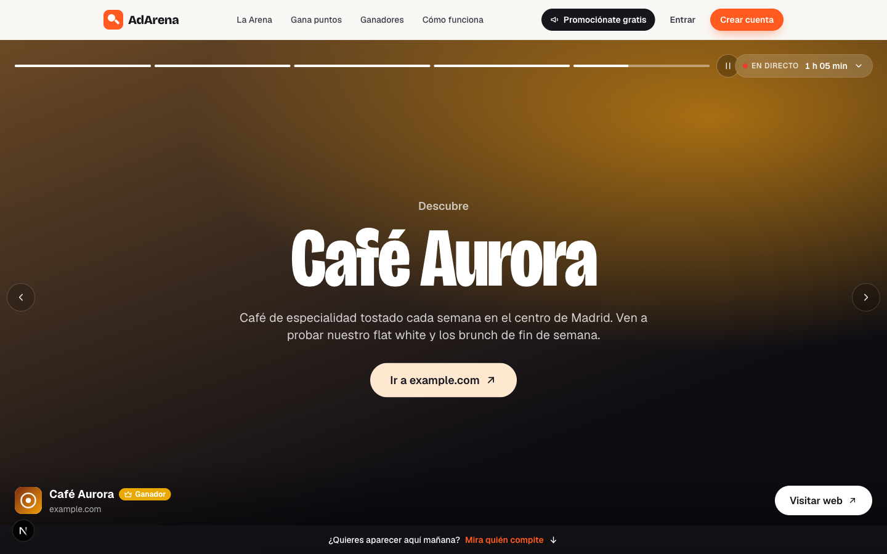 |

- **El fondo toma su color de marca** (el `theme-color` de su web o, si no lo declara, el color dominante de su foto principal). Cada día, la portada es de quien gana.
- Siempre visibles: la barra de escenas (se puede tocar cada una), pausa, flechas (escritorio), deslizar con el dedo (móvil), y abajo su nombre, «Ganador» y **«Visitar web»**.
- Con «reducir movimiento» activado en el sistema, no pasa sola.
- Si su web no se pudo leer, se muestra el anuncio clásico (imagen, nombre y descripción).

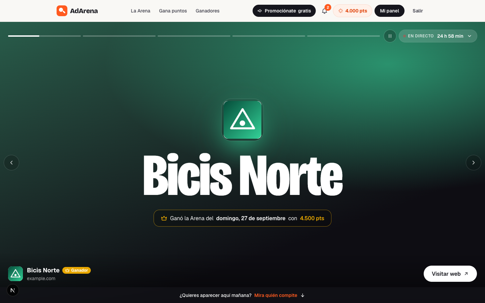

En el móvil:

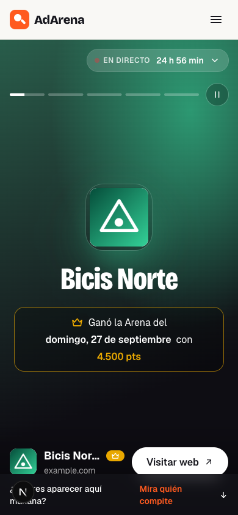

### 4.2 Antes de publicarse

- **Mi anuncio** muestra «Así se verá si ganas» con la presentación real y el botón **«Volver a leer mi web»** (como mucho una vez cada 2 minutos).

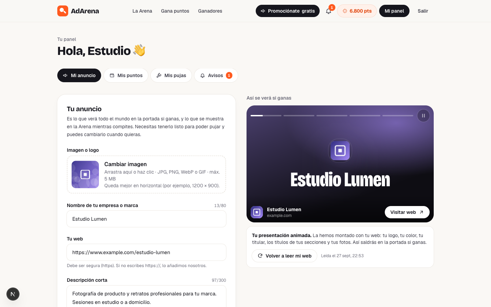

- **Moderación** muestra la presentación del ganador pendiente y **«Volver a leer su web»**. Al aprobar, queda **congelada**.

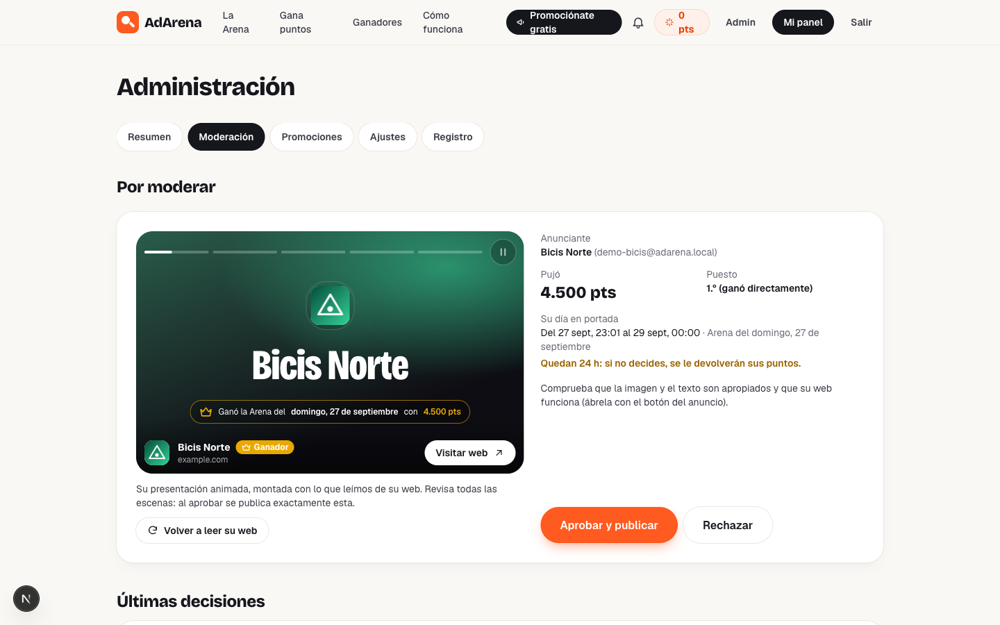

### 4.3 En local (datos de ejemplo)

Las webs de los anunciantes de ejemplo (`www.example.com/…`) no existen, así que se crean «webs de ejemplo» (logo, fotos y frases) marcadas como `DEMO`, que nunca se intentan leer de internet. Si tu base de datos local ya tenía los anunciantes de ejemplo, al arrancar se les crean sus webs de ejemplo y se añade la presentación al ganador que está en portada (sin tocar a usuarios reales).

## 5. Leer webs de forma segura

Leer una dirección que escribe un usuario es delicado: alguien podría intentar que AdArena se conectara a su propia red interna (**SSRF**). Protecciones:

| Protección | Cómo |
|---|---|
| Solo webs públicas | Antes de conectar se resuelve el dominio y se **descartan las IP internas** (127.x, 10.x, 172.16–31.x, 192.168.x, 169.254.x —metadatos de la nube—, 100.64/10, IPv6 privadas, IPv4 escondidas en IPv6…). El cliente se conecta **exactamente** a las IP comprobadas: un DNS tramposo que cambie de respuesta tampoco sirve |
| Solo https, puerto 443 | Se comprueba al empezar y **en cada redirección** (máx. 5) |
| Límites | 5 s para conectar, 8 s sin datos, 1,5 MB de HTML y 5 MB por imagen (si mandan más, se corta) |
| Nada de cookies ni reintentos | Solo un GET, con el agente `AdArenaBot/1.0` |
| Imágenes saneadas | Se vuelven a codificar desde cero (igual que las que suben los usuarios) y se guardan en AdArena: nunca enlazamos imágenes de otras webs |
| Texto limpio | Una línea, sin caracteres de control, recortado. React lo muestra como texto: nunca se inserta HTML de otra web |

**Cuándo se lee una web:** al guardar tu anuncio, al publicar una promoción, cada 15 minutos para las webs en uso (proyectos de hoy, promociones y ganadores pendientes) si tienen más de 20 h, y cuando lo pides en Mi anuncio o en moderación (mínimo 2 minutos entre lecturas). Siempre en segundo plano (2 a la vez): nunca hace esperar a nadie. Si una web falla, se conservan los datos buenos anteriores. Las fotos que no han cambiado no se vuelven a descargar.

**Qué se guarda** (tabla `site_previews`): si se puede mostrar dentro de AdArena, nombre, titular, descripción, color, logo, foto principal, hasta 3 fotos más, hasta 5 frases destacadas, cuándo se leyó y el último error.

**¿Se puede mostrar dentro de AdArena?** Lo decide cada web con sus cabeceras: `Content-Security-Policy: frame-ancestors` (si existe, manda) o `X-Frame-Options: DENY/SAMEORIGIN`.

## 6. Los puntos: 200 al empezar, 500 al ganar y un solo reloj

| Cómo | Puntos | Cuándo |
|---|---|---|
| Al crear la cuenta | 200 | Una sola vez |
| Mirando la web de un proyecto | 10 cada 10 s + 40 a los 60 s | Hasta 100 por proyecto y día |
| Créditos extra | 20 por enlace | 10 al día |
| **Ganar la Arena** | **500** | Cuando se aprueba tu anuncio (movimiento `WINNER_BONUS`, clave `winner-bonus:<hueco>`: nunca dos veces) |

El premio sale de `POINTS_ISSUED` como el resto de puntos repartidos, así que «Los puntos cuadran» sigue funcionando. El aviso de aprobación lo dice: «Y de regalo, 500 puntos para que vuelvas a pujar».

## 7. Promociónate: ahora bien visible

| Dónde | Qué |
|---|---|
| Cabecera | Botón oscuro **«Promociónate gratis»** siempre a la vista (y grande en el menú del móvil) |
| Portada | Sección nueva «Que la comunidad mire tu canal o tu web» con un dibujo de tu enlace entre los de la comunidad |
| Gana puntos | Tercera ficha, en naranja: «Promociónate gratis» |
| Créditos extra | Franja naranja al final: «¿Quieres que miren tu canal o tu web?» |
| Pie de página | Enlace |
| Página Promocionar | Cabecera naranja con lo que obtienes y **vista previa en directo** mientras escribes: detecta la red y enseña cómo verán tu enlace |

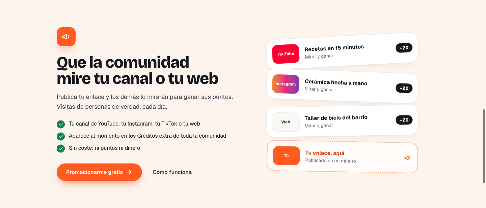

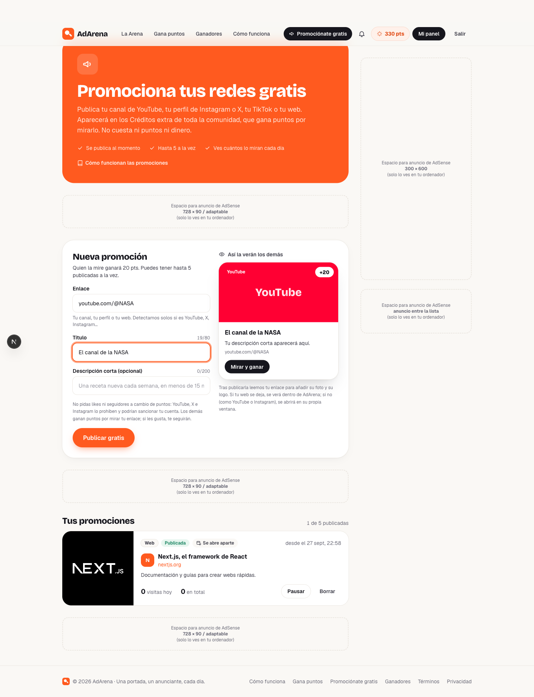

## 8. Dónde van los anuncios

| Página | Huecos |
|---|---|
| Portada | 1 banner **pequeño** bajo la clasificación |
| La Arena | 1 banner **pequeño** bajo la clasificación, lejos del botón de pujar |
| Promociónate gratis | Banner superior, banner entre el formulario y la lista, uno **entre la lista** cada tres promociones, banner inferior y, en escritorio, dos en la columna lateral (300×600 y otro) |
| Gana puntos, Créditos extra, visor | **Ninguno** (normas de AdSense: no se puede pagar por ver anuncios) |

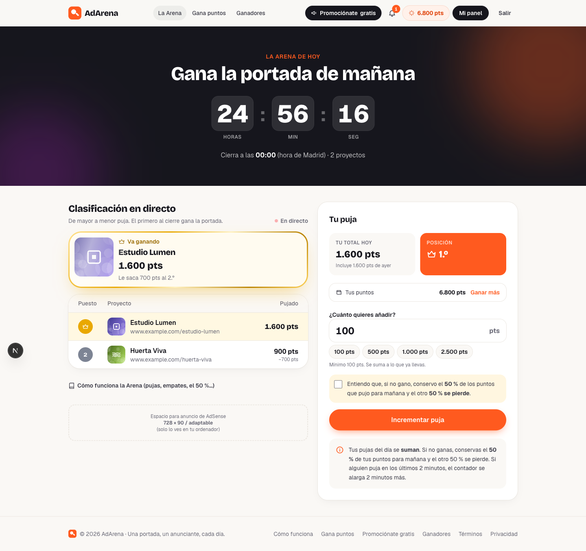

## 9. La guía «Cómo funciona»

Página nueva en `/como-funciona` con índice lateral (en el móvil, botones arriba):

1. **Tu primer día** (5 pasos: cuenta → mirar webs → anuncio → pujar → ganar).
2. **Los Arena Points** (tabla de cómo se consiguen).
3. **Ganar puntos mirando webs** (dentro de AdArena o en su ventana, qué para el contador, por qué no se gana más rápido, límites).
4. **Créditos extra**.
5. **Promociónate gratis** (pasos y normas).
6. **La Arena** (pujar, clasificación, últimos minutos, el 50 %, un ejemplo con números).
7. **Si ganas** (la presentación, la revisión, los 500 puntos y consejos para que tu web quede bien).
8. **Preguntas frecuentes**.

Se enlaza desde la cabecera (en pantallas grandes), el menú del móvil, el pie, «Cómo funciona» de la portada, Gana puntos, la Arena y Promocionar.

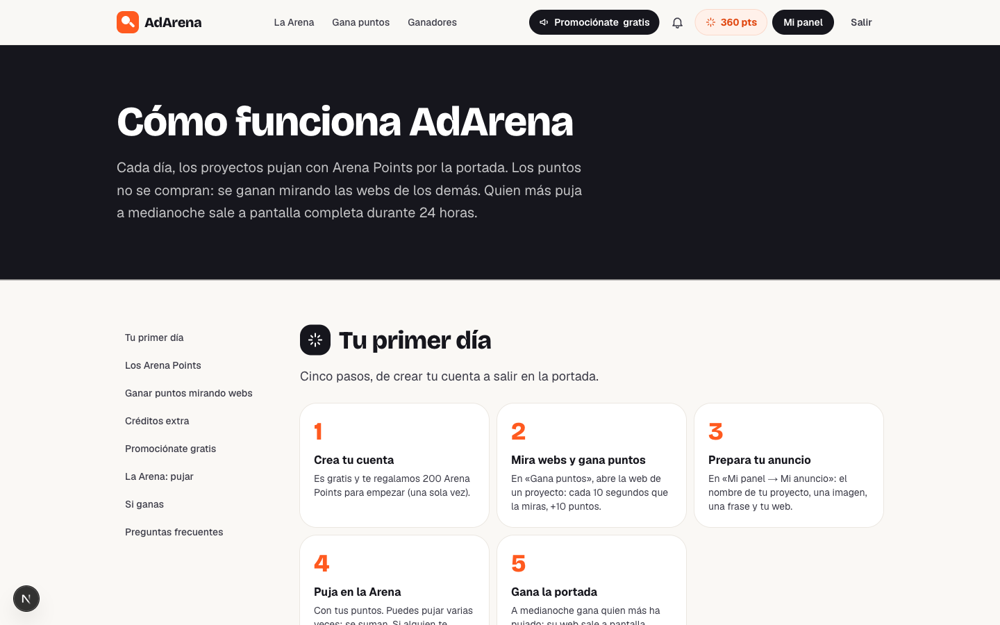

## 10. El diseño

- **Una sola cosa llamativa: la presentación del ganador.** Toma el color de su marca y usa la variante **estrecha** de Bricolage Grotesque (su eje de anchura) para que su nombre ocupe la pantalla. Todo lo demás sigue sobrio: crema, tinta y naranja.
- **Superficie "noche"** (`#0e0d13`) para lo inmersivo: el visor y la presentación.
- **Los puntos se notan:** el círculo de 10 s, el «+10» que sube, el sello «100 conseguidos», la barra de tu día y el número de la cabecera que se actualiza al momento.
- **Explicar en el sitio:** cada página tiene una línea de «cómo funciona» y un enlace a la guía.
- Probado en 1440 px, 1024 px y 390 px, sin desbordes horizontales. Con sesión iniciada, «Cómo funciona» sale en la cabecera solo en pantallas muy anchas (siempre está en el menú del móvil y en el pie).

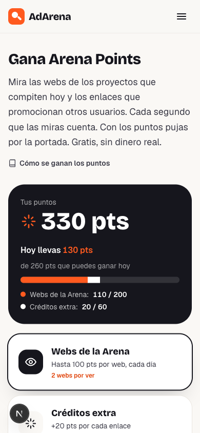

## 11. API: qué cambia

| Método | Ruta | Qué |
|---|---|---|
| POST | `/api/earn/projects/{id}/tick` | Ahora acepta `{"ticks": 1..6}` (opcional; por defecto 1). Responde también `ticksAwarded` |
| GET | `/api/earn`, `/api/earn/tasks`, `/api/promotions`, `/api/public/projects/{id}` | Cada proyecto, tarea o promoción lleva `site`: `mode` (`FRAME`/`WINDOW`), `frameUrl`, `openUrl`, `domain`, `siteName`, `title`, `description`, `iconUrl`, `imageUrl`, `themeColor` |
| GET | `/api/public/home` | `currentAd.showcase`: la presentación congelada del ganador (o `null`) |
| GET | `/api/me/ad-profile/showcase` | Tu presentación: `status` (`NONE`/`PENDING`/`READY`/`FAILED`), `showcase`, `fetchedAt`, `error`, `canRefreshAt` |
| POST | `/api/me/ad-profile/showcase/refresh` | Volver a leer tu web (409 `SHOWCASE_REFRESH_TOO_SOON` si hace menos de 2 min) |
| GET | `/api/admin/ad-slots/pending`, `/recent` | Cada hueco lleva `showcase` (la congelada o la que se congelaría ahora) |
| POST | `/api/admin/ad-slots/{id}/showcase/refresh` | Volver a leer la web del ganador (202, en segundo plano) |
| — | Reglas (`rules`) | Nuevo `winnerBonus` |

## 12. Base de datos: migración V11

`V11__site_previews_and_winner_bonus.sql`:
- Tabla **`site_previews`** (una fila por dirección): origen (`WEB`/`DEMO`), estado (`READY`/`FAILED`), dirección final, si se puede mostrar, dirección del reproductor, nombre, titular, descripción, color (`#rrggbb`), logo y foto principal (imágenes de AdArena), galería y frases (JSON), de dónde salió cada imagen, último error y fecha de lectura. Restricciones: dirección única y siempre `https://`, color válido.
- **`ad_slots.showcase`** (JSON): la presentación congelada al aprobar.
- Tipo de movimiento **`WINNER_BONUS`**.

## 13. Configuración

| Variable | Por defecto | Qué es |
|---|---|---|
| `WINNER_BONUS_POINTS` | 500 | Regalo al ganador cuando su anuncio sale en portada |
| `SITE_PREVIEWS_ENABLED` | true | Leer las webs de los proyectos. En `false`, todas las webs se abren en su ventana y el ganador sale con su anuncio clásico |

En `application.yml` (`app.previews`): relectura a las 20 h, espera mínima de 2 minutos y el agente `AdArenaBot/1.0`. En los tests está apagado: nunca salen a internet.

La **CSP** de la web permite ahora iframes `https:` (el visor), que se cargan aislados con `sandbox`.

## 14. Archivo por archivo

### Backend

| Archivo | Cambio |
|---|---|
| `pom.xml` | `httpclient5` (gestionado por Spring Boot) y `jsoup` 1.23.2 |
| `db/migration/V11__site_previews_and_winner_bonus.sql` | Nuevo (§12) |
| `site/fetch/PublicAddresses.java` | ¿Es una IP pública? (bloquea redes internas, metadatos, IPv6 privadas…) |
| `site/fetch/PublicDnsResolver.java` | Resolver DNS que solo deja IP públicas |
| `site/fetch/SiteFetcher.java`, `HttpSiteFetcher.java` | Lector de webs con todas las precauciones del §5 |
| `site/extract/FramePolicy.java` | ¿Se deja mostrar dentro de AdArena? |
| `site/extract/EmbedLinks.java` | Vídeos de YouTube → reproductor sin cookies |
| `site/extract/SiteExtractor.java` | Saca nombre, titular, descripción, color, logos, fotos y frases del HTML |
| `site/extract/DominantColor.java` | Color de marca a partir de una foto |
| `site/domain/SitePreview.java`, `site/repository/SitePreviewRepository.java` | Lo leído de cada web |
| `site/service/SitePreviewUpdater.java` | Lee la web, descarga y sanea imágenes y guarda |
| `site/service/SitePreviewRefresher.java` | Cola en segundo plano (2 a la vez, sin repetir) |
| `site/service/SitePreviewService.java` | `SiteInfo` para el visor y `Showcase` para la presentación |
| `site/service/SitePreviewWarmer.java` | Tarea de cada 15 min |
| `site/service/SitePreviewJson.java` | JSON de galería, frases y presentación |
| `site/service/MyShowcaseService.java`, `site/controller/MyShowcaseController.java` | Presentación en Mi anuncio |
| `site/dto/SiteDtos.java` | `SiteInfo`, `Showcase`, `MyShowcase` |
| `earn/service/AttentionClock.java` | Un solo reloj de atención por persona |
| `earn/service/ViewRewardService.java` | Varios tramos por petición, reloj compartido, `site` en proyectos |
| `earn/service/SocialTaskService.java` | Reloj compartido en las tareas, `site` en tareas |
| `earn/service/PromotionService.java` | Lee la web al publicar; `site` en promociones |
| `earn/dto/EarnDtos.java`, `earn/controller/EarnController.java` | `TickRequest`, `site`, `winnerBonus` |
| `adslot/domain/AdSlot.java`, `adslot/service/ModerationService.java` | Presentación congelada y premio de 500 al aprobar |
| `adslot/service/AdSlotQueryService.java`, `admin/controller/AdminController.java` | Presentación en moderación y «volver a leer su web» |
| `home/service/HomeService.java`, `home/dto/HomeResponse.java` | Presentación en la portada |
| `adprofile/service/AdProfileService.java` | Lee la web al guardar el anuncio |
| `notification/service/Notices.java` | El aviso de aprobación menciona los 500 |
| `common/jobs/ScheduledJobs.java` | Tarea de las webs cada 15 min |
| `common/config/AppProperties.java`, `application.yml` | `winnerBonus`, bloque `previews`, términos `2026-09-27-b` |
| `demo/DemoSites.java`, `DemoSitesBackfill.java`, `DemoImages.java`, `DemoDataSeeder.java` | Webs de ejemplo en local |

### Frontend

| Archivo | Cambio |
|---|---|
| `lib/useActiveTimer.ts` | Dos modos (dentro de AdArena / en su ventana) y varios tramos a la vez |
| `components/viewer/SiteViewer.tsx`, `SiteAvatar.tsx` | El visor y el logo/inicial de cada web |
| `components/earn/ProjectViewer.tsx`, `TaskViewer.tsx`, `app/visitar/[id]` | Visor de proyectos y de Créditos extra |
| `components/earn/EarnShell.tsx`, `EarnProjectsView.tsx`, `TasksView.tsx`, `PlatformBadge.tsx` | Rediseño de Gana puntos y Créditos extra |
| `components/ad/WinnerShowcase.tsx` | La presentación animada |
| `components/home/HomeClient.tsx`, `PromoteSection.tsx`, `StandingsSection.tsx`, `HowItWorks.tsx` | Portada: presentación, anuncio pequeño, promociónate y guía |
| `components/arena/ArenaClient.tsx`, `ProjectDialog.tsx` | Anuncio pequeño, enlace a la guía y «Mirar su web y ganar puntos» |
| `components/promote/PromoteView.tsx` | Más huecos de anuncios, vista previa en directo y fotos de cada promoción |
| `components/panel/ShowcasePreview.tsx`, `AdProfileEditor.tsx`, `PointsView.tsx` | Presentación en Mi anuncio; «Premio por ganar la Arena» |
| `components/admin/ModerationView.tsx` | Presentación en moderación |
| `components/layout/SiteHeader.tsx`, `SiteFooter.tsx` | «Promociónate gratis» y «Cómo funciona» |
| `app/como-funciona/page.tsx` | La guía |
| `app/legal/terminos`, `app/legal/privacidad` | Premio, visor y lectura de tu web |
| `app/globals.css`, `app/layout.tsx` | Color "noche", animaciones y ejes de la tipografía |
| `components/icons.tsx`, `ui/Toaster.tsx` | Iconos nuevos; avisos por encima del visor |
| `lib/types.ts`, `lib/api.ts` | `SiteInfo`, `Showcase`, `MyShowcase`, tramos múltiples |
| `next.config.ts` | `frame-src 'self' https:` |

## 15. Tests

**257 tests, 0 fallos** (`./mvnw clean test`; eran 172 antes de esta fase). Nuevos:

| Test | Qué comprueba |
|---|---|
| `PublicAddressesTest` | 30 direcciones internas bloqueadas (IPv4, IPv6, IPv4 escondidas) y 7 públicas permitidas; el resolver descarta las internas y falla si no queda ninguna |
| `HttpSiteFetcherUrlTest` | Solo https, sin IP, sin localhost, sin usuario:clave, solo el puerto 443 |
| `FramePolicyTest` | `X-Frame-Options`, `frame-ancestors` (none, self, *, https:, nuestro dominio, comodines, varias políticas) |
| `EmbedLinksTest` | Vídeos de YouTube (7 formatos) sí; canales y otras webs no |
| `SiteExtractorTest` | Nombre, titular, color, logos, frases sin menús ni cookies ni repetidas, fotos, páginas casi vacías, texto limpio y `<main>` que no envuelve el contenido |
| `SitePreviewUpdaterIntegrationTest` | Lectura completa con un lector falso: presentación, color por la foto, webs que no se dejan, no releer antes de tiempo, reutilizar fotos, conservar datos si la web cae, redes sociales sin leer |
| `MyShowcaseApiIntegrationTest` | Mi anuncio: sin anuncio, presentación lista, espera mínima; moderación solo para el admin |
| `ViewRewardIntegrationTest` (+2) | Varios tramos al volver de otra ventana (nunca más que el reloj) y reloj compartido con Créditos extra |
| `ModerationIntegrationTest` (+1 y ampliados) | Premio de 500 (una vez, con su aviso) y presentación congelada aunque la web cambie |
| `DemoDataSeederTest` | La portada de ejemplo trae su presentación |

## 16. Lo que tienes que hacer tú

1. **Arranca `./dev.sh`**. La migración V11 se aplica sola y tus anunciantes de ejemplo reciben sus webs de ejemplo: verás la presentación animada en la portada.
2. **Prueba el visor**: en «Gana puntos», abre un proyecto y mira cómo sube el círculo. Cambia de pestaña y verás «En pausa». Prueba un Crédito extra de YouTube: se abre en su ventana.
3. **Tu propio proyecto** (el de pruebas): en Mi anuncio verás cómo quedaría su presentación con tu web real. Si tu web tiene una buena imagen para compartir (la que sale al pegar el enlace en WhatsApp), un logo y títulos claros, queda espectacular.
4. **AdSense**: nada nuevo que configurar (usa los mismos 3 bloques). Recuerda: **no actives los anuncios automáticos**.
5. **Abogado**: los términos (versión `2026-09-27-b`) añaden el premio al ganador, el visor y el permiso para leer la web del anunciante. Que los revise con lo demás.
6. **Guardar en Git**: desde «Fase 1» no se ha guardado nada. Si quieres, lo hago yo.

## 17. Límites conocidos

- **En modo ventana no podemos saber si miras esa ventana**, solo que está abierta y que no estás en AdArena. Es el límite de los navegadores. Por eso el límite diario y el reloj único del servidor.
- **Algunas webs se dejan mostrar pero no funcionan bien dentro de otras** (piden cookies o comprueban si están en un iframe). Para eso está «Abrir aparte».
- **La lectura de webs es heurística:** cada web está hecha de una manera. Si faltan frases o fotos, se saltan esas escenas; si no se puede leer, se usa el anuncio clásico. El anunciante puede volver a pedir la lectura.
- **Webs que bloquean a los lectores automáticos** (protección anti-bots) no se podrán leer: se abren en su ventana y el ganador sale con su anuncio clásico.
- El visor de vídeos de YouTube usa `youtube-nocookie.com`; los canales y perfiles de redes sociales siempre se abren aparte.
