# Fase 11 — La web en inglés, la Arena en el centro, diseño nuevo y el modo "ventana aparte" arreglado

> Fecha: 2026-09-28. Estado: ✅ terminada. Tests del backend: **258 en verde** (257 + 1 nuevo).
> Web: `tsc`, `eslint` y `next build` sin errores. Verificada en el navegador (escritorio y móvil) con
> una copia aparte (puertos 3001/8082 y su propia base de datos, ya borrada), sin tocar tu `./dev.sh`.

## Índice

1. [Lo que pediste y qué se hizo](#1-lo-que-pediste-y-qué-se-hizo)
2. [Decisiones que tomé (y por qué)](#2-decisiones-que-tomé-y-por-qué)
3. [El modo "ventana aparte" no puntuaba: por qué y cómo se arregló](#3-el-modo-ventana-aparte-no-puntuaba-por-qué-y-cómo-se-arregló)
4. [Lo principal es ganar la puja: la navegación nueva](#4-lo-principal-es-ganar-la-puja-la-navegación-nueva)
5. [Sin repeticiones: qué se quitó o se juntó](#5-sin-repeticiones-qué-se-quitó-o-se-juntó)
6. [El diseño nuevo: "marcador de estadio"](#6-el-diseño-nuevo-marcador-de-estadio)
7. [Toda la web en inglés](#7-toda-la-web-en-inglés)
8. [Rutas nuevas y redirecciones](#8-rutas-nuevas-y-redirecciones)
9. [Un fallo encontrado al verificar (y su test)](#9-un-fallo-encontrado-al-verificar-y-su-test)
10. [Archivo por archivo](#10-archivo-por-archivo)
11. [Tests y verificación](#11-tests-y-verificación)
12. [Lo que tienes que hacer tú](#12-lo-que-tienes-que-hacer-tú)
13. [Límites conocidos](#13-límites-conocidos)
14. [Segunda ronda (2026-09-28): aprobar al ganador y el diseño de "la pista"](#14-segunda-ronda-2026-09-28-aprobar-al-ganador-y-el-diseño-de-la-pista)

---

## 1. Lo que pediste y qué se hizo

| Pediste | Qué se hizo |
|---|---|
| Que se vea que **lo principal es ganar la puja** | La Arena es el primer botón de la cabecera, con la **cuenta atrás en directo** siempre visible (también en el móvil). La portada lleva una franja amarilla "Want this spot tomorrow? Bid for it" pegada al ganador de hoy y, justo debajo, el **marcador** de la Arena con "Bid now". Todas las secciones enlazan a la Arena |
| Que sea **más fácil de navegar, sin repeticiones** | Cabecera con 4 secciones (Arena, Earn points, Promote, Winners) + tu cuenta. Se quitaron las piezas duplicadas (ver §5) |
| **Cambiar el diseño**, que no parezca "hecho por IA" | Identidad nueva de **marcador de estadio**: azul cobalto, amarillo señal, tinta casi negra, esquinas casi rectas, sombras duras, titulares estrechos en mayúsculas y un contador de fichas tipo pantalla de estación (ver §6) |
| **Toda la web en inglés** | Todos los textos de la web, los emails, los avisos, los mensajes de error de la API, los datos de ejemplo, la guía y los textos legales. También las **rutas** (`/arena`, `/earn`, `/promote`…), con redirecciones desde las antiguas |
| Ganar puntos con webs externas **no puntuaba** | Encontrada la causa (COOP, §3) y cambiada la regla del contador. Probado con **x.com real**: suma los +20 |
| "Míramelo todo" | Revisión completa: 258 tests, build, navegador en escritorio y móvil. Salió un fallo que impedía arrancar el backend con datos antiguos (§9), ya arreglado con su test |

## 2. Decisiones que tomé (y por qué)

| Decisión | Por qué |
|---|---|
| El código, los comentarios y la documentación **siguen en español** | Es lo que tú lees y mantienes. Solo cambia lo que ve el usuario |
| Rutas en inglés **y** redirecciones permanentes (308) desde las antiguas | Hay emails ya enviados y enlaces guardados con `/panel`, `/proyecto/…` |
| Inglés británico para fechas y números (`1,250 pts`, `Friday 25 September`, `1st/2nd`) | Formato europeo de fecha, y la hora sigue siendo la de Madrid |
| "Créditos extra" pasa a llamarse **Bonus links**; "Mi panel", **Account** | Nombres cortos y claros en inglés |
| "How it works" sale del menú principal (va al pie y a enlaces dentro de cada sección) | El menú queda para lo que se usa a diario; la guía se enlaza donde hace falta |
| Versión de los términos: **2026-09-27-en** | Los términos cambiaron de idioma: quien se registre acepta la versión inglesa. Cada cuenta guarda la versión que aceptó |
| No cambié ninguna regla de negocio (puntos, límites, 50 %, 500 al ganador…) | Ya estaban decididas |

## 3. El modo "ventana aparte" no puntuaba: por qué y cómo se arregló

**Qué pasaba.** Cuando una web no se deja mostrar dentro de AdArena (YouTube, X, Instagram, muchas
tiendas), el visor la abre en una ventana aparte. Hasta ahora el contador comprobaba cada 200 ms si
esa ventana seguía abierta (`ventana.closed`).

**La causa.** Esas webs envían la cabecera **`Cross-Origin-Opener-Policy`** (COOP). Lo comprobé con las
cabeceras reales de youtube.com, x.com e instagram.com. Con COOP, el navegador **corta el enlace** entre
AdArena y la ventana nada más cargar la web, y para AdArena la ventana aparece como **cerrada**
(`closed = true`) aunque sigas en ella. Resultado: el contador se paraba al instante. Es una medida de
seguridad del navegador; no se puede "saltar".

**La regla nueva** (`lib/useActiveTimer.ts` + `components/viewer/SiteViewer.tsx`):

1. Pulsas **Open x.com**: AdArena abre la web en su ventana y apunta que está "abierta".
2. **Mientras estás fuera de AdArena** (en esa ventana), el contador cuenta.
3. En cuanto **vuelves a AdArena**, se para ("Welcome back: the counter is paused"), con dos botones:
   **Back to x.com** (vuelve a esa ventana o la abre de nuevo) e **I'm done** (deja de contar).
4. Si el navegador bloquea la ventana, se avisa y hay un enlace para abrirla a mano.

Ya no depende de `ventana.closed`, así que funciona igual con cualquier web. El servidor no cambia: sigue
decidiendo con un solo reloj por persona y sin pagar nunca más tiempo del que ha pasado de verdad.

**Probado** con x.com real (sí envía COOP): abrir → 12 s fuera de AdArena → **+20 puntos** confirmados
por el servidor (el saldo pasó de 4.000 a 4.020).

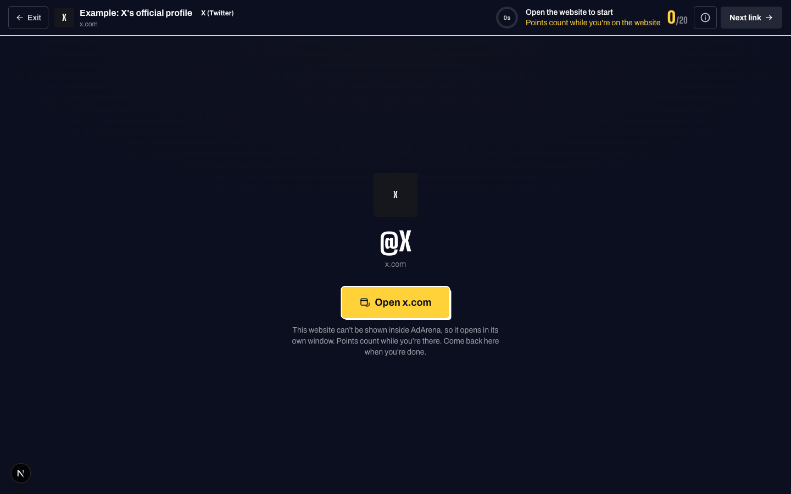
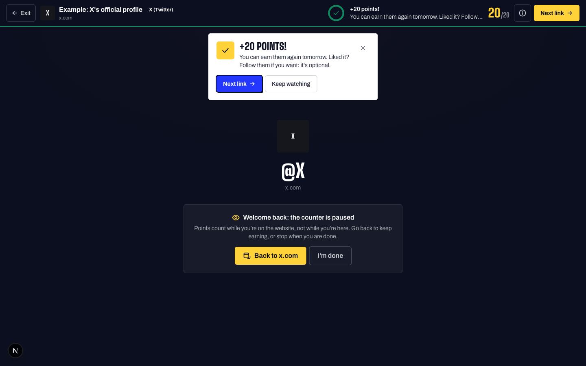

Además, cuando ya has conseguido todos los puntos de esa web, el panel ya no dice "the counter is
paused" (confundía): dice que ya no hay más puntos hoy y que puedes seguir mirándola.

## 4. Lo principal es ganar la puja: la navegación nueva

**Cabecera** (`components/layout/SiteHeader.tsx`):

```
[AdArena] [● ARENA 20:09:53]  Earn points  Promote  Winners        [★ 3,520 pts] [🔔] [Account]
```

- **ARENA** es un botón oscuro con un punto rojo "en directo" y la **cuenta atrás hasta el cierre**
  (en amarillo). Es lo primero que se ve en todas las páginas, también en el móvil (desde 370 px).
- Tus puntos, tus avisos y **Account** (tu anuncio, puntos, pujas y avisos). **Log out** está dentro de
  Account (y en el menú del móvil).
- Móvil: menú con "The Arena: bid for the homepage" el primero, luego el resto y "How it works".

**Portada** (`components/home/HomeClient.tsx`), de arriba abajo:

1. **El ganador de hoy** a pantalla completa (la presentación animada), con una **franja amarilla** al pie:
   "Want this spot tomorrow? Bid for it" + cuenta atrás + **Bid now**.
2. **El marcador de la Arena** (`ArenaScoreboard`): "This spot is up for grabs", el contador de fichas,
   quién va primero, **Bid now** y **Earn points first**. Si no hay ganador hoy, este marcador es la
   cabecera de la portada ("Win tomorrow's homepage"), con el aviso del día si toca.
3. **Today's standings**: los 5 primeros y "See all N projects in the Arena".
4. **How to win**: 3 pasos numerados (Earn points → Bid → Win the homepage), cada uno con su enlace, y
   "Read the full guide".
5. Un anuncio pequeño (AdSense), al final.

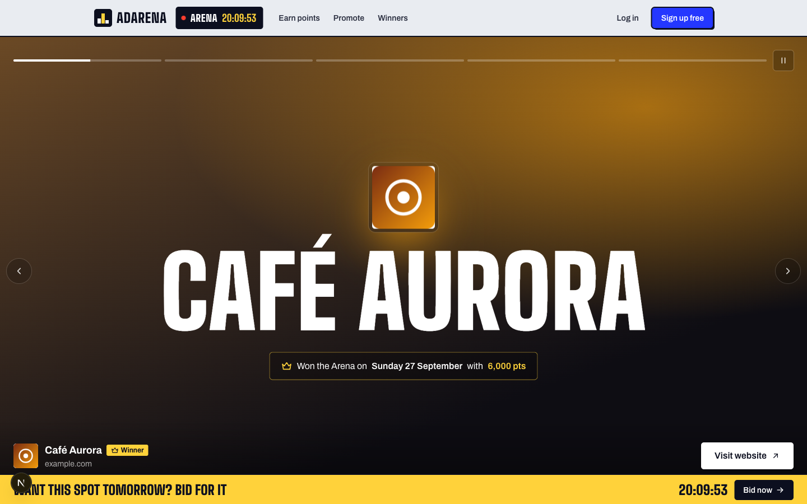
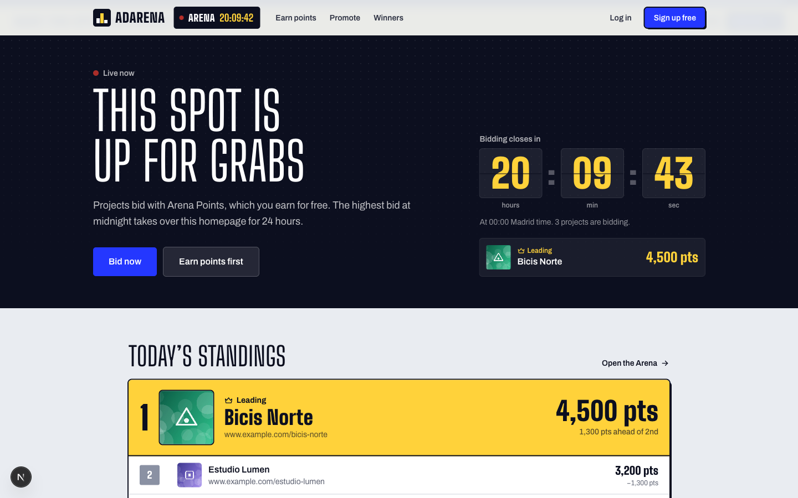
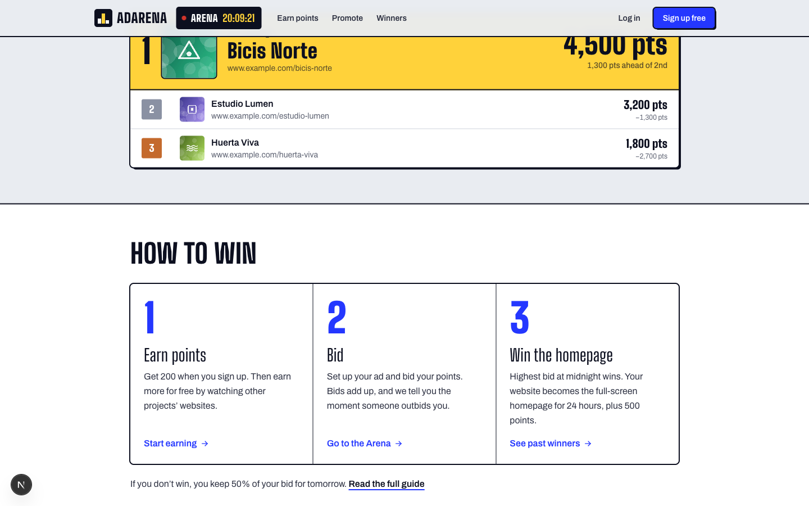

**La Arena** (`/arena`): el mismo marcador ("Today's Arena"), la clasificación en directo y la tarjeta
**Your bid** (a la derecha en escritorio, arriba en el móvil).

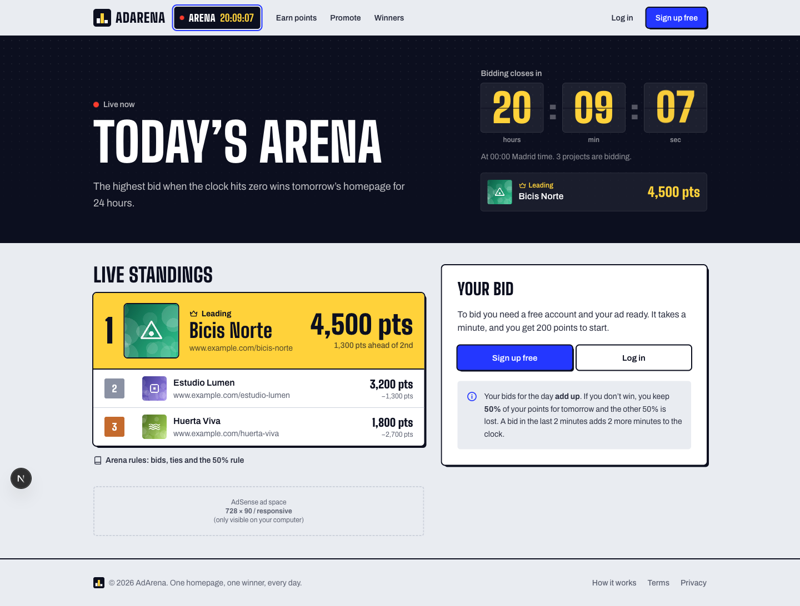
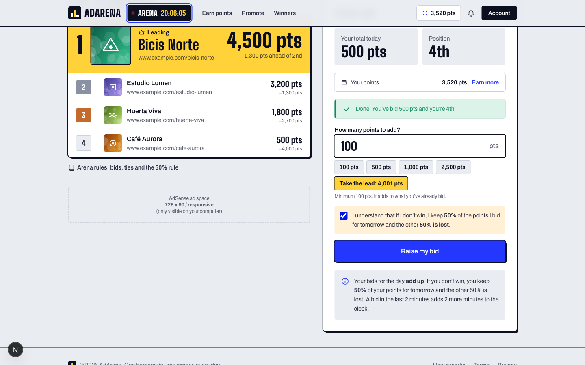

**Earn points** (`/earn`): tu marcador del día (tus puntos en grande, lo ganado hoy frente a lo posible)
con "Bid them in the Arena", y **dos pestañas**: *Websites* y *Bonus links*, cada una con cuántas te
quedan hoy.

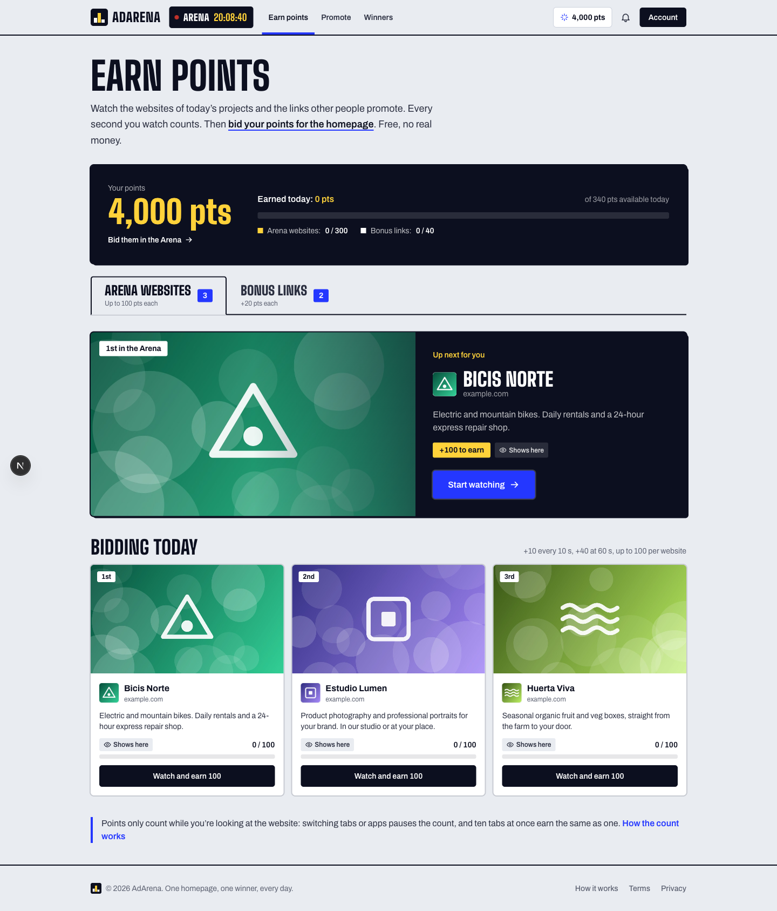
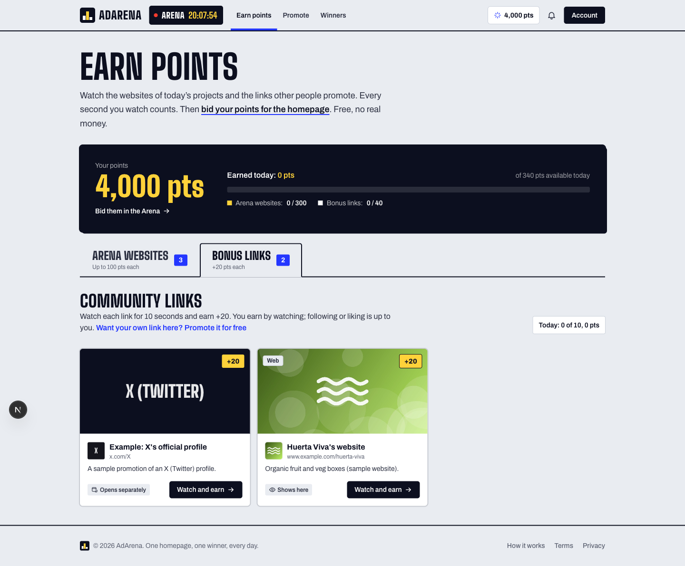

**Account** (`/account`): "Hi, …", Log out y pestañas My ad · My points · My bids · Notifications.

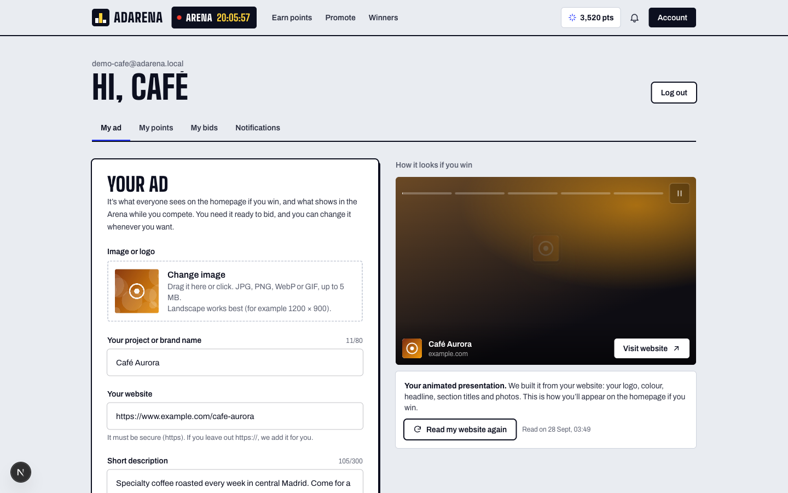

## 5. Sin repeticiones: qué se quitó o se juntó

| Antes | Ahora |
|---|---|
| Desplegable "En directo" arriba a la derecha de la portada (tiempo del anuncio + top 5) | Quitado: el contador está en la cabecera y el top 5 justo debajo |
| Franja "¿Quieres aparecer aquí mañana?" + cabecera de la Arena + sección de clasificación, cada una con su llamada | Una franja y un marcador con "Bid now" |
| Clasificación: placa grande del 1.º + tarjetas del 2.º y 3.º + tabla con los mismos proyectos | **Una sola lista**: la fila del 1.º grande y amarilla, el resto filas normales |
| Sección "Promociónate gratis" en la portada, ficha grande en Gana puntos y franja en Créditos extra | Promote está en el menú; en Bonus links queda una línea ("Want your own link here? Promote it for free") |
| Sección larga "Cómo funciona" en la portada (4 pasos + "¿y si no gano?" + enlace) repitiendo la guía | 3 pasos cortos + "Read the full guide" |
| "Cómo cuenta el tiempo" (3 bloques) en Gana puntos, repitiendo la guía | Una línea con enlace a la guía |
| En Gana puntos, el proyecto destacado aparecía también en la lista de abajo | La lista muestra "More websites today" sin el destacado |
| En la Arena, "quién va primero" en el marcador y en la clasificación justo debajo | En la Arena, el marcador no lo repite (en la portada sí, porque allí la clasificación está más abajo) |

## 6. El diseño nuevo: "marcador de estadio"

La idea sale del propio producto: una subasta diaria con cuenta atrás es un **marcador de estadio**.

| Pieza | Valor |
|---|---|
| Color principal (`brand`) | Azul cobalto `#2437ff` |
| Quien va ganando / ganador (`gold`) | Amarillo señal `#ffd23a` |
| Tinta y fondos oscuros (`ink`, `night`) | `#0c0f1f` |
| Fondo general (`canvas`) | Gris frío `#e9ecf1` |
| En directo (`live`) | Rojo `#ff3d2e` |
| Titulares | **Big Shoulders** (estrecha, de marcador), en mayúsculas |
| Texto | **Archivo** |
| Esquinas | Casi rectas (3–14 px en vez de muy redondeadas) |
| Sombras | "Duras" (un bloque negro desplazado, `shadow-lift`/`shadow-hard`), no difuminadas |
| Botón principal | Azul con borde de tinta y sombra dura que se "hunde" al pulsarlo |
| Contador | Fichas con la raya horizontal de las pantallas de paletas de las estaciones; en los 2 últimos minutos se ponen rojas |
| Fondo del marcador | Una rejilla muy tenue de puntos (focos de estadio), no un negro plano |

Lo único llamativo es el **marcador** (y la fila amarilla del 1.º); el resto es sobrio. Los nombres de
los colores en Tailwind no cambian (`brand`, `gold`…), así que todos los componentes cambiaron a la vez
desde `app/globals.css`. El icono y el logotipo son un **podio** (el 1.º en amarillo). La presentación del
ganador conserva **su** color de marca: ese día la portada es suya.

En el móvil:

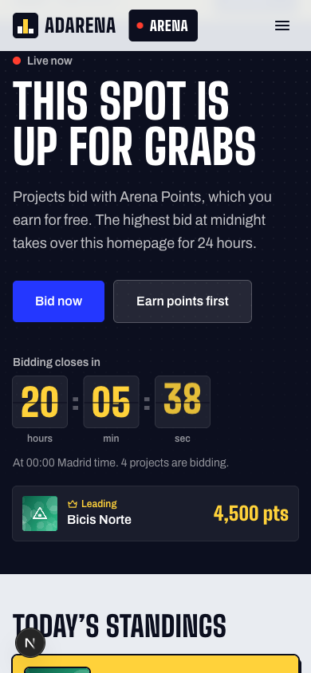
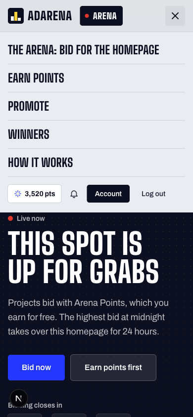
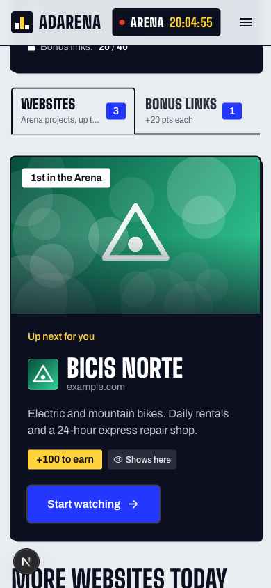
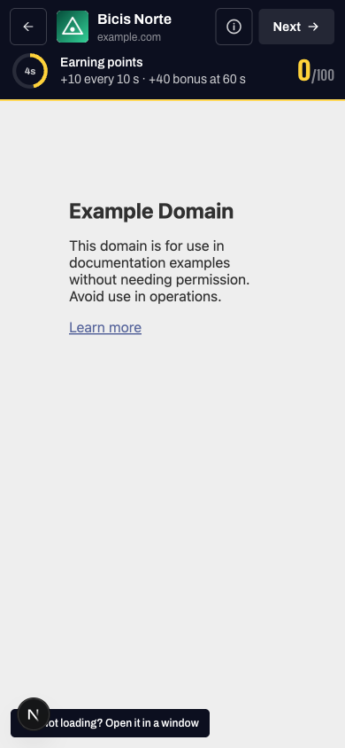

## 7. Toda la web en inglés

**Web (frontend):** todos los textos, títulos de página y metadatos, avisos emergentes, formularios y
errores; la guía **How it works** reescrita (y reordenada: primero pujar y ganar, luego cómo conseguir
puntos, con la regla nueva del modo ventana); **Terms** y **Privacy** traducidos (siguen siendo un
borrador para tu abogado); `<html lang="en">`; formatos en `lib/format.ts` (`1,250 pts`, `13h 20m`,
`Friday 25 September`, `1st`).

**Backend:** mensajes de error de la API y de validación, **emails** (asunto y cuerpo, con los colores
nuevos), avisos en directo y guardados (`Notices`), textos de los movimientos de puntos, fechas de los
emails en inglés, enlaces de los emails a las rutas nuevas (`/reset-password`, `/account`…) y
`Accept-Language` en inglés al leer webs.

**Datos de ejemplo:** en inglés (`demo/DemoContent.java`). Si tu base de datos local ya tenía los datos
de ejemplo en español, **se traducen solos** al arrancar el backend (`DemoSitesBackfill`).

Lo que **no** se traduce solo: los avisos que ya tenías guardados (se quedan como se escribieron) y lo
que hayan escrito los usuarios (sus anuncios y promociones).

## 8. Rutas nuevas y redirecciones

| Antes | Ahora |
|---|---|
| `/ganar`, `/ganar/extra` | `/earn`, `/earn/links` |
| `/proyecto/:id`, `/visitar/:id` | `/watch/:id`, `/watch/link/:id` |
| `/promocionar`, `/ganadores`, `/como-funciona` | `/promote`, `/winners`, `/how-it-works` |
| `/entrar`, `/registro`, `/recuperar`, `/restablecer` | `/login`, `/signup`, `/forgot-password`, `/reset-password` |
| `/panel`, `/panel/puntos`, `/panel/pujas`, `/panel/avisos` (y `/panel/saldo`) | `/account`, `/account/points`, `/account/bids`, `/account/notifications` |
| `/admin/moderacion`, `/admin/promociones` (y `/admin/recargas`), `/admin/ajustes`, `/admin/registro` | `/admin/moderation`, `/admin/promotions`, `/admin/settings`, `/admin/audit-log` |
| `/legal/terminos`, `/legal/privacidad` | `/legal/terms`, `/legal/privacy` |

Todas las antiguas redirigen con **308** (`next.config.ts → redirects`). Comprobado: `/ganar → /earn`,
`/proyecto/abc → /watch/abc`, `/panel → /account`, `/como-funciona → /how-it-works`, `/ganadores → /winners`.

## 9. Un fallo encontrado al verificar (y su test)

Al arrancar el backend con una base de datos limpia en modo `dev`, **no arrancaba**:
`value too long for type character varying(80)`.

**Causa:** `DemoSitesBackfill` traduce los datos de ejemplo antiguos probando cada traducción en cada
columna, también en el **título** de las promociones (máx. 80 caracteres). PostgreSQL rechaza un texto
más largo que la columna **aunque no coincida con ninguna fila**. Los tests no lo vieron porque ese código
solo se ejecuta en el perfil `dev`. Tu `./dev.sh` también habría fallado al reiniciarlo.

**Arreglo:** `translate(tabla, columna, longitudMáxima)` solo prueba las traducciones que caben.

**Test nuevo:** `DemoDataSeederTest.translatesOldSpanishDemoDataWithoutBreakingOnLongTexts` crea una
promoción y un anuncio con los textos antiguos en español, ejecuta la traducción y comprueba que quedan
en inglés. Comprobé que **falla con el código anterior** (el mismo error) y pasa con el arreglo.

## 10. Archivo por archivo

### Frontend

| Archivo | Cambio |
|---|---|
| `app/globals.css` | Colores, radios y sombras nuevos; titulares estrechos en mayúsculas; `.flap` (raya del contador); `.scoreboard` (rejilla del marcador) |
| `app/layout.tsx` | Tipografías Archivo + Big Shoulders, metadatos en inglés, `lang="en"` |
| `app/icon.svg`, `components/Logo.tsx` | Logotipo del podio |
| `components/layout/SiteHeader.tsx` | Navegación nueva con `ArenaTicker` (cuenta atrás en directo) |
| `components/layout/SiteFooter.tsx` | How it works · Terms · Privacy |
| `components/arena/ArenaScoreboard.tsx` | **Nuevo**: el marcador (portada y Arena) |
| `components/arena/Leaderboard.tsx` | Una sola lista (fila amarilla del 1.º) y `limit` para la portada |
| `components/arena/Countdown.tsx` | Fichas de marcador; rojo en los 2 últimos minutos |
| `components/arena/ArenaClient.tsx`, `BidPanel.tsx`, `ProjectDialog.tsx`, `medals.ts` | Inglés y estilo nuevo |
| `components/home/HomeClient.tsx` | Portada nueva (franja, marcador, top 5, 3 pasos) |
| `components/home/ArenaHero.tsx`, `LiveDropdown.tsx`, `PromoteSection.tsx`, `HowItWorks.tsx`, `StandingsSection.tsx` | **Borrados** (sustituidos por lo anterior) |
| `components/ad/WinnerShowcase.tsx`, `AdView.tsx` | Inglés; barra de escenas sin el hueco del desplegable |
| `components/viewer/SiteViewer.tsx`, `lib/useActiveTimer.ts` | Regla nueva del modo ventana (§3) |
| `components/earn/*` | Inglés; EarnShell con marcador y 2 pestañas; sin fichas de promoción repetidas; el destacado no se repite |
| `components/promote/PromoteView.tsx` | Inglés y estilo nuevo |
| `components/panel/*` | Account con pestañas y Log out; inglés |
| `components/admin/*` | Inglés y estilo nuevo |
| `components/auth/*`, `components/history/HistoryClient.tsx`, `components/legal/LegalPage.tsx`, `components/ui/*` | Inglés y estilo nuevo |
| `app/how-it-works/page.tsx` | Guía reescrita en inglés |
| `app/legal/terms/page.tsx`, `app/legal/privacy/page.tsx` | Traducidos (versión `2026-09-27-en`) |
| `app/**` (carpetas) | Rutas renombradas (§8); títulos de página en inglés |
| `next.config.ts` | Redirecciones de las rutas antiguas |
| `lib/format.ts`, `lib/api.ts`, `lib/arena-context.tsx` | Formatos y mensajes en inglés |

### Backend

| Archivo | Cambio |
|---|---|
| Mensajes de error, DTOs de validación y servicios | En inglés |
| `notification/service/Notices.java`, `EmailTemplates.java` | Avisos y emails en inglés, colores nuevos, enlaces a las rutas nuevas |
| `user/service/PasswordResetService.java` | Enlace `/reset-password?token=…` |
| `common/…/Points.java`, `ModerationService` | Números y fechas en inglés |
| `site/fetch/HttpSiteFetcher.java` | `Accept-Language` en inglés |
| `demo/DemoContent.java` | **Nuevo**: textos de ejemplo en inglés y su traducción desde los antiguos |
| `demo/DemoSitesBackfill.java` | Traduce los datos antiguos; arreglo de §9 |
| `application.yml` | `terms-version: "2026-09-27-en"` |
| Tests | Actualizados a los textos en inglés + 1 test nuevo (§9) |

## 11. Tests y verificación

- **Backend:** `./mvnw clean test` → **258 tests, 0 fallos**.
- **Web:** `tsc --noEmit`, `eslint` (0 avisos) y `next build` correctos.
- **Navegador** (copia aparte en 3001/8082 con base de datos propia, ya parada y borrada):
  portada (con ganador), Arena, pujar (500 puntos → 4.º, clasificación al instante), Earn points,
  Bonus links, **modo ventana con x.com real (+20)**, visor dentro de AdArena, Account, menú del móvil,
  redirecciones de rutas antiguas.
- Nota: la copia de la web se ejecutó desde una carpeta temporal porque Next.js 16 no deja dos
  servidores de desarrollo en la misma carpeta (el tuyo estaba en marcha).

## 12. Lo que tienes que hacer tú

1. **Reinicia `./dev.sh`** (Ctrl + C y otra vez `./dev.sh`) para ver la web nueva. Tus datos de ejemplo
   se traducen solos al arrancar.
2. Prueba el **modo ventana** en tu Chrome o Safari de verdad: Earn points → Bonus links → el de X o
   YouTube → **Open** → quédate unos segundos en esa ventana → vuelve. Deberías ver los puntos sumados.
   Si el navegador bloquea la ventana, permite las ventanas emergentes de `localhost`.
3. Los **términos y la privacidad en inglés** son una traducción del borrador: que los revise tu abogado
   (fase 12).
4. Si tenías enlaces guardados a rutas en español, siguen funcionando (redirigen).

## 13. Límites conocidos

- En modo ventana, AdArena sabe que abriste la web y que no estás en AdArena, pero no puede ver esa
  ventana (el navegador lo impide). Los límites diarios y el reloj único acotan lo que se puede ganar.
- Los avisos antiguos guardados y el contenido que escriben los usuarios no se traducen.
- La tipografía Big Shoulders no tiene "fuente de reserva ajustada" en Next.js (aviso inofensivo en el
  build): mientras carga, los titulares se ven un instante con otra letra.

## 14. Segunda ronda (2026-09-28): aprobar al ganador y el diseño de "la pista"

### 14.1 "Me pone que está siendo revisada": cómo se aprueba

El anuncio ganador **no sale en la portada hasta que un administrador lo aprueba** (es una regla tuya
de las primeras fases). Mientras tanto, la portada dice "The winning ad is being reviewed".

1. Entra con la cuenta de administrador: `admin@adarena.local` / `AdminAdArena2026!` (en tu ordenador).
2. Arriba aparece **Admin** → pestaña **Moderation**.
3. Revisa la presentación (todas sus escenas), los datos del anunciante y su web.
4. **Approve and publish**: se gastan sus puntos, recibe sus 500 y su presentación sale **al momento** a
   pantalla completa en la portada. **Reject** (con un motivo): recupera el 100 % de sus puntos y pasa a
   revisión el siguiente clasificado.
5. Si no decides antes de que acabe su día, se le devuelven los puntos solos.

**Nuevo atajo:** si eres administrador y la portada dice que el ganador se está revisando, el aviso lleva
un enlace **Review it now** que te lleva directo a Moderation.

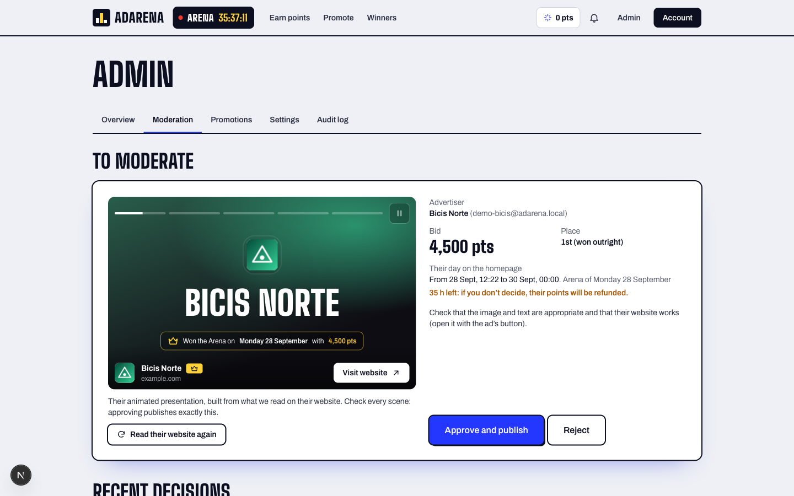
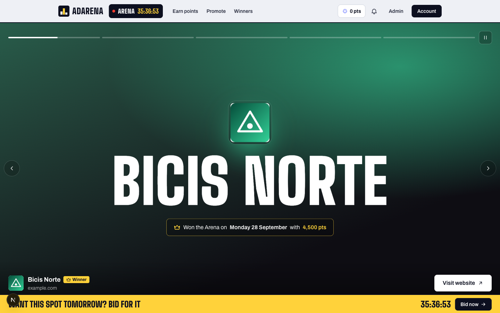

Probado de principio a fin en la copia de verificación: *End the Arena now* (Admin → Overview) →
Bicis Norte en Moderation → *Approve and publish* → la portada muestra su presentación.

### 14.2 El diseño: la pista de atletismo

Pediste un diseño más particular y bonito. La idea: **cada día es una carrera por la portada de mañana**.

- **La pista** (`.track` en `app/globals.css`): el marcador de la Arena (portada y `/arena`) y la cabecera
  de la guía son ahora una **pista azul con sus calles blancas** en vez de un fondo casi negro. El
  contador va en fichas de tinta con cifras amarillas; quien va primero, en una placa amarilla.
- **La clasificación es una carrera** (`components/arena/Leaderboard.tsx`): cada proyecto va por su calle
  y su **barra llega tan lejos como su puja comparada con la del primero**, que toca la meta en amarillo.
  Se ve de un vistazo quién gana y por cuánto ("700 pts behind"). Cuando alguien puja, las barras
  **avanzan** (animación suave; desactivada si el sistema pide reducir el movimiento).
- **Botón amarillo "meta"** (`variant="gold"`): sobre la pista azul, "Bid now" y "Sign up free" van en
  amarillo (el azul se perdía).
- **Earn points**: tu marcador del día, en azul pista con la barra de progreso en amarillo.
- **Más suave en general**: esquinas algo más redondeadas (4–24 px), fondo gris tiza `#eef0f5` y sombras
  con un toque del azul de la pista en vez de los bloques negros desplazados (el botón principal conserva
  su efecto de "pulsarse").
- Detalles: el punto rojo "Live now" lleva un borde blanco para verse sobre el azul; en el móvil, el nombre
  del que va primero puede ocupar dos líneas en vez de cortarse.

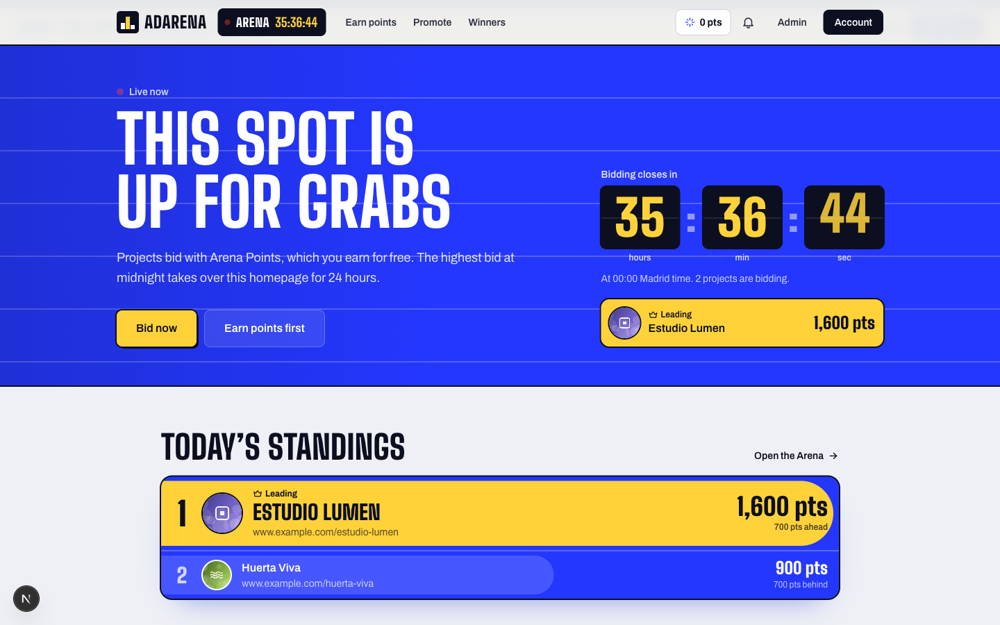
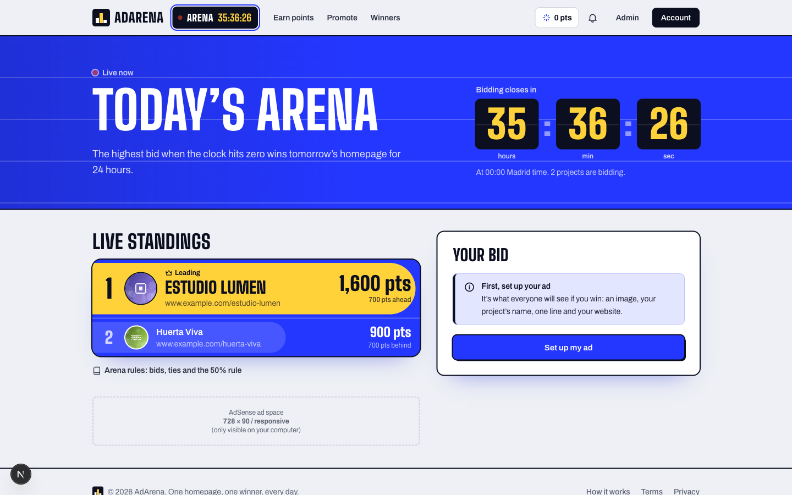
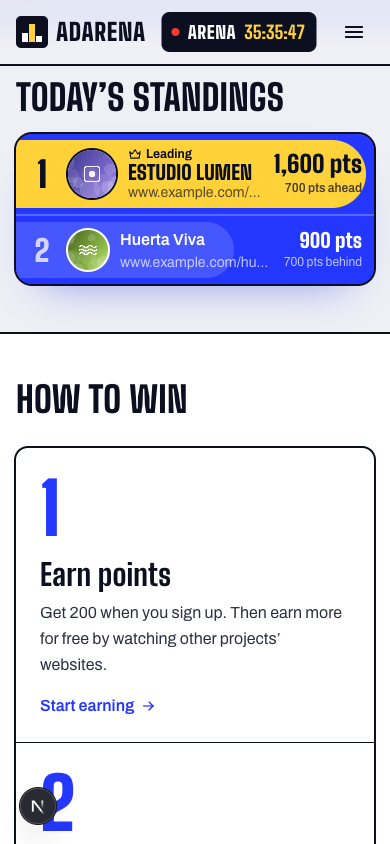
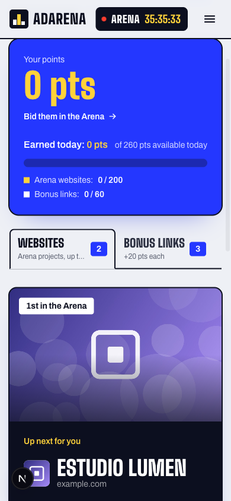

Archivos: `app/globals.css`, `components/ui/Button.tsx`, `components/arena/ArenaScoreboard.tsx`,
`components/arena/Countdown.tsx`, `components/arena/Leaderboard.tsx`, `components/home/HomeClient.tsx`,
`components/earn/EarnShell.tsx`, `app/how-it-works/page.tsx`. Sin cambios en el backend.

Comprobado: `tsc`, `eslint` y `next build` sin errores; navegador en escritorio y móvil (copia aparte en
3001/8082 con su propia base de datos, ya parada y borrada).

